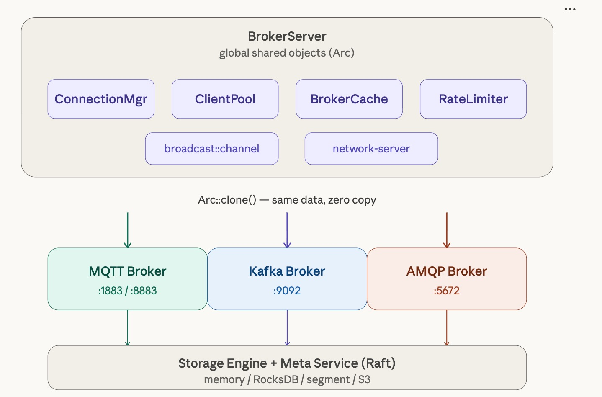
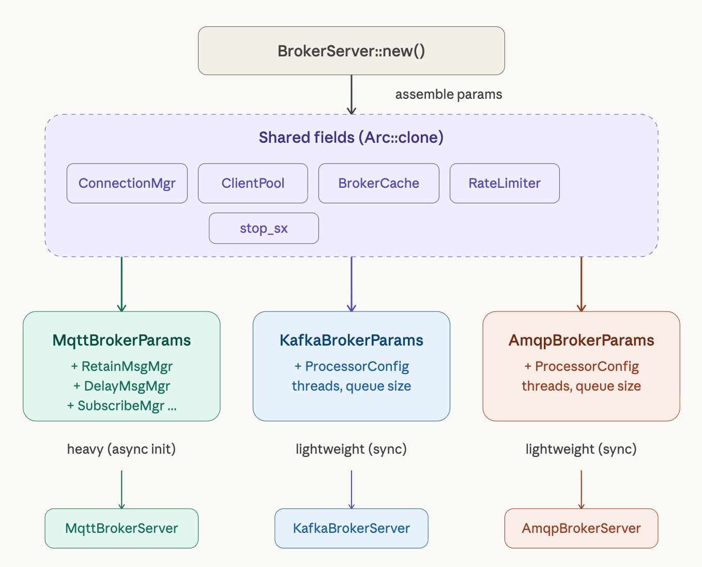
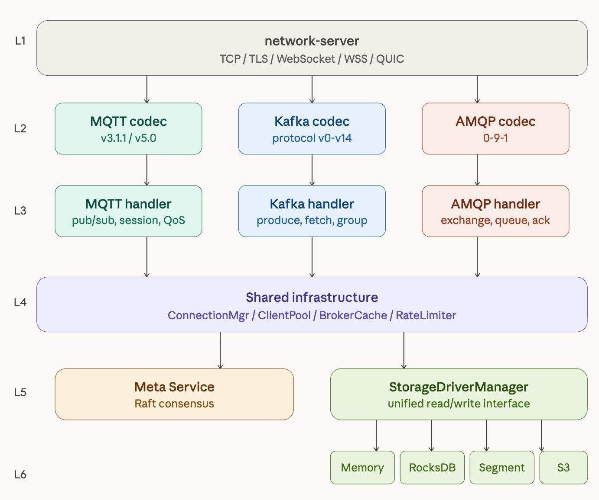

# RobustMQ 多协议架构：从 MQTT 到 Kafka、AMQP 的协议解析

RobustMQ 的核心远景就是做一个 All In One MQ。而支持多协议就是基础，难点不在于协议本身的解析实现，而在于怎么让不同协议共享基础设施，同时又互不干扰。协议之间既要复用连接管理、限流、存储这些公共能力，又要保持各自的独立性，不能因为一个协议的变更影响到其他协议的稳定性。

这篇文章记录 RobustMQ 在这条路上的实践。经过了两年的打磨，MQTT 已慢慢趋于成熟。我们最近完成了 Kafka 和 AMQP 协议的框架接入，虽然协议逻辑本体还是空壳，但整个多协议架构已经跑通，两个协议的服务能正常启动并监听端口，并且几乎没有对现有代码做任何侵入性改动。这意味着我们在多协议这条路上已经基本走通，接下来只需要在这套框架里填充各个协议的具体逻辑。

## 先说结论

接入 Kafka 和 AMQP 两个协议之后，`broker-server`（负责启动所有协议服务的入口模块）的核心启动逻辑，新增的代码只有两行：

```rust
self.start_kafka_broker(app_stop.clone());
self.start_amqp_broker(app_stop.clone());
```

两个协议的 Broker Server 从构建到启动，没有引入任何新的全局状态，没有新的初始化流程，没有改动任何公共模块的接口。MQTT 的代码一行都没动。

这不是凑巧，是架构设计的结果。接下来逐一拆解。

## MQTT 的基础已经足够厚


RobustMQ 的 MQTT 实现已经相对成熟，在支持完整 MQTT 功能的过程中，我们积累了一套完善的基础设施：网络连接管理、集群级限流、节点元数据缓存、gRPC 客户端连接池、延迟消息处理、存储适配层……这些组件在 MQTT 的长期打磨中变得稳定，并且天然适合跨协议复用。

关键在于这些组件的组织方式。它们全部以 `Arc<T>` 的形式存在于 `BrokerServer` 中，作为整个服务进程的全局共享对象：

```rust
pub struct BrokerServer {
    connection_manager: Arc<NetworkConnectionManager>,
    client_pool: Arc<ClientPool>,
    broker_cache: Arc<NodeCacheManager>,
    global_rate_limiter: Arc<GlobalRateLimiterManager>,
    // ... 以及各协议各自的 params
}
```

`Arc<T>` 的语义是引用计数共享指针，`clone()` 只是复制了一个指针，底层数据是同一份。当 Kafka 和 AMQP 需要这些能力时，直接 `clone()` 一份 `Arc` 指针即可——没有数据复制，没有重新初始化，没有任何额外开销。连接管理器是同一个，客户端池是同一个，限流器是同一个，缓存是同一个。三个协议共享同一套基础设施，彼此完全对等。

这是接入成本低的根本原因：MQTT 已经把基础打好了，后来的协议只需要站在这个基础上往上加。

## Params struct：清晰的协议边界

在确定共享全局对象之后，还需要解决一个问题：如何把这些对象传递给各个协议，同时保持清晰的边界，避免各协议直接相互依赖。

RobustMQ 的方案是为每个协议定义一个专属的 Params struct。每个协议的 Broker Server 不接受散列的构造参数，只接受一个统一的结构体：

```rust
#[derive(Clone)]
pub struct KafkaBrokerServerParams {
    pub connection_manager: Arc<ConnectionManager>,
    pub client_pool: Arc<ClientPool>,
    pub broker_cache: Arc<NodeCacheManager>,
    pub global_limit_manager: Arc<GlobalRateLimiterManager>,
    pub stop_sx: broadcast::Sender<bool>,
    pub proc_config: ProcessorConfig,
}
```

`AmqpBrokerServerParams` 结构完全一致。这个设计在实践中有几个明显好处：

**边界清晰，需求显式。** 一个协议需要什么外部依赖，看这个 struct 就全知道了，不需要追代码。如果某天 Kafka 需要新增一个依赖，改 struct 加一个字段，编译器会在所有构建点报错，强迫开发者有意识地处理这个依赖，而不是悄悄扩大全局状态。

**构建集中，成本可见。** 所有协议的 params 都在 `BrokerServer::new()` 里统一组装。Kafka 和 AMQP 目前只依赖全局对象，所以组装是完全同步的，不需要任何异步初始化：

```rust
let kafka_params = KafkaBrokerServerParams {
    connection_manager: connection_manager.clone(),
    client_pool: client_pool.clone(),
    broker_cache: broker_cache.clone(),
    global_limit_manager: global_rate_limiter.clone(),
    stop_sx: main_stop_send.clone(),
    proc_config: ProcessorConfig {
        accept_thread_num: config.kafka_runtime.network.accept_thread_num,
        handler_process_num: config.kafka_runtime.network.handler_thread_num,
        channel_size: config.kafka_runtime.network.queue_size,
    },
};
```

对比 MQTT 的 params 构建——MQTT 需要在 `broker_runtime.block_on()` 里异步初始化 `RetainMessageManager`、`DelayMessageManager`、`SubscribeManager` 等十几个组件，构建过程相对复杂。Kafka 和 AMQP 目前没有这些特有组件，构建代码极其简洁。随着协议功能的完善，这个 struct 会逐渐扩充，但扩充的边界是受控的。

**可独立调优。** 每个协议有自己的配置节——`[kafka_runtime.network]`、`[amqp_runtime.network]`——网络线程数、处理队列大小可以单独设置。MQTT 流量大可以给更多线程，Kafka 和 AMQP 按需配置，互不影响。

## 网络层：一次实现，所有协议受益

网络层是 RobustMQ 多协议架构中另一个重要的杠杆点。`network-server` crate 提供了完整的网络处理框架，抽象了 TCP 连接的 accept 循环、读写 buffer 管理、连接生命周期管理等底层细节。

更重要的是，`network-server` 已经支持 **TCP、TLS、WebSocket、WebSocket Secure（WSS）、QUIC** 五种传输层协议。这些能力是协议无关的——任何接入这套框架的应用层协议，都可以免费获得这五种传输层的支持，完全无需额外实现。

这对新协议的接入意义重大。当我们为 Kafka 或 AMQP 填充协议逻辑时，不需要考虑"要不要支持 TLS"、"要不要支持 WebSocket"这类问题，网络层已经替你处理好了。Kafka over QUIC？AMQP over TLS？在这套框架里，这不是额外的工作，是默认就有的能力。

## 停止信号：一个 channel，所有协议联动

停机协调是多协议系统里容易踩坑的地方。最直觉的做法是给每个协议一个独立的 stop channel，关闭时逐个通知。但这样做引入了顺序依赖——先停哪个、后停哪个？如果某个 channel 的接收端还没 ready，发送方提前发信号会怎样？这些问题不难解，但每个都需要小心处理，积累下来代码就变得脆弱。

RobustMQ 的做法是用 `tokio::sync::broadcast` 共享同一个停机 channel：

```rust
let (app_stop, _) = broadcast::channel::<bool>(2);
// ...
self.start_mqtt_broker(app_stop.clone()).await;
self.start_kafka_broker(app_stop.clone());
self.start_amqp_broker(app_stop.clone());
```

`broadcast` 的语义是一对多广播——发送方发送一次，所有订阅者都能收到。三个协议各自在内部调用 `stop_sx.subscribe()` 订阅这个 channel，当停机信号到来时，三个协议同时收到，各自有序关闭，不需要任何外部协调逻辑。没有顺序依赖，没有 channel 生命周期问题，没有"先停谁"的决策负担。

这个设计还有一个副作用：当 MQTT 因为某些原因触发停机时，Kafka 和 AMQP 也会同步收到信号，整个进程以一致的状态退出，不会出现某个协议还在运行、其他协议已经停止的中间态。

## 接入一个新协议需要几步

有了这套基础，再接入一个新协议（比如 RocketMQ 协议），流程是确定的，没有什么意外。

**第一步：新建协议 crate。**

创建 `rocketmq-broker` crate，专注于 RocketMQ 协议的帧解析和业务逻辑实现。底层网络处理完全依赖 `network-server`，不需要自己处理 TCP accept、连接读写、buffer 管理这些事情。网络层提供的五种传输协议支持也自动继承。

**第二步：定义 Params struct。**

参考 `KafkaBrokerServerParams`，定义 `RocketMQBrokerServerParams`。当前阶段只需要列出必要的全局对象依赖，后续随着功能扩充再逐步完善。这个 struct 就是协议对外部世界的全部依赖声明。

**第三步：添加配置节。**

在 `BrokerConfig` 里加一个 `rocketmq_runtime: RocketMQRuntime`，内嵌 `network: Network` 子配置。对现有配置结构是追加，不是修改，不影响任何现有协议的配置。

**第四步：在 broker-server 接入。**

```rust
// BrokerServer::new() 里组装 params
let rocketmq_params = RocketMQBrokerServerParams { ... };

// BrokerServer::start() 里一行启动
self.start_rocketmq_broker(app_stop.clone());
```

完成。不需要改动 MQTT 的任何代码，不需要修改任何公共模块的接口，停机逻辑自动覆盖，五种传输层协议自动支持。整个接入过程的工作量集中在协议逻辑本身，框架层几乎是零成本。

## 为什么这套设计能成立

回看整个架构，几个关键决策共同撑起了这套多协议框架的可扩展性：

**共享而不是复制。** 基础设施以 `Arc<T>` 共享，协议之间是同一份数据，没有同步开销，也没有状态不一致的风险。这是整个架构的基础假设——公共能力应该只有一份实例。

**全局对象在 `BrokerServer` 里集中管理。** 所有公共资源有且只有一个创建点，各协议只能通过 params 拿到引用，不能绕过这个边界直接访问全局状态。这个约束确保了协议之间的隔离性，也让资源的生命周期管理变得清晰。

**网络层与协议逻辑解耦。** `network-server` crate 负责所有传输层细节，协议 crate 只关注帧解析和业务逻辑。这条分界线非常稳定——网络层的升级（比如新增某种传输协议）对协议层完全透明，协议层的变更也不会影响网络层。

**停机信号广播而非点对点。** 用 `broadcast` 统一管理停机，消除了多协议场景下的协调复杂性，让每个协议可以独立实现自己的优雅停机逻辑，而不需要知道其他协议的存在。

**Params struct 作为显式依赖声明。** 每个协议通过 struct 字段明确声明自己的依赖，编译器在依赖关系发生变化时强制开发者处理。这个约束在项目规模增大后会越来越有价值。

## 展望：存储层与元数据层的对接

目前 Kafka 和 AMQP 的协议框架已经跑通，但业务逻辑还是空壳。下一个阶段的核心工作，是将这两个协议对接到 RobustMQ 已有的存储层和元数据层。

**存储层已经就绪。** RobustMQ 的 Storage Engine 已经完成搭建，支持内存、Segment 文件、RocksDB、MySQL、MinIO、S3 多种存储后端，通过统一的 `StorageDriverManager` 抽象对上层暴露一致的读写接口。MQTT 已经在生产级别使用这套存储层，稳定性经过了验证。Kafka 和 AMQP 的消息持久化，可以直接对接这个抽象层，不需要自己实现存储逻辑。

**元数据层已经就绪。** Meta Service 基于 Raft 实现了分布式元数据管理，并且支持插件化扩展。Topic 元数据、分区信息、消费者组状态——这些 Kafka 和 AMQP 都需要管理的数据，可以直接存储在这套元数据服务中，获得开箱即用的分布式一致性保证。

**下一步的路径是清晰的。** 以 Kafka 为例，接下来的工作大致分为三层：

- **协议解析层**：实现完整的 Kafka 协议帧解析，覆盖 Produce、Fetch、Metadata、OffsetCommit 等核心 API
- **元数据对接**：Topic 创建、分区分配、Broker 注册通过 Meta Service gRPC 接口完成，消费者组协调逻辑对接元数据存储
- **存储对接**：消息写入和读取通过 `StorageDriverManager` 完成，Offset 管理复用现有的 `OffsetManager`

AMQP 路径类似：Exchange、Queue、Binding 的元数据通过 Meta Service 管理，消息路由和持久化对接存储层。

这条路上最重要的一点是：存储层和元数据层的接口已经稳定，MQTT 的实践证明了它们的设计是可靠的。Kafka 和 AMQP 的业务逻辑实现，可以站在这些已验证的基础上推进，不需要重新发明轮子，也不会因为基础层的问题而被阻塞。

在我们看来，最值得开心的是，在适配 Kafka 和AMQP协议的过程中，我们验证了长时间的架构和代码打磨、不断调整优化是有效果的，也给了我们信心，更加安静的去打磨我们的Broker，静待花开～。
