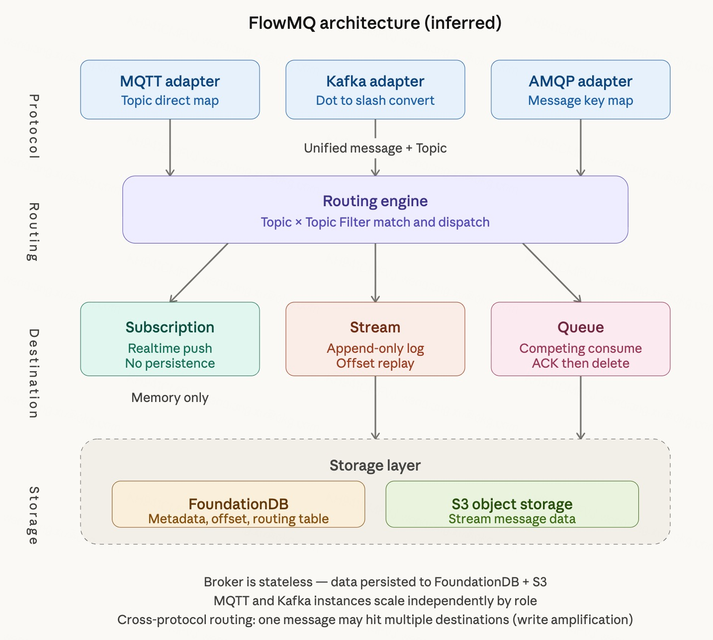
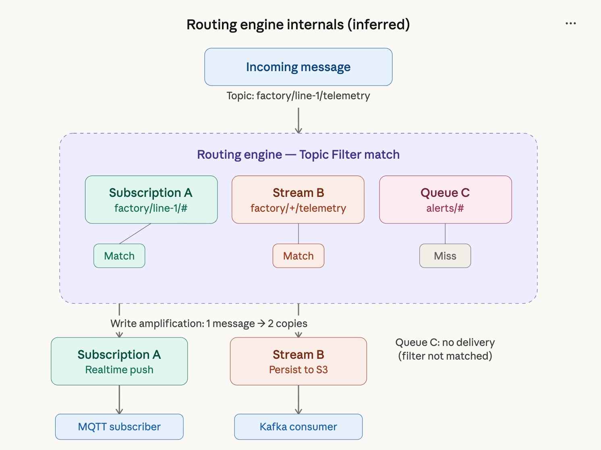

# FlowMQ 技术架构分析与推测

2026 年 3 月 20 日，EMQ 在 Tech Day 上正式发布了 FlowMQ——一款定位为"融合消息流平台"的新产品。根据公开信息推测，FlowMQ 的前身极可能是 EMQ 于 2021 年开源的流数据库 HStreamDB——HStreamDB 官网 hstream.io 已直接 301 重定向至 flowmq.io，GitHub 上的 flowmq-io 组织 fork 了 FoundationDB 等相关项目，且两者在架构理念上存在明显的继承关系。EMQ 官方未明确公开两者的关系，以下分析基于这一推测展开。本文基于 FlowMQ 公开文档、GitHub 痕迹及 HStreamDB 的技术背景，对其架构进行分析与推测。

## 一、产品定位演变

HStreamDB 最初定位为"流数据库"，用 Haskell 编写，主打流数据的存储与实时处理，以 SQL 为主要接口。这个定位在市场上未能获得足够牵引力——项目停留在 v0.14，社区活跃度低迷。

FlowMQ 的定位发生了根本转变：从"流数据库"转向"统一消息平台"。核心叙事变为——用一个系统同时提供 Pub/Sub、Stream、Queue 三种消息能力，原生支持 MQTT、Kafka、AMQP 多协议接入和跨协议互通。

这一转变的背景是 EMQ 看到了企业消息基础设施碎片化的痛点：设备接入用 MQTT Broker，事件流用 Kafka，任务分发用 RabbitMQ，三套系统各自运维、靠桥接程序拼接。FlowMQ 试图用一个平台替代这三套系统。

## 二、整体架构

根据公开文档推测，FlowMQ 的架构分为四层（见下图）：

### 2.1 协议适配层

每种协议对应一个独立的适配器，职责单一：将外部协议消息翻译为 FlowMQ 内部统一格式，并将协议中的"地址"映射为 FlowMQ 的 Topic。

映射规则：
- **MQTT**：topic 直接映射，`sensors/device-001/telemetry` → `sensors/device-001/telemetry`
- **Kafka**：分隔符转换，`.` 转为 `/`，`sensors.device-001.telemetry` → `sensors/device-001/telemetry`
- **AMQP**：message key 映射为 Topic

适配器是可插拔的设计，新增协议只需新增适配器，不动核心路由引擎。

部署配置中支持按协议角色独立伸缩：可以通过 `mqtt-num` 和 `kafka-num` 分别控制 MQTT 和 Kafka 实例数量，甚至在同一台机器上混合部署不同角色。这意味着 MQTT 连接密集时单独扩 MQTT 实例，Kafka 吞吐大时单独扩 Kafka 实例。

### 2.2 路由引擎（核心）

路由引擎是 FlowMQ 架构的中枢。它只做一件事：将消息携带的 Topic 与所有 Destination 注册的 Topic Filter 进行匹配，命中则投递。

Topic Filter 支持通配符：
- `+` 匹配单个层级
- `#` 匹配剩余所有层级

以下是路由引擎内部的消息流转逻辑：

路由引擎完全协议无关——它不知道也不关心消息从 MQTT 来还是从 Kafka 来。跨协议互通在这一层"自然发生"，因为路由引擎根本不区分协议来源。

这个设计的优点是解耦彻底、扩展性好。缺点是如果一条消息同时命中多个 Destination，消息会被复制分发到每一个，产生写放大。

### 2.3 Destination 层

Destination 是 FlowMQ 最核心的抽象。三种类型对应三种消息语义：

**Subscription**：实时推送。消息到达后立即推送给在线订阅者，不经过持久化存储。对应 MQTT 的 pub/sub 语义。延迟最低，但消息不落盘，离线订阅者收不到。

**Stream**：追加日志。消息以 append-only log 形式持久化到 S3 对象存储，支持分区、offset 消费、历史回放。本质就是 Kafka Topic 的翻版，完全兼容 Kafka 协议和 API。Stream 支持绑定 Topic Filter，自动捕获匹配的消息进行持久化。

**Queue**：工作队列。消息缓存到队列中，竞争消费，ACK 后删除。对应 RabbitMQ 的队列语义。

Destination 的设计是可扩展的，文档提到未来会引入 Table 等新类型。

### 2.4 存储层

**FoundationDB 承担元数据存储。** 部署配置中直接使用 `fdbserver`、`fdb.cluster`、`fdbcli` 等 FoundationDB 原生工具，安装包名为 `flowmq-meta`。FoundationDB 是 Apple 开源的强一致性分布式 KV 存储，承担 Topic 注册、Destination 配置、订阅关系、Consumer Offset、Namespace 隔离、集群协调等元数据管理。

**S3 兼容对象存储承担消息数据持久化。** 部署配置中 S3 相关参数仅在 Kafka 功能开启时需要配置，说明 Stream 的数据存 S3，而 Subscription 的实时推送不经过 S3。支持 AWS S3、阿里云 OSS、Ceph、MinIO 等。

Broker 节点本身是无状态的计算层，不存储数据，可以秒级扩缩容、快速故障替换，无需 rebalance。

## 三、跨协议互通机制

跨协议互通是 FlowMQ 的核心卖点，其实现完全依赖路由引擎的 Topic 匹配机制。

**MQTT → Kafka 路径**：IoT 设备通过 MQTT publish 消息 → 适配器映射为 FlowMQ Topic → 路由引擎匹配到某个 Stream 的 Topic Filter → 消息写入 Stream（持久化到 S3）→ Kafka consumer 从 Stream 按 offset 消费。

**Kafka → MQTT 路径**：后端通过 Kafka producer 写入消息 → 适配器将 `.` 转 `/` 映射为 Topic → 路由引擎匹配到 Subscription → 消息直接内存推送给在线 MQTT 订阅者，不落盘。

关键点在于：这不是 MQTT 和 Kafka 在读写同一份数据，而是路由引擎把消息复制到不同的 Destination 中。如果同一条消息同时命中 Subscription 和 Stream，它会被处理两次——一次内存推送，一次 S3 写入。

## 四、技术选型分析

### 4.1 为什么选 FoundationDB

FoundationDB 提供强一致性事务、高可用、水平扩展能力。用它做元数据层有几个好处：
- 不需要像 Kafka 那样依赖 ZooKeeper / KRaft 做集群协调
- 事务能力天然适合 Consumer Offset、订阅关系等需要一致性保证的元数据
- Apple 在生产环境大规模验证过

代价是部署和运维复杂度显著增加。FoundationDB 本身就是一个需要独立运维的分布式集群。

### 4.2 为什么选 S3 对象存储

S3 作为 Stream 的持久化底座，核心优势是成本和弹性：
- 存储单价远低于 EBS/本地盘
- 容量按需付费，无需预分配
- 持久性由云厂商保证（AWS S3 11 个 9）
- Broker 无状态，扩缩容不涉及数据迁移

这条路线与 AutoMQ、WarpStream 的思路一致——将 Kafka 的本地盘存储替换为对象存储。

### 4.3 Haskell 的角色

HStreamDB 是用 Haskell 编写的。FlowMQ 是否沿用 Haskell 尚不确定，但从 GitHub flowmq-io 组织 fork 了 FoundationDB（C++）和 Bento（Go）来看，FlowMQ 的技术栈可能不再是纯 Haskell，而是混合多语言。Haskell 在基础软件领域的生态薄弱和人才稀缺，可能是促使技术栈转型的原因之一。

## 五、架构优缺点

### 优点

1. **解耦彻底**：协议、路由、存储三层各自独立，新增协议或新增 Destination 类型不影响其他层。
2. **弹性伸缩**：Broker 无状态 + 对象存储，扩缩容秒级完成。
3. **按角色独立伸缩**：MQTT 和 Kafka 实例可以独立调整数量。
4. **跨协议互通开箱即用**：不需要额外的桥接程序。

### 缺点

1. **写放大**：一条消息命中多个 Destination 会被复制多次。在 IoT 高频上报场景下，如果同一份数据既要实时推送又要持久化分析，存储成本倍增。
2. **部署复杂度高**：至少需要 FoundationDB 集群 + S3 + FlowMQ Broker 三套组件，最小部署需要 3 台节点。
3. **外部依赖重**：强依赖 FoundationDB 和 S3，任何一个出问题都影响整个系统。
4. **Topic 映射限制**：Kafka 的 `.` 和 MQTT 的 `/` 自动互转是硬编码规则，如果 Kafka topic 本身包含 `/` 或 MQTT topic 包含 `.`，映射会冲突。
5. **闭源**：FlowMQ 是闭源商业产品，用户无法审计代码、无法自行修复问题、存在厂商锁定风险。

## 六、总结

FlowMQ 本质上是一个**路由引擎驱动的多协议消息分发平台**，底层依赖 FoundationDB 做元数据管理、S3 做消息持久化。它的架构设计优先保证解耦性和弹性，代价是写放大和部署复杂度。

从 HStreamDB 到 FlowMQ 的转型，反映了 EMQ 对市场需求的重新判断：企业不需要一个流数据库，而是需要一个能统一 MQTT、Kafka、AMQP 的消息平台。这个判断与行业趋势一致。

FlowMQ 的出现验证了"统一消息平台"这个方向的市场需求，但其闭源、重依赖、高部署复杂度的特点，也为开源、轻量、自包含的替代方案留下了明确的市场空间。

## 七、进一步思考

以下观点为个人技术分析和推测，不代表对 FlowMQ 或 EMQ 的贬低。技术架构的取舍没有绝对的对错，不同的设计选择服务于不同的约束和目标。我们始终欢迎技术交流和讨论。

### 7.1 重外部依赖是消息系统的大忌
消息系统是基础设施的基础设施，它一旦不可用，上层所有业务都会受到影响。因此消息系统自身的依赖链应当越短越好，可控性越强越好。
FlowMQ 强依赖 FoundationDB 做元数据存储、S3 做消息持久化。这意味着系统的故障域从 FlowMQ 自身扩展到了 FoundationDB 集群和 S3 服务——任何一个环节出现问题，都可能导致整个消息平台不可用。这不仅仅是"运维门槛高"的体验问题，更是"故障域扩大"的架构问题。
历史上，消息系统领域已经反复验证了这个教训：

Kafka 依赖 ZooKeeper：ZooKeeper 本身并非不优秀，但作为外部依赖，它增加了故障源、复杂化了运维，最终 Kafka 社区花了数年时间开发 KRaft 来移除这个依赖。
Pulsar 依赖 BookKeeper：BookKeeper 增加了部署和调优难度，成为 Pulsar 市场推广的阻力之一，也是社区长期讨论的痛点。

FlowMQ 对 FoundationDB 的依赖可能面临同样的困境。不是因为 FoundationDB 不好，而是对于消息系统这种要求极高可用性的基础设施，每多一个外部依赖就多一个不可控的故障源。

### 7.2 路由引擎是架构缺陷的信号

个人认为，路由引擎的存在本身暗示了一个架构层面的问题：FlowMQ 的 Subscription、Stream、Queue 三种 Destination 底层并非同一份存储。正因为底层存储不统一，才需要一个路由层在中间做消息的匹配和复制分发。
如果底层是真正统一的存储，消息写入一次就完成了，不同协议的消费者各自用自己的语义读取同一份数据即可——Subscription 实时推送是一种读取视角，Stream 按 offset 回放是另一种读取视角，Queue 竞争消费又是一种读取视角。中间不需要任何分发逻辑。
多协议统一的真正意义应当是一份存储，多种消费视角，而不是一份消息，路由引擎复制成多份，再分别消费。后者本质上还是多套系统的思路，只不过用路由引擎把拼接过程自动化了。

### 7.3 前置 Destination 规划增加了用户心智负担
FlowMQ 的架构要求用户在消息写入之前就规划好 Destination：这条消息要去 Subscription 还是 Stream 还是 Queue？需要提前创建 Destination 并绑定 Topic Filter。
这意味着用户在系统设计阶段就必须想清楚每条消息的完整消费路径。如果后续需求变化——比如原来只需要实时推送，现在还需要持久化分析——就得新增一个 Destination，同一条消息从此多写一份，产生写放大。
而如果底层是统一存储的架构，用户只管把消息写进来，后续想加什么消费方式随时加，不需要提前规划，也不会产生额外的写入成本。消费需求的变化不应该影响写入链路。

### 7.4 写放大在大规模场景下的代价
在百万设备、高频上报的 IoT 场景下，同一份设备遥测数据通常既需要实时推送给监控大屏（Subscription），又需要持久化供后端分析（Stream）。在 FlowMQ 的架构中，每条消息都会被路由引擎复制写入两个 Destination，存储成本和 I/O 压力直接翻倍。
随着 Destination 数量增加（比如再加一个 Queue 做告警任务分发），写放大倍数还会继续增长。在数据量巨大的场景下，这个代价是实实在在的成本。

## 参考文档

- [FlowMQ 产品概述](https://docs.emqx.com/zh/flowmq/latest/product/overview.html)
- [FlowMQ 核心特性](https://docs.emqx.com/zh/flowmq/latest/product/features.html)
- [FlowMQ 基本概念](https://docs.emqx.com/zh/flowmq/latest/concepts/core-concepts.html)
- [FlowMQ 消息路由](https://docs.emqx.com/zh/flowmq/latest/concepts/message-routing.html)
- [FlowMQ 跨协议互通](https://docs.emqx.com/zh/flowmq/latest/features/cross-protocol.html)
- [FlowMQ 数据流](https://docs.emqx.com/zh/flowmq/latest/features/streaming.html)
- [FlowMQ 集群部署](https://docs.emqx.com/zh/flowmq/latest/admin/deployment.html)
- [FlowMQ 官网](https://flowmq.io/)
- [FlowMQ 发布博客](https://www.emqx.com/zh/blog/flowmq-ai-unified-messaging-platform-release)
- [EMQX 切换 BSL 公告](https://www.emqx.com/en/blog/adopting-business-source-license-to-accelerate-mqtt-and-ai-innovation)
- [HStreamDB GitHub](https://github.com/hstreamdb/hstream)
- [flowmq-io GitHub](https://github.com/flowmq-io)

## 免责声明

本文所有架构分析和技术推测均基于 FlowMQ 公开文档、官网信息、GitHub 公开仓库及 HStreamDB 的历史技术背景进行的逻辑推理，**不代表 EMQ 官方的技术实现细节，不保证与 FlowMQ 实际架构完全一致**。FlowMQ 为闭源商业产品，其内部实现细节无法从外部完全确认。本文仅供技术交流和学习参考，如有偏差，欢迎指正。