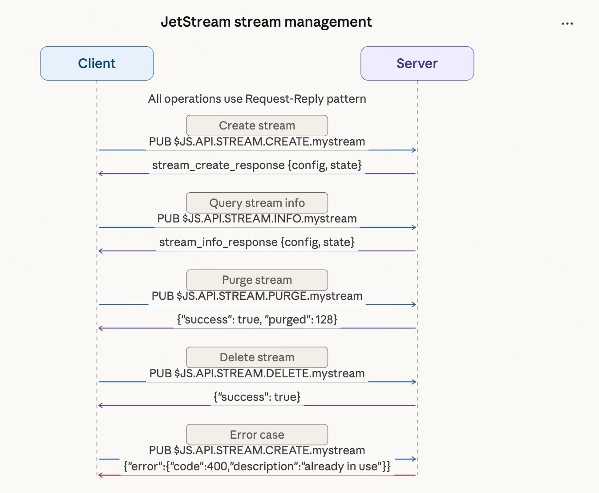
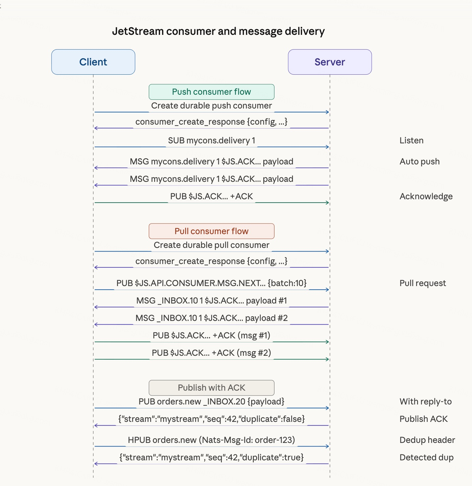
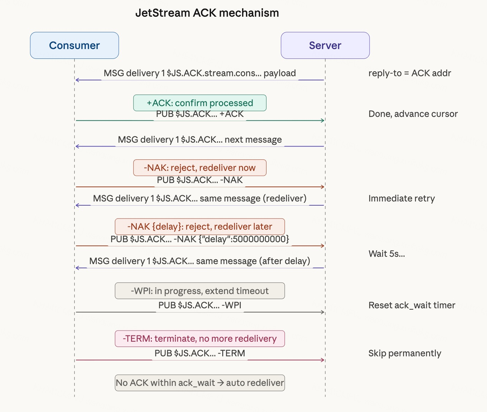

# NATS JetStream 协议详解

JetStream 是 NATS 内置的持久化引擎，在 Core NATS 的 Pub/Sub 基础上增加了消息存储、重放、流量控制和精确投递语义。它没有引入任何新的线上协议指令——所有操作都通过标准的 `PUB`（带 reply-to）和 `MSG` 完成，服务端在内部暴露了一组以 `$JS.API.` 开头的 Subject，客户端向这些 Subject 发 JSON 请求，服务端把结果发回 reply-to 地址。

## JetStream 解决什么问题

Core NATS 是纯实时的：消息发出时如果没有在线的订阅者，消息就丢了。这在很多场景下不够用：

- 服务重启后需要从上次断点继续消费
- 多个消费者需要各自独立地重放同一批消息
- 需要保证消息至少被处理一次（或恰好一次）
- 需要在消息量超过消费速度时做背压

JetStream 通过 Stream（持久化存储）+ Consumer（消费游标）解决这些问题，同时保持 NATS 协议层不变。

## 核心概念

### Stream

Stream 是消息的持久化容器，绑定一组 Subject（支持通配符）。发布到这些 Subject 的消息会被服务端捕获并存储，按照配置的保留策略决定保留多久或多少。

**存储类型：**

| 类型 | 说明 |
| ---- | ---- |
| `file` | 持久化到磁盘，服务重启后消息不丢失 |
| `memory` | 存储在内存，性能更高，重启后消息消失 |

**保留策略（Retention）：**

| 策略 | 说明 |
| ---- | ---- |
| `limits` | 按数量、大小、时间上限保留，支持消息重放，默认策略 |
| `workqueue` | 消息被确认后立即删除，实现工作队列语义，每条消息只被一个消费者处理 |
| `interest` | 只在有 Consumer 关联时保留消息，所有 Consumer 确认后删除 |

### Consumer

Consumer 是 Stream 上的消费游标，记录当前消费到哪条消息，支持断线续传。同一个 Stream 可以有多个独立的 Consumer，各自维护自己的进度。

**Durable vs Ephemeral：**

- **Durable**：有名字，断线重连后游标保留，从上次停止的地方继续
- **Ephemeral**：无名字，连接断开后服务端自动清理

**Push vs Pull：**

| 类型 | 说明 | 适用场景 |
| ---- | ---- | -------- |
| Push Consumer | 服务端主动推消息到指定 Subject，客户端 SUB 收消息 | 单消费者，需要有序重放 |
| Pull Consumer | 客户端主动向服务端请求消息，控制消费节奏 | 多消费者水平扩展，背压控制 |

**投递策略（Deliver Policy）：**

| 策略 | 说明 |
| ---- | ---- |
| `all` | 从 Stream 第一条消息开始 |
| `new` | 只接收订阅之后新发布的消息 |
| `last` | 从最后一条消息开始 |
| `last_per_subject` | 每个 Subject 各取最后一条 |
| `by_start_sequence` | 从指定序号开始 |
| `by_start_time` | 从指定时间点开始 |

**ACK 策略（Ack Policy）：**

| 策略 | 说明 |
| ---- | ---- |
| `explicit` | 每条消息都要显式 ACK，未 ACK 的消息会超时重投 |
| `all` | ACK 一条等于确认此前所有消息 |
| `none` | 不需要 ACK，消息投递后立即视为已处理 |

**Replay 策略（Replay Policy）：**

| 策略 | 说明 |
| ---- | ---- |
| `instant` | 尽可能快地重放消息，不考虑原始发布的时间间隔 |
| `original` | 按消息原始发布的时间间隔重放，模拟真实流量 |

## 协议交互机制

所有 JetStream 操作都是标准的 NATS Request-Reply 模式：

```
Client → PUB $JS.API.<operation> <reply-to> <len>
         <json request body>

Server → MSG <reply-to> <sid> <len>
         <json response body>
```

客户端先 `SUB _INBOX.<random>`，把这个地址作为 reply-to 发出请求，然后等服务端把响应发到这个 Subject。

以下是 JetStream 各操作的完整交互时序图。

### Stream 管理交互



**创建 Stream：**

```
PUB $JS.API.STREAM.CREATE.mystream _INBOX.1 148\r\n
{
  "name": "mystream",
  "subjects": ["orders.>"],
  "storage": "file",
  "retention": "limits",
  "max_msgs": -1,
  "max_bytes": -1,
  "max_age": 0,
  "num_replicas": 1
}\r\n

→ MSG _INBOX.1 1 256\r\n
{
  "type": "io.nats.jetstream.api.v1.stream_create_response",
  "config": { ... },
  "state": { "messages": 0, "bytes": 0, "first_seq": 0, "last_seq": 0 }
}\r\n
```

**查询 Stream 信息：**

```
PUB $JS.API.STREAM.INFO.mystream _INBOX.2 0\r\n
\r\n
```

**列出所有 Stream：**

```
PUB $JS.API.STREAM.LIST _INBOX.3 2\r\n
{}\r\n
```

**删除 Stream：**

```
PUB $JS.API.STREAM.DELETE.mystream _INBOX.4 0\r\n
\r\n

→ MSG _INBOX.4 1 28\r\n
{"success":true}\r\n
```

**清空 Stream 消息（Purge）：**

```
PUB $JS.API.STREAM.PURGE.mystream _INBOX.5 0\r\n
\r\n
```

### Consumer 管理与消费交互



**创建 Push Consumer（Durable）：**

```
PUB $JS.API.CONSUMER.DURABLE.CREATE.mystream.mycons _INBOX.6 192\r\n
{
  "stream_name": "mystream",
  "config": {
    "durable_name": "mycons",
    "deliver_subject": "mycons.delivery",
    "deliver_policy": "all",
    "ack_policy": "explicit",
    "ack_wait": 30000000000,
    "replay_policy": "instant"
  }
}\r\n
```

客户端随后 SUB `mycons.delivery` 接收服务端推送的消息。

**创建 Pull Consumer：**

```
PUB $JS.API.CONSUMER.DURABLE.CREATE.mystream.pullcons _INBOX.7 128\r\n
{
  "stream_name": "mystream",
  "config": {
    "durable_name": "pullcons",
    "deliver_policy": "all",
    "ack_policy": "explicit"
  }
}\r\n
```

**查询 Consumer 信息：**

```
PUB $JS.API.CONSUMER.INFO.mystream.mycons _INBOX.8 0\r\n
\r\n
```

**删除 Consumer：**

```
PUB $JS.API.CONSUMER.DELETE.mystream.mycons _INBOX.9 0\r\n
\r\n
```

### 消息消费

**Pull Consumer 拉取消息：**

```
PUB $JS.API.CONSUMER.MSG.NEXT.mystream.pullcons _INBOX.10 64\r\n
{"batch": 10, "expires": 5000000000}\r\n

→ MSG _INBOX.10 1 $JS.ACK.mystream.pullcons.1.1.1.1700000000.0 64\r\n
<message payload>\r\n

→ MSG _INBOX.10 1 $JS.ACK.mystream.pullcons.1.2.2.1700000001.0 64\r\n
<message payload>\r\n
```

`batch` 指定一次最多拉多少条，`expires` 是等待超时（纳秒）。服务端收到多少条就发多少条，不够 batch 也会在 expires 到期后返回。

当没有可用消息且超时到期时，服务端会返回一个带 `Status: 408` 的 Header 消息表示请求超时：

```
→ HMSG _INBOX.10 1 16 16\r\n
NATS/1.0 408\r\n
\r\n
\r\n
```

当 Pull Consumer 已过期或被删除时，服务端返回 `Status: 409`。

**直接按序号获取消息（不走 Consumer）：**

```
PUB $JS.API.STREAM.MSG.GET.mystream _INBOX.11 12\r\n
{"seq": 42}\r\n

→ MSG _INBOX.11 1 256\r\n
{
  "type": "io.nats.jetstream.api.v1.stream_msg_get_response",
  "message": {
    "subject": "orders.new",
    "seq": 42,
    "data": "<base64 encoded payload>",
    "time": "2024-01-01T00:00:00Z"
  }
}\r\n
```

也可以按 Subject 获取最后一条消息：

```
PUB $JS.API.STREAM.MSG.GET.mystream _INBOX.11 32\r\n
{"last_by_subj": "orders.new"}\r\n
```

### ACK 机制



服务端推送给消费者的消息，reply-to 字段就是 ACK 地址，格式为：

```
$JS.ACK.<stream>.<consumer>.<delivered_count>.<stream_seq>.<consumer_seq>.<timestamp>.<pending_msgs>
```

各字段含义：

| 字段 | 说明 |
| ---- | ---- |
| `delivered_count` | 该消息被投递的次数（重投时递增） |
| `stream_seq` | 消息在 Stream 中的全局序号 |
| `consumer_seq` | 消息在 Consumer 中的序号 |
| `timestamp` | 投递时间戳（纳秒） |
| `pending_msgs` | 当前 Consumer 待处理的消息数量 |

客户端通过向这个地址 PUB 不同的 payload 来表达不同的 ACK 语义：

| Payload | ACK 类型 | 说明 |
| ------- | -------- | ---- |
| 空（0 字节）或 `+ACK` | AckAck | 确认此消息已处理 |
| `-NAK` | AckNak | 拒绝，立即重新投递 |
| `-NAK {"delay": 5000000000}` | AckNak with delay | 拒绝，延迟指定纳秒后重投 |
| `-WPI` | AckProgress | 处理中，延长 ack_wait 超时，防止超时重投 |
| `-NXT` | AckNext | 确认并立即请求下一条（Pull Consumer 专用） |
| `-TERM` | AckTerm | 终止，不再重投，消息视为已处理但不再需要 |

**示例：**

```
# 收到的消息（reply-to 即 ACK 地址）
MSG mycons.delivery 1 $JS.ACK.mystream.mycons.1.5.5.1700000000.0 13\r\n
Hello JetStream\r\n

# 确认
PUB $JS.ACK.mystream.mycons.1.5.5.1700000000.0 0\r\n
\r\n

# 拒绝并延迟重投
PUB $JS.ACK.mystream.mycons.1.5.5.1700000000.0 26\r\n
-NAK {"delay":5000000000}\r\n

# 处理中，延长超时
PUB $JS.ACK.mystream.mycons.1.5.5.1700000000.0 4\r\n
-WPI\r\n

# 终止，不再重投
PUB $JS.ACK.mystream.mycons.1.5.5.1700000000.0 5\r\n
-TERM\r\n
```

### JetStream Publish（带 ACK 的发布）

普通的 `PUB` 发布消息后没有确认。JetStream 提供带 ACK 的发布方式——发布时带上 reply-to，服务端会回复一个 Publish ACK 确认消息已持久化：

```
PUB orders.new _INBOX.20 24\r\n
{"item":"widget","qty":5}\r\n

→ MSG _INBOX.20 1 64\r\n
{"stream":"mystream","seq":42,"duplicate":false}\r\n
```

响应中 `seq` 是消息在 Stream 中的序号，`duplicate` 表示是否为重复消息（配合去重使用）。

**去重（Exactly Once Publish）：**

发布时在 Header 中携带 `Nats-Msg-Id`，服务端在配置的去重窗口内检测重复：

```
HPUB orders.new _INBOX.21 44 68\r\n
NATS/1.0\r\n
Nats-Msg-Id: order-123\r\n
\r\n
{"item":"widget","qty":5}\r\n

→ MSG _INBOX.21 1 56\r\n
{"stream":"mystream","seq":42,"duplicate":false}\r\n
```

如果同一个 `Nats-Msg-Id` 在去重窗口内再次发布，响应中 `duplicate` 为 `true`，消息不会重复存储。

### 账户信息

```
PUB $JS.API.INFO _INBOX.12 0\r\n
\r\n

→ MSG _INBOX.12 1 256\r\n
{
  "type": "io.nats.jetstream.api.v1.account_info_response",
  "memory": 0,
  "storage": 102400,
  "streams": 3,
  "consumers": 5,
  "limits": { "max_memory": -1, "max_storage": -1, "max_streams": -1, "max_consumers": -1 }
}\r\n
```

## 完整 API Subject 一览

### Stream 操作

| 操作 | Subject |
| ---- | ------- |
| 创建 Stream | `$JS.API.STREAM.CREATE.<stream>` |
| 更新 Stream | `$JS.API.STREAM.UPDATE.<stream>` |
| 查询 Stream 信息 | `$JS.API.STREAM.INFO.<stream>` |
| 列出所有 Stream | `$JS.API.STREAM.LIST` |
| 列出 Stream 名称 | `$JS.API.STREAM.NAMES` |
| 删除 Stream | `$JS.API.STREAM.DELETE.<stream>` |
| 清空 Stream 消息 | `$JS.API.STREAM.PURGE.<stream>` |
| 按序号获取消息 | `$JS.API.STREAM.MSG.GET.<stream>` |
| 删除指定消息 | `$JS.API.STREAM.MSG.DELETE.<stream>` |
| 快照备份 | `$JS.API.STREAM.SNAPSHOT.<stream>` |
| 恢复备份 | `$JS.API.STREAM.RESTORE.<stream>` |

### Consumer 操作

| 操作 | Subject |
| ---- | ------- |
| 创建 Ephemeral Consumer | `$JS.API.CONSUMER.CREATE.<stream>` |
| 创建 Durable Consumer | `$JS.API.CONSUMER.DURABLE.CREATE.<stream>.<consumer>` |
| 创建 Consumer（2.9+，带过滤） | `$JS.API.CONSUMER.CREATE.<stream>.<consumer>.<filter>` |
| 查询 Consumer 信息 | `$JS.API.CONSUMER.INFO.<stream>.<consumer>` |
| 列出所有 Consumer | `$JS.API.CONSUMER.LIST.<stream>` |
| 列出 Consumer 名称 | `$JS.API.CONSUMER.NAMES.<stream>` |
| 删除 Consumer | `$JS.API.CONSUMER.DELETE.<stream>.<consumer>` |
| Pull 拉取消息 | `$JS.API.CONSUMER.MSG.NEXT.<stream>.<consumer>` |

### 其他

| 操作 | Subject |
| ---- | ------- |
| 账户信息 | `$JS.API.INFO` |
| ACK 消息 | `$JS.ACK.<stream>.<consumer>.<...>` |
| 流量控制 | `$JS.FC.<stream>.>` |

## JetStream Domain

当服务端配置了 JetStream Domain 时，API Subject 前缀从 `$JS.API` 变为 `$JS.<domain>.API`，其余格式不变。例如：

```
# 默认
PUB $JS.API.STREAM.INFO.mystream _INBOX.1 0

# 指定 domain
PUB $JS.hub.API.STREAM.INFO.mystream _INBOX.1 0
```

## 错误响应格式

所有 JetStream API 在出错时返回统一的 JSON 错误格式：

```json
{
  "type": "io.nats.jetstream.api.v1.stream_create_response",
  "error": {
    "code": 400,
    "err_code": 10058,
    "description": "stream name already in use"
  }
}
```

常见错误码：

| err_code | 说明 |
| -------- | ---- |
| 10039 | Stream 不存在 |
| 10014 | Consumer 不存在 |
| 10058 | Stream 名称已存在 |
| 10059 | Subject 已被其他 Stream 绑定 |
| 10071 | Consumer 名称已存在 |

客户端应通过检查响应 JSON 中是否存在 `error` 字段来判断操作是否成功。

## 与 Core NATS 的关系

JetStream 不引入任何新的线上协议命令。协议解析器不需要做任何修改就能处理 JetStream 的所有通信——服务端识别 `$JS.API.*` 的请求，路由到内部 JetStream 处理逻辑，再通过标准 `MSG` 把结果发回客户端。

这意味着：

- 普通 `PUB` 发出的消息，如果匹配了某个 Stream 的 Subject，会被自动捕获持久化，发布者不需要感知 JetStream 的存在
- 想要发布确认（Publish ACK），只需在 `PUB` 时带上 reply-to 即可
- Consumer 收到的消息就是标准的 `MSG` 或 `HMSG`，reply-to 字段是 ACK 地址
- 所有管理操作都是向 `$JS.API.*` Subject 发 JSON 请求

实现 JetStream 兼容的工作全部在业务层：识别 `$JS.API.*` Subject、解析 JSON 请求体、执行对应的 Stream/Consumer 操作、把结果序列化成 JSON 通过 `MSG` 回复。

## 参考资料

- [JetStream 概念介绍](https://docs.nats.io/nats-concepts/jetstream)
- [JetStream Wire API Reference](https://docs.nats.io/reference/reference-protocols/nats_api_reference)
- [Streams 详细说明](https://docs.nats.io/nats-concepts/jetstream/streams)
- [Consumers 详细说明](https://docs.nats.io/nats-concepts/jetstream/consumers)
- [JetStream Walkthrough](https://docs.nats.io/nats-concepts/jetstream/js_walkthrough)