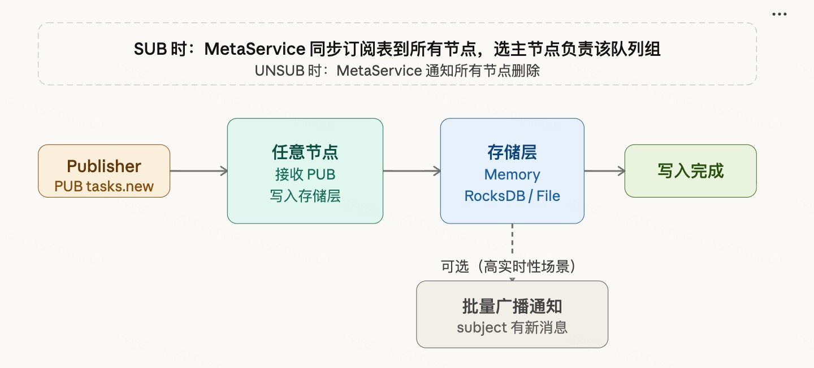
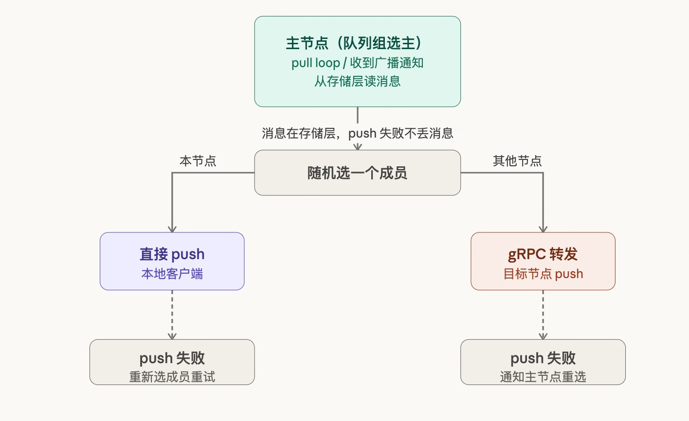

# RobustMQ NATS 队列组订阅设计

## 什么是队列组订阅

普通订阅是 1:N 的——一条消息发出去，所有订阅者都收到一份。队列组订阅是 1:1 的——一条消息发出去，队列组里只有一个成员收到。

```
普通订阅：
PUB tasks.new → Worker A 收到
               Worker B 收到
               Worker C 收到

队列组订阅（同一个 queue group）：
PUB tasks.new → Worker A 收到（随机选一个）
               Worker B 不收到
               Worker C 不收到
```

队列组本质上是在 broker 层实现了竞争消费，不需要客户端之间协调，不需要分布式锁。水平扩展只需要加一个带相同队列组名的订阅者，缩容只需要断开连接。

---

## 核心设计原则：写入与推送解耦

RobustMQ 的队列组设计与 NATS 原生实现的最大区别在于：**写入路径和推送路径完全解耦**。

NATS 原生是实时 push 模型，消息到达节点时立即做路由决策并投递。RobustMQ 采用**存储驱动的 pull-then-push 模型**：

- 写入节点只管写存储，不做任何路由决策
- 推送由队列组主节点独立驱动，从存储层读取后投递

这个设计让写入路径极度简化，同时天然解决了消息丢失问题——push 失败时消息还在存储层，不需要额外的消息恢复机制。

---

## 订阅同步

客户端发起 SUB 时，通过 MetaService 将订阅信息同步到所有节点，同时选出该队列组的主节点。

```
客户端 SUB tasks.new workers
       ↓
MetaService 同步订阅表到所有节点
同时选主：指定某个节点负责该队列组的推送
       ↓
客户端 UNSUB 时
MetaService 通知所有节点删除该订阅条目
```

**为什么在 SUB 时选主，而不是在消息到达时动态选择？**

写入时选主意味着每条消息到达都要做一次全局路由决策——查路由表、选成员、判断本地还是远端。SUB 时选主把这个决策提前到订阅建立阶段，做一次，写入路径上完全不需要路由逻辑，只需要查"这个队列组的主节点是谁"，直接转发。

RobustMQ 的选主和故障切换能力已有现成实现，这里直接复用，不是新增复杂度。

---

## 写入路径


```
Publisher PUB tasks.new
       ↓
消息到达任意节点
       ↓
写入存储层（Memory / RocksDB / File Segment）
       ↓
返回写入成功

可选（高实时性场景）：
批量广播通知 → subject 有新消息
```

写入节点不需要知道订阅者在哪，不需要做任何投递判断。写入即完成，性能最优。


广播通知是可选的加速手段，只携带 subject 名，不携带消息内容，批量发送控制性能开销。不开启广播通知时，推送依靠主节点的定时 pull loop 驱动，大多数场景够用。

---

## 推送路径

推送由队列组主节点独立驱动。

**触发方式（两种，互为补充）：**

- **定时 pull loop（主路径）**：主节点持续轮询存储层，有消息立即处理，无消息等待 20-50ms 后再拉。实现简单，性能稳定可预期。
- **广播通知唤醒（加速通道）**：写入节点广播"有新消息"信号，主节点收到后提前唤醒，不等 pull 间隔。适合低频写入的低延迟场景。

两种方式覆盖全频率区间：低频写入靠通知及时触达，高频写入 pull loop 本来就一直在跑，通知的边际价值不大。



**投递方式（两种，按成员位置选择）：**

```
主节点读到消息
       ↓
从队列组成员中随机选一个
       ↓
成员在本节点 → 直接 push 给客户端
成员在其他节点 → gRPC 转发给目标节点 → 目标节点 push 给客户端
```

**push 失败处理：**

- 本地 push 失败：重新选成员重试
- gRPC 转发后目标节点 push 失败：目标节点通知主节点，主节点重新选成员

消息始终在存储层，push 失败不丢消息，重新选成员重试即可。

---

## 队列组生命周期

队列组不需要显式创建或销毁。第一个带队列组名的 SUB 到来时，组自动存在，MetaService 完成选主；最后一个成员 UNSUB 时，组自动消失，主节点停止 pull loop。

成员动态加入和退出对消息投递完全透明——新成员加入立刻参与分配，成员退出后主节点自动从剩余成员中选择投递目标。

---

## 连接断开的处理

客户端连接断开（主动断开或心跳超时）时：

```
Server 检测到连接断开
       ↓
通过 MetaService 通知所有节点删除该订阅
       ↓
如果断开的是队列组主节点的客户端
→ 从剩余成员中重新选主
如果断开的是普通成员
→ 主节点下次选成员时自动跳过
```

由于消息在存储层持久化，断线窗口期的消息不会丢失，重连后通过正常 pull loop 继续投递。

---

## 设计总结

| 维度 | 设计选择 | 原因 |
|---|---|---|
| 选主时机 | SUB 时选主 | 写入路径零决策开销 |
| 写入路径 | 只写存储，不路由 | 极简，性能最优 |
| 推送触发 | pull loop + 广播通知 | 覆盖全频率区间 |
| 跨节点投递 | gRPC 转发 | 复用现有内部通信能力 |
| 失败处理 | 重选成员重试 | 消息在存储层，不丢失 |
| 选主/故障切换 | 复用 RobustMQ 现有能力 | 不引入新复杂度 |

核心思想：把 NATS 的实时 push 模型改造成存储驱动的 pull-then-push 模型，写入和推送彻底解耦，写入路径极简，推送路径由主节点独立负责，失败有兜底。