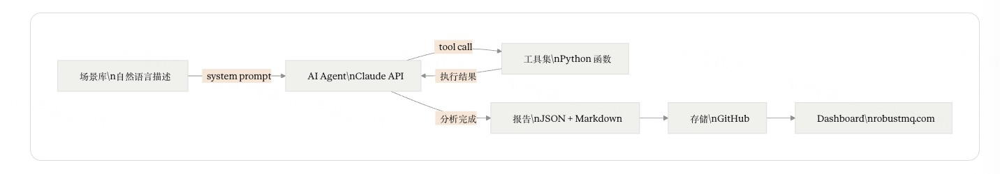

# RobustMQ Test Agent 技术设计文档

RobustMQ Test Agent 是一个专为 RobustMQ 定制的 AI 测试 Agent，用来解决 RobustMQ 自身的质量问题。通过 AI Agent 驱动混沌测试的完整闭环——自动部署集群、注入故障、执行多语言 SDK 测试、分析日志、生成报告——持续不间断地验证 RobustMQ 的稳定性和协议兼容性。

---

## 背景

RobustMQ 是一个多协议消息中间件，目标是覆盖 MQTT、mq9 等主流协议，定位生产级使用。

消息中间件的质量门槛极高。用户评估一个消息中间件，第一个问题不是功能够不够，而是敢不敢用：消息会不会丢、节点挂了能不能恢复、客户端 SDK 换个版本还能不能正常连。这些问题靠单元测试和常规集成测试覆盖不到，必须在真实的混乱条件下持续验证。

对 RobustMQ 而言，**协议兼容性是最大的风险，也是最大的竞争力**。支持多协议意味着需要兼容各语言、各版本的客户端 SDK。任何一个 SDK 版本出现不兼容，用户就无法平滑接入，项目的可信度直接受损。如何低成本、系统化地保证协议兼容性，是 RobustMQ 能否存活和持续成长的核心命题。

---

## 现有测试的局限

RobustMQ 目前有单元测试和基础集成测试，覆盖核心逻辑的正确性。但存在以下盲区：

**协议兼容性未系统覆盖**：不同语言、不同版本的客户端 SDK 与 broker 的兼容性没有持续验证机制，兼容问题只能靠用户踩坑后反馈。

**故障场景未覆盖**：broker 宕机、进程 kill、节点重启过程中的消息投递行为没有系统化测试。

**长时间运行问题未覆盖**：内存泄漏、连接池耗尽、消息积压后的行为，只有长时间运行才能暴露，当前缺乏这类验证机制。

**组合场景未覆盖**：单个异常容易测，多个异常同时发生时的系统行为几乎没有覆盖。

**问题发现周期过长**：传统开源社区依赖用户发现问题、提 issue、等待修复，这个流程往往以月计。对一个早期项目，这个节奏太慢，无法支撑快速迭代。

---

## 目标

基于 AI 构建一套专为 RobustMQ 定制的全自动化混沌测试系统。有三个核心目标：

**第一，自动发现问题，加速修复。** 用 AI 替代人工完成测试执行、日志分析、问题定位的全流程，极大压缩从问题出现到被发现的时间。第一阶段聚焦代码 bug、逻辑错误、可优化空间；第二阶段深入挖掘安全问题；第三阶段引入 Claude Code 对源码进行深度静态分析，直接辅助修复。

**第二，公开测试过程，建立社区信任。** 所有测试记录、分析报告、问题修复状态完全公开，包括失败记录。我们不怕暴露问题，怕的是问题存在却没人看到、没人修复。完全透明的测试过程，是建立社区信任最直接的方式，比任何文档和声明都有说服力。

**第三，系统化解决协议兼容性问题。** 引入多语言、多版本 SDK 矩阵，由 AI Agent 自动执行覆盖，自动识别兼容问题并归因。用低成本的方式持续保证 RobustMQ 对各主流客户端的兼容性。

这套系统本身完全由 Claude Code 实现。它属于非核心系统，代码逻辑以工具函数为主，是 Claude Code 擅长的场景，不需要消耗核心开发精力。

---

## 系统设计

### 核心思路

本质上，这是**混沌工程的思路，全流程 AI 自动化**。

混沌工程的核心是：主动构造故障，观察系统行为，发现隐藏问题。传统混沌工程需要人工设计场景、人工分析结果、人工撰写报告，成本高，难以持续。这套系统用 AI Agent 替代人工完成这三个环节，让混沌测试可以不间断地持续运行。

系统由 **AI Agent + 工具集** 构成。AI Agent 是大脑，读取场景描述，自主决定执行顺序，根据中间结果动态调整策略，最终生成报告。工具集是手脚，执行具体的集群操作、故障注入、日志收集。没有 hardcode 的执行流程，没有 Python 调度逻辑，AI 驱动一切。

实现上极简：Claude API tool use + 若干 Python 工具函数。不引入 LangGraph、CrewAI 等 Agent 框架——这些框架解决多 agent 协作问题，本系统是单 agent + 固定工具集，直接用原生 tool use 更简单、更可控。

### 整体架构

AI Agent 读取场景描述，调用工具集执行操作，观察返回结果，决定下一步动作，最终生成报告。整个过程无人工干预，持续不间断运行。

### AI Agent

使用 Claude API tool use 实现。输入是场景的自然语言描述，Agent 据此自主完成：

- 决定本轮部署几个节点、使用什么配置
- 选择注入哪种故障、在什么时机注入
- 选择使用哪个语言、哪个版本的 SDK 运行测试客户端
- 判断消息投递结果是否符合预期
- 收集日志、分析异常、定位可疑原因
- 生成结构化测试报告

Agent 可以多轮调用工具，根据中间结果动态调整。例如发现某个指标异常时，Agent 可以自主决定是换 SDK 版本重跑以确认是兼容问题，还是深入分析日志定位 broker 端原因。

### 工具集

| 工具 | 功能 |
|------|------|
| `cluster_start(nodes, config)` | 启动指定节点数的 RobustMQ 集群 |
| `cluster_stop()` | 销毁当前集群，释放资源 |
| `inject_fault(type, target, params)` | 注入故障：kill / 网络延迟 / 丢包 / 磁盘压力 |
| `run_client(protocol, sdk_lang, sdk_version, scenario)` | 运行指定语言和版本的测试客户端，返回消息对账结果 |
| `get_logs(level, time_range)` | 获取 broker 日志，按级别和时间过滤 |
| `get_metrics(node)` | 获取集群指标：连接数、消息速率、内存使用等 |
| `push_report(report)` | 将测试报告推送到 GitHub 公开仓库 |

工具函数只负责执行，不包含业务逻辑。所有判断和决策在 Agent 侧完成。

### 报告格式

每次测试生成结构化报告，包含：

- 测试时间、场景名称、协议、SDK 语言和版本、集群配置
- 执行过程：Agent 的工具调用序列及每步结果
- 验证结果：消息发送总数、接收总数、丢失数、重复数
- 问题描述：发生了什么现象，在哪个阶段出现
- 初步分析：可疑原因、需要排查的代码路径
- 严重程度：P0 / P1 / P2
- 原始日志：完整 broker 日志

报告以 JSON + Markdown 双格式输出，推送到 GitHub 公开仓库，作为 Dashboard 的数据源。

---

## 协议兼容性测试

协议兼容性是本系统的核心关注点。RobustMQ 支持多协议，需要兼容各语言、各版本的客户端 SDK。任何一个兼容性问题都会直接影响用户接入体验。

### 多语言多版本 SDK 矩阵

AI Agent 在执行测试时，系统化地覆盖不同语言和版本的 SDK 组合：

**MQTT SDK 覆盖范围**

| 语言 | SDK | 覆盖版本 |
|------|-----|----------|
| Python | paho-mqtt | 1.x / 2.x |
| Go | eclipse/paho.mqtt.golang | 1.x |
| Rust | rumqttc | 0.2x |
| Java | Eclipse Paho Java | 1.x |
| JavaScript | mqtt.js | 4.x / 5.x |
| C | Eclipse Paho C | 1.x |

**mq9 SDK 覆盖范围**

随 mq9 协议实现推进，持续增加各语言官方 SDK 的覆盖。

### 兼容性问题归因

同一场景在不同 SDK 语言和版本下执行，AI Agent 对比结果，自动识别三种问题模式：

| 现象 | 归因 |
|------|------|
| 相同场景，不同 SDK 结果不一致 | 协议实现问题，broker 端行为与协议规范存在偏差 |
| 特定 SDK 版本失败，其他版本正常 | SDK 版本兼容问题，需要针对该版本做适配 |
| 所有 SDK 均失败 | broker 端问题，与客户端实现无关 |

---

## 场景库设计

场景用自然语言描述，AI Agent 读懂后自主执行，不需要脚本，不需要流程图。场景库随协议支持扩展持续增加。

### MQTT

| 场景 | 类型 | 描述 |
|------|------|------|
| QoS 0/1/2 正常收发 | 基础 | 验证各 QoS 级别消息投递正确性 |
| 大消息收发（1MB+） | 基础 | 验证大包处理能力 |
| 高并发连接（1000+） | 基础 | 验证连接管理稳定性 |
| 持久会话重连 | 基础 | 断开重连后离线消息是否正确补发 |
| broker 节点 kill -9 | 故障 | 消息传输中途进程被强杀，验证消息完整性 |
| broker 节点正常重启 | 故障 | 重启过程中消息投递行为 |
| 网络延迟注入 | 故障 | 高延迟下 QoS 1/2 重传逻辑是否正确 |
| 网络丢包注入 | 故障 | 丢包场景下消息可靠性 |
| 大量连接同时断开 | 客户端异常 | 1000 个连接同时断开对 broker 的冲击 |
| 重连风暴 | 客户端异常 | 断开后立即重连，反复循环 |
| 慢消费者 | 客户端异常 | 消费速率远低于生产速率，验证积压行为 |
| 发布中途 broker 宕机 + 重连 | 组合 | 宕机恢复后 QoS 1/2 消息是否补发 |
| 慢消费者 + broker 重启 | 组合 | 积压消息在重启后是否完整保留 |

### mq9

| 场景 | 类型 | 描述 |
|------|------|------|
| 基础 Mailbox 创建和销毁 | 基础 | Mailbox 生命周期管理正确性 |
| 高/普通/低优先级消息收发 | 基础 | 三级优先级投递顺序验证 |
| TTL 到期 Mailbox 自动清理 | 基础 | 过期 Mailbox 是否正确回收 |
| 多 Agent 并发写同一 Mailbox | 基础 | 并发写入下消息完整性 |
| PUBLIC.LIST 订阅发现 | 基础 | 系统 Mailbox 列表维护正确性 |
| broker 节点 kill -9 | 故障 | 强杀后 Mailbox 数据是否保留 |
| broker 节点正常重启 | 故障 | 重启后未消费消息是否完整 |
| 网络延迟注入 | 故障 | 高延迟下消息投递行为 |
| 大量 Mailbox 同时创建 | 客户端异常 | 高并发创建对 broker 的冲击 |
| Agent 发送后立即销毁 Mailbox | 客户端异常 | 未消费消息的处理行为 |
| 慢消费 Agent + 消息积压 | 客户端异常 | 积压场景下优先级队列行为 |
| broker 重启 + 高优先级消息未消费 | 组合 | 重启后优先级顺序是否保持 |
| 多 Agent 并发写 + 网络抖动 | 组合 | 双重压力下消息完整性 |

---

## Quality Dashboard

所有测试记录通过官网公开展示，不做任何过滤，包括失败记录和尚未修复的问题。

我们的态度是：不怕暴露问题，怕的是问题存在却没人看到、没人修复。公开失败记录，反而是质量认真对待的证明。一个已知问题从发现到修复的完整过程都在上面，这比任何质量声明都有说服力。

**列表页**：时间、场景名、协议、SDK 语言和版本、状态（pass/fail）、一句话摘要，支持按协议、状态、时间筛选。

**详情页**：完整测试背景、Agent 执行过程、消息投递验证结果、原始 broker 日志、AI 分析报告、问题修复状态（open / fixed in vX.X.X）。

数据存储在 GitHub 公开仓库，官网静态读取，零后端。

---

## 演进规划

**第一阶段：代码质量**

聚焦发现代码 bug、逻辑错误、可优化空间。AI Agent 通过混沌测试触发问题，分析日志定位原因，生成可操作的修复建议。目标是快速建立 RobustMQ 的基础稳定性。

**第二阶段：安全问题**

在基础稳定性建立后，引入安全场景：异常输入、边界条件、协议攻击面。AI Agent 深入挖掘潜在安全问题。

**第三阶段：代码深度分析**

引入 Claude Code 对 RobustMQ 源码进行持续的静态分析，生成收敛的、不过度的分析报告，发现逻辑错误和可优化空间，并直接辅助修复。进一步压缩问题发现到修复的时间，让整个研发循环更快。

---

## 总结

这套系统本质上是混沌工程的思路，全流程 AI 自动化。

在 AI 时代，基础设施项目的竞争不只是技术架构的竞争，也是谁能在合适的位置用好 AI 的竞争。RobustMQ 的协议兼容性挑战、质量验证挑战，恰好是 AI 能够低成本系统化解决的问题。

这个项目不是 RobustMQ 的核心引擎，但会是最重要的支撑系统。它解决的是 RobustMQ 能不能被信任、能不能被规模化采用的问题。

核心价值有两点：一是**加速产品成长**，传统开源社区问题发现到修复周期以月计，这套系统目标把它压缩到天级，AI 不间断地跑，不间断地发现问题，质量快速提升；二是**建立社区信任**，完全公开的测试记录和问题修复历史，让社区看到一个真正在认真对待质量的项目。

---

## 参考

- **TiDB TiPocket**：PingCAP 内部的自动化 chaos 测试框架，最接近本系统设计目标的开源实现，但无 AI 分析层，流程 hardcode，强依赖 Kubernetes。
- **Jepsen**：分布式系统正确性验证工具，侧重一致性验证，不侧重持续自动化运行。
- **Chaos Mesh**：K8s 原生故障注入平台，可作为工具集中故障注入的替代方案（待 RobustMQ 迁移到 K8s 部署时）。