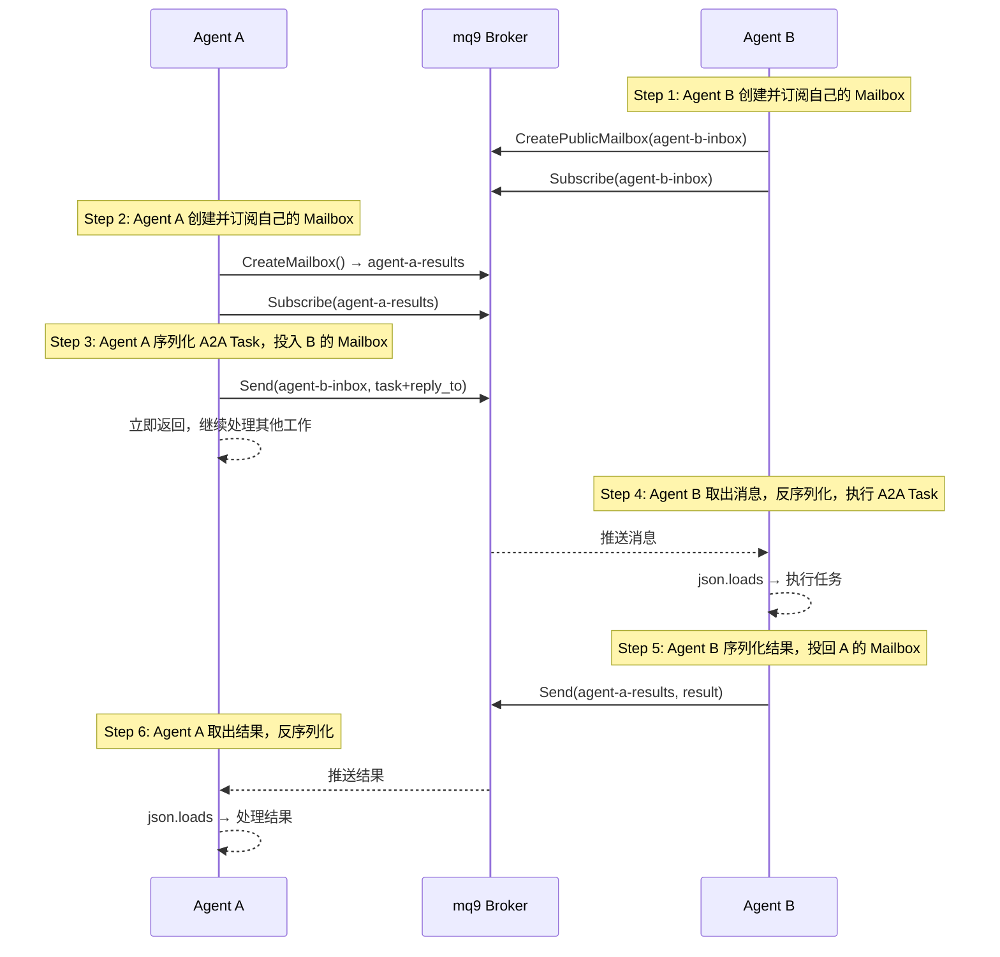

# 用 mq9 解决 A2A 异步可靠通信的问题

## A2A 是什么

AI Agent 越来越多，一个系统里往往有多个 Agent 协作：一个负责搜索、一个负责分析、一个负责生成报告。这些 Agent 可能用不同的框架构建（LangChain、CrewAI、AutoGen），运行在不同的服务器上。Agent A 想调用 Agent B，但不知道 B 在哪、能做什么、接口是什么。

**A2A（Agent2Agent）协议**是 Google 推出的标准化协议，目标是让不同框架、不同公司构建的 Agent 能够互相发现和调用。现在已经是 Linux Foundation 项目，100+ 公司支持。

三个核心概念：

**AgentCard**：每个 Agent 在固定地址（`/.well-known/agent.json`）暴露一个 JSON 文件，描述自己是谁、能做什么、怎么联系。

```json
{
  "name": "DataAnalysisAgent",
  "description": "分析数据并生成报告",
  "url": "https://agent-b.example.com",
  "version": "1.0.0",
  "skills": [
    {
      "id": "data_analysis",
      "name": "Data Analysis",
      "description": "分析输入数据，返回洞察报告"
    }
  ]
}
```

**Task**：标准化的任务对象，定义了"发任务、追踪进度、拿结果"的格式。

**HTTP 通信**：Agent A 读取 Agent B 的 AgentCard，然后用标准的 HTTP + JSON-RPC 给 B 发 Task。


---

## A2A 的异步盲区

A2A 解决了 Agent 互操作的问题，但有一个没有解决好的场景：**接收方不在线**。

A2A 支持三种交互模式：

- **同步 request/response**：发出去等结果，Agent B 不在线直接失败
- **SSE streaming**：适合长任务进度推送，连接断了消息就没了
- **push notification**：需要 Agent B 提供可达的回调地址，B 离线同样失败

三种模式有一个共同假设：**接收方必须在线且可达**。

生产环境里这是真实问题：Agent 重启、网络抖动、任务积压是常态。A2A 没有内置消息持久化机制，消息可靠性完全依赖上层自己处理。

除此之外：

- **没有优先级**：紧急任务和普通任务一视同仁
- **没有广播**：一个任务发给多个 Agent，需要逐个 HTTP 调用
- **网络隔离**：企业内网的 Agent 无法暴露公网 HTTP 地址，跨网络协作很困难

---

## mq9 是什么

mq9 是一个专为 Agent 异步通信设计的消息协议，核心是 **Mailbox（邮箱）** 语义。

每个 Agent 有一个 Mailbox，其他 Agent 往 Mailbox 里投消息，消息持久化存储，接收方随时来取。发送方和接收方不需要同时在线。

关键特性：

- **持久化**：消息投入后存储在 broker，TTL 到期前不会丢失
- **离线不丢**：接收方离线期间的消息全部保留，上线后取走
- **优先级**：支持 critical / urgent / normal 三级，紧急消息优先处理
- **一对多**：多个 Agent 订阅同一个 Mailbox，一次投递所有人收到
- **网络灵活**：只需要能连到同一个 broker，不需要双方网络直接可达

mq9 基于 NATS 协议实现，提供 Python、Go、Java、Rust、JavaScript、C# 六种语言 SDK。

---

## 用 mq9 补上 A2A 的空白

把 mq9 引入 A2A 系统，核心思路是：**用 mq9 替换 A2A 的 HTTP 传输层**。

```
A2A 原来的方式：
Agent A ──HTTP──▶ Agent B（B 必须在线）

加入 mq9 之后：
Agent A ──投递──▶ mq9 Mailbox ──取出──▶ Agent B（B 何时在线都行）
```

A2A 负责定义任务格式（Task）和能力发现（AgentCard），mq9 负责消息的可靠异步传递。

**现在就能用**。不需要等任何标准化，唯一需要做的是把 A2A Task 序列化成 JSON 投入 mq9，接收方取出后反序列化执行。

---

## 动手：完整示例

### 安装

```bash
pip install langchain-mq9 langchain-openai
```

### 通信流程



### agent_b.py

Agent B 独立运行，启动时创建自己的 Mailbox 并订阅，持续等待任务。

```python
# agent_b.py
import asyncio
import json
from langchain_mq9 import Mq9Toolkit, CreatePublicMailboxTool
from langchain.agents import AgentType, initialize_agent
from langchain_openai import ChatOpenAI
from robustmq.mq9 import Client

SERVER = "nats://demo.robustmq.com:4222"

async def main():
    toolkit = Mq9Toolkit(server=SERVER)
    tools = toolkit.get_tools()
    llm = ChatOpenAI(model="gpt-4o-mini")

    # Step 1: Agent B 创建自己的 Mailbox
    await CreatePublicMailboxTool(server=SERVER)._arun(
        name="agent-b-inbox",
        ttl=86400,
        desc="Agent B 的任务队列"
    )
    print("Agent B: Mailbox 创建完成，开始订阅 agent-b-inbox...")

    agent_b = initialize_agent(
        tools, llm,
        agent=AgentType.OPENAI_FUNCTIONS,
        verbose=True,
    )

    # Step 2: 订阅自己的 Mailbox，消息到达时回调触发
    # Step 4: 收到消息，反序列化，执行 A2A Task
    # Step 5: 执行完成，序列化结果，投回 reply_to 指定的 Mailbox
    async def on_message(msg):
        task = json.loads(msg.data)
        print(f"Agent B: 收到任务 {task['task_id']}")

        agent_b.invoke({
            "input": f"执行 {task['type']} 任务，数据是 {task['payload']}，"
                     f"把结果用 json.dumps 序列化后投入 mail_id 为 {task['reply_to']} 的 Mailbox，优先级 normal"
        })

    async with Client(SERVER) as client:
        await client.subscribe("agent-b-inbox", on_message)
        print("Agent B: 订阅成功，等待任务...")
        await asyncio.sleep(float("inf"))  # 持续运行

asyncio.run(main())
```

### agent_a.py

Agent A 独立运行，创建自己的结果 Mailbox，投递任务后继续处理其他工作，异步取结果。

```python
# agent_a.py
import asyncio
import json
from langchain_mq9 import Mq9Toolkit, CreateMailboxTool
from langchain.agents import AgentType, initialize_agent
from langchain_openai import ChatOpenAI

SERVER = "nats://demo.robustmq.com:4222"

async def main():
    toolkit = Mq9Toolkit(server=SERVER)
    tools = toolkit.get_tools()
    llm = ChatOpenAI(model="gpt-4o-mini")

    agent_a = initialize_agent(
        tools, llm,
        agent=AgentType.OPENAI_FUNCTIONS,
        verbose=True,
    )

    # Step 2: Agent A 创建自己的结果 Mailbox
    result_mailbox = await CreateMailboxTool(server=SERVER)._arun(ttl=3600)
    print(f"Agent A: 结果 Mailbox 创建完成 → {result_mailbox}")

    # Step 3: 序列化 A2A Task，投入 Agent B 的 Mailbox
    a2a_task = {
        "task_id": "task-001",
        "type": "data_analysis",
        "payload": "dataset_v1: [record_1, record_2, record_3]",
        "reply_to": result_mailbox      # 告知 Agent B 结果发往哪里
    }
    agent_a.invoke({
        "input": "向 mail_id 为 agent-b-inbox 的 Mailbox 发送 normal 优先级消息：" + json.dumps(a2a_task, ensure_ascii=False)
    })
    print("Agent A: Task 已投递，继续处理其他工作...")
    print("（Agent B 此刻是否在线无所谓，消息已持久化）")

    # 继续处理其他工作...
    await asyncio.sleep(10)

    # Step 6: 异步取结果，反序列化
    agent_a.invoke({
        "input": f"读取 mail_id 为 {result_mailbox} 的 Mailbox 中的消息，用 json.loads 解析后输出分析结果"
    })

asyncio.run(main())
```

### 运行

先启动 Agent B，再启动 Agent A：

```bash
# 终端 1：启动 Agent B，创建 Mailbox，订阅等待
python agent_b.py

# 终端 2：启动 Agent A，投递任务，异步取结果
python agent_a.py
```

Agent B 不在线时，Agent A 投递的任务会持久化在 Mailbox 里，等 Agent B 启动后自动取走。

---

## 优先级：紧急任务插队

A2A 没有内置优先级机制。用 mq9，critical 消息始终在 normal 和 low 之前被处理，不需要维护多个队列。

```python
# 普通任务
agent_a.invoke({
    "input": f"向 'agent-b-inbox' 发送 normal 优先级消息：{json.dumps({'task_id': 'task-002', 'type': 'batch_report'})}"
})

# 紧急任务，无论发送顺序，Agent B 总是先处理这条
agent_a.invoke({
    "input": f"向 'agent-b-inbox' 发送 critical 优先级消息：{json.dumps({'task_id': 'task-003', 'type': 'incident_analysis', 'payload': '支付系统异常'})}"
})
```

---

## 广播：一个 Task 发给多个 Agent

```python
# 创建广播频道
await CreatePublicMailboxTool(server=SERVER)._arun(
    name="all-agents-broadcast",
    ttl=86400
)

# 投递一次，所有订阅了这个 Mailbox 的 Agent 都能收到
agent_a.invoke({
    "input": f"向 'all-agents-broadcast' 发送 normal 优先级消息：{json.dumps({'type': 'config_update', 'payload': '系统配置已更新，请重新加载'})}"
})
```

---

## 跨网络协作

A2A 的 HTTP 通信要求双方网络可达，企业内网 Agent 无法直接暴露公网地址。

mq9 的方式不同：**双方只需要能连到同一个 broker**。

```
# 公网场景
SERVER = "nats://demo.robustmq.com:4222"
任何能访问公网的 Agent 都能通过这个 broker 互通

# 企业内网场景
SERVER = "nats://192.168.1.100:4222"
内网部署 RobustMQ，所有内部 Agent 通过内网 broker 互联
数据不出内网，满足安全合规要求

# 混合场景
内网 broker ──federation──▶ 公网 broker
内外网 Agent 通过 federation 打通，内网数据受控流出
```

broker 地址可以是公网，也可以是企业自建内网，切换只需要改一个配置。

---

## 与 A2A 原生方式的对比

|  | A2A 原生 HTTP | A2A + mq9 |
|---|---|---|
| 接收方离线 | Task 丢失 | 消息持久化，等待接收方上线 |
| 发送方阻塞 | 等待响应 | 投完即走，不阻塞 |
| 优先级 | 无内置支持 | critical / urgent / normal 自动保序 |
| 广播 | 逐个 HTTP 调用 | 多 Agent 订阅同一 Mailbox |
| 网络隔离 | 要求双方可达 | 只需连到同一 broker |
| 网络抖动 | 请求失败需重试 | 消息已持久化，不受影响 |

---

## 现在的局限

这套方案已经能解决问题，有两处需要自己处理：

**A2A Task 需要手动序列化/反序列化**：把 Task 对象 `json.dumps()` 投入 mq9，接收方 `json.loads()` 取出，这一层目前没有封装好的库，需要自己写。

**mail_id 需要带外传递**：Agent B 的 Mailbox 地址目前需要提前约定，没有自动发现机制。

---

## 下一步：原生集成

根本的解法是在 A2A AgentCard 里加入 `mq9_addr` 字段：

```json
{
  "name": "DataAnalysisAgent",
  "url": "https://agent-b.example.com",
  "mq9_addr": "agent-b-inbox",
  "version": "1.0.0"
}
```

支持 mq9 的 Agent 读到 AgentCard，自动走异步通道。不支持的 Agent 忽略这个字段，降级走 HTTP，完全向后兼容。

这个字段一旦进入 A2A 规范，mq9 就成为 A2A 生态的标准异步通信层。这是我们正在推动的方向。

---

## 总结

A2A 解决了 Agent 互操作的问题，但在异步可靠通信上有明显盲区。mq9 填补了这个空白：消息持久化、离线不丢、优先级保序、跨网络协作。

两者结合不需要等待任何标准化，今天就可以用。A2A 负责能力发现和任务格式，mq9 负责消息的可靠传递。

---

## 相关资源

- A2A 协议：[github.com/a2aproject/A2A](https://github.com/a2aproject/A2A)
- mq9 协议规范：[docs/mq9-protocol.md](https://github.com/robustmq/robustmq-sdk/blob/main/docs/mq9-protocol.md)
- langchain-mq9：[github.com/robustmq/robustmq-sdk/tree/main/langchain-mq9](https://github.com/robustmq/robustmq-sdk/tree/main/langchain-mq9)
- RobustMQ：[github.com/robustmq/robustmq](https://github.com/robustmq/robustmq)
- Demo server：`nats://demo.robustmq.com:4222`（无需本地部署，直接连接测试）