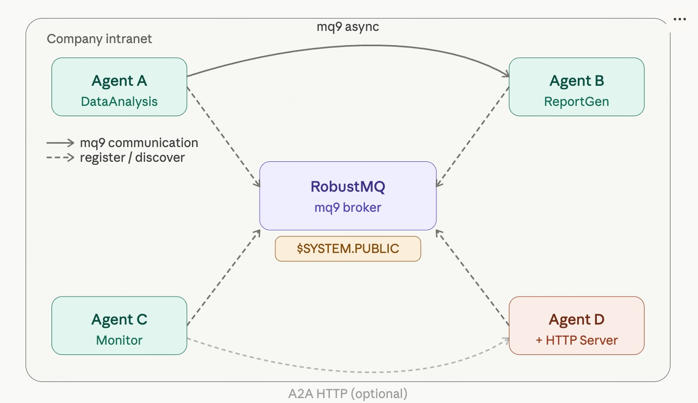
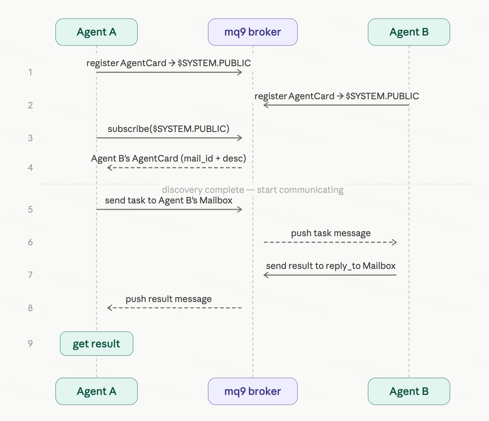

# 用 mq9 给 A2A 补上 Agent 发现和异步通信能力

## 背景

A2A（Agent2Agent）是 Google 推出的开放协议，目标是让不同框架、不同公司构建的 Agent 能够互相发现和调用。现在已经是 Linux Foundation 项目，100+ 公司支持。

A2A 的标准流程是这样的：

1. Agent 启动一个 HTTP Server，在 `/.well-known/agent.json` 暴露自己的 AgentCard
2. 其他 Agent 通过 HTTP 拉取 AgentCard，发现对方的能力和地址
3. 通过 HTTP 发送 Task，同步等待结果

这套机制解决了 Agent 互操作的问题，但有两个局限：

**发现依赖 HTTP**：每个 Agent 必须有一个可达的 HTTP 地址。内网 Agent 要被发现，网络必须打通；Agent 不在线，就无法被发现。没有一个标准的"我怎么找到有哪些 Agent"的机制，地址需要提前知道或带外传递。

**通信是同步的**：A2A 的 HTTP 调用要求接收方在线。接收方重启、网络抖动、任务积压，消息就丢了。

mq9 刚好能补上这两个空白，而且没有做多余的事。

---

## mq9 做了什么

mq9 是一个专为 Agent 异步通信设计的消息协议，核心概念是 Mailbox。每个 Agent 有一个 Mailbox，消息持久化存储，发送方和接收方不需要同时在线。

对 A2A 来说，mq9 补充了两件事：

**Agent 发现**：Agent 启动时把自己的 AgentCard 投入一个公共 Mailbox，其他 Agent 订阅这个 Mailbox 就能发现所有已注册的 Agent。不需要 HTTP Server，不需要注册中心，只需要连到同一个 mq9 broker。

**异步通信**：发现对方之后，可以选择走 mq9 异步通道，而不是 HTTP 同步调用。消息持久化，接收方离线也不丢。

这两件事 mq9 本身已经具备，没有额外开发。

---

## 在公司内部署

在公司内网部署一个 RobustMQ，就有了完整的 Agent 基础设施：



所有 Agent 只需要连接到这个 broker，不需要互相知道地址，不需要暴露 HTTP 端口。

---

## Agent 注册

Agent 启动时，创建一个公开 Mailbox，`name` 是自己的 mq9 地址，`desc` 是 A2A AgentCard 的 JSON 序列化。一行搞定注册——`$SYSTEM.PUBLIC` 是 broker 内置的系统 Mailbox，所有 `public=True` 的 Mailbox 创建后自动进入，无需额外操作。

```python
import json
from robustmq.mq9 import Client

BROKER = "nats://robustmq.internal:4222"

agent_card = {
    "name": "DataAnalysisAgent",
    "url": "https://agent-b.internal",  # HTTP 地址，可选
    "version": "1.0.0",
    "skills": [
        {
            "id": "analyze",
            "name": "Analyze Data",
            "description": "分析数据，返回洞察报告"
        }
    ]
}

async def register():
    async with Client(BROKER) as client:
        # public=True：自动注册到 $SYSTEM.PUBLIC
        # name：其他 Agent 用这个名字给你发消息
        # desc：AgentCard JSON，其他 Agent 订阅 $SYSTEM.PUBLIC 时读取
        await client.create(
            ttl=86400,
            public=True,
            name="data-analysis-agent",
            desc=json.dumps(agent_card)
        )
        print("Agent 注册完成，mq9 地址：data-analysis-agent")
```

---

## Agent 发现：订阅 $SYSTEM.PUBLIC

其他 Agent 订阅 `$SYSTEM.PUBLIC`，实时获取所有已注册的 Agent。mq9 的 store-first 特性确保订阅后能收到所有历史注册的 Agent，不会错过在自己之前启动的 Agent。

```python
async def discover_agents():
    async with Client(BROKER) as client:
        agents = {}

        async def on_agent_registered(msg):
            # desc 字段就是 AgentCard JSON
            card = json.loads(msg.desc)
            # mail_id 就是 Agent 的 mq9 地址，直接用来发消息
            mq9_addr = msg.mail_id
            agents[mq9_addr] = card
            print(f"发现 Agent: {card['name']}")
            print(f"  mq9 地址: {mq9_addr}")
            print(f"  技能: {[s['name'] for s in card['skills']]}")
            if "url" in card:
                print(f"  HTTP 地址: {card['url']}")

        await client.subscribe("$SYSTEM.PUBLIC", on_agent_registered)
        await asyncio.sleep(2)
        return agents
```

---

## 通信方式：Agent 自己决定

发现对方之后，Agent 手里有两个地址：

- **mail_id**：发布者投 AgentCard 时，消息天然携带发布者的 mail_id，收到方直接就知道对方的 mq9 地址
- **url**：AgentCard 里的 A2A 标准 HTTP 地址（可选，Agent 可以不启动 HTTP Server）

走哪个通道，Agent 自己决定。两个选项：

**走 mq9 异步通道**：不需要对方在线，消息持久化，适合任务处理时间长、或者不确定对方是否在线的场景。

```python
async def send_task_via_mq9(sender_mail_id: str, target_mail_id: str, task: dict):
    async with Client(BROKER) as client:
        task["reply_to"] = sender_mail_id  # 告知对方结果发回哪里
        await client.send(
            target_mail_id,
            json.dumps(task).encode(),
            priority=Priority.NORMAL
        )
        print("任务已投递，继续处理其他工作")
```

**走 A2A 标准 HTTP**：同步调用，需要对方在线，适合需要立即拿到结果的场景。

```python
from a2a.client import A2AClient
import httpx

async def send_task_via_http(url: str, message: str):
    async with httpx.AsyncClient() as http_client:
        client = await A2AClient.get_client_from_agent_card_url(
            http_client, url
        )
        response = await client.send_message(message)
        print(f"收到响应: {response}")
```

两种方式提供了不同的选择，不是替代关系。Agent 根据自己的场景决定用哪个，也可以同时支持两种。

---

## 完整流程



---

## 两种模式对比

| | A2A 标准 HTTP | A2A + mq9 |
|---|---|---|
| 发现方式 | 提前知道 HTTP 地址 | 订阅公共 Mailbox，自动发现 |
| 需要 HTTP Server | 是 | 否（可选） |
| 接收方离线 | 消息丢失 | 消息持久化等待 |
| 内网部署 | 需要网络可达 | 只需连到同一 broker |
| 通信方式 | 同步 | 异步 |

---

## 定位说明

mq9 不是 A2A HTTP 的替代，是一个补充选项。

Agent 可以同时支持两种方式——有 HTTP Server 的走标准 A2A，没有的走 mq9。调用方根据 AgentCard 里的字段自动选择，完全向后兼容，现有的 A2A 实现不需要任何改动。

在公司内网场景里，部署一个 RobustMQ，所有内部 Agent 通过 mq9 互联，不需要每个 Agent 都暴露 HTTP 端口，也不需要维护一个注册中心。mq9 刚好够用，没有多做多余的事。

---

## 相关资源

- A2A 协议：[github.com/a2aproject/A2A](https://github.com/a2aproject/A2A)
- mq9 协议规范：[docs/mq9-protocol.md](https://github.com/robustmq/robustmq-sdk/blob/main/docs/mq9-protocol.md)
- RobustMQ：[github.com/robustmq/robustmq](https://github.com/robustmq/robustmq)
- Demo server：`nats://demo.robustmq.com:4222`