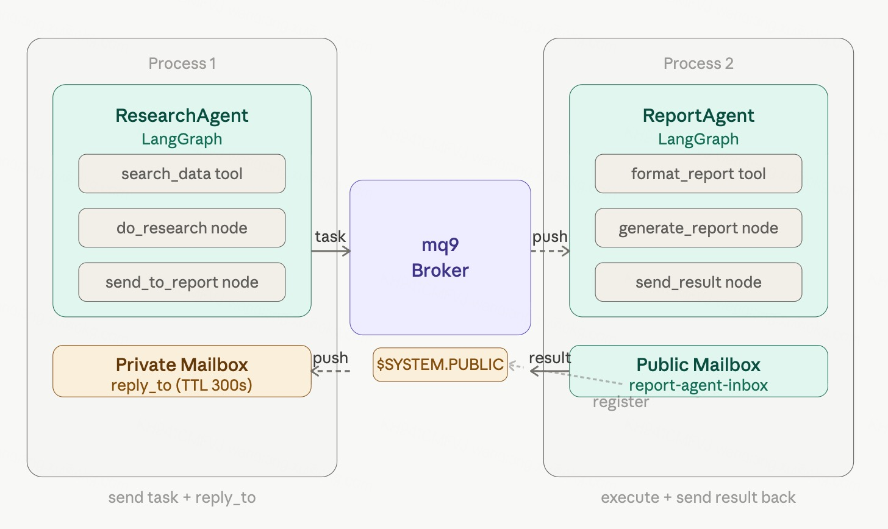

# 用 mq9 连接两个 LangGraph Agent

## 问题

LangGraph 很好地解决了单个 Agent 内部的逻辑编排——工具调用、状态管理、条件分支都在图里处理，清晰可控。

但多个 Agent 之间怎么协作？

常见的做法是放在同一个进程里，用 Supervisor 模式调度。这在简单场景下够用，但有一个根本局限：**所有 Agent 必须在同一个进程里，无法跨服务部署**。

生产环境里，ResearchAgent 和 ReportAgent 往往是独立的服务，可能运行在不同的机器上，有各自的资源配置和扩缩容策略。这时候 Supervisor 模式就不够用了。

mq9 解决的就是这个问题——让两个独立进程的 LangGraph Agent 通过 Mailbox 异步通信，完全解耦。

---

## 架构



**LangGraph 负责单个 Agent 内部的逻辑**：工具调用、推理、状态流转。

**mq9 负责 Agent 之间的消息传递**：跨进程、异步、离线不丢。

---

## 安装

```bash
pip install langgraph langchain-openai langchain-mq9
```

---

## ReportAgent

ReportAgent 是服务提供方，启动时注册到 `$SYSTEM.PUBLIC`，持续监听任务 Mailbox，收到任务后用 LangGraph 处理，结果发回给发送方。

```python
# report_agent.py
import asyncio
import json
from typing import TypedDict, Annotated
import operator

from langgraph.graph import StateGraph, END
from langgraph.prebuilt import create_react_agent
from langchain_openai import ChatOpenAI
from langchain_core.messages import HumanMessage
from langchain_core.tools import tool
from robustmq.mq9 import Client, Priority

SERVER = "nats://demo.robustmq.com:4222"
llm = ChatOpenAI(model="gpt-4o-mini")

# ── 工具 ──────────────────────────────────────────────────
@tool
def format_report(title: str, content: str) -> str:
    """格式化生成报告"""
    return f"# {title}\n\n## 摘要\n{content}\n\n## 结论\n分析完成。"

# ── LangGraph 图 ──────────────────────────────────────────
class ReportState(TypedDict):
    messages: Annotated[list, operator.add]
    query: str
    data: str
    report: str
    reply_to: str

inner_agent = create_react_agent(llm, [format_report])

def generate_report(state: ReportState):
    result = inner_agent.invoke({
        "messages": [HumanMessage(
            content=f"根据以下数据生成关于 '{state['query']}' 的报告：\n{state['data']}"
        )]
    })
    return {"report": result["messages"][-1].content}

async def send_result(state: ReportState):
    async with Client(SERVER) as client:
        await client.send(
            state["reply_to"],
            json.dumps({"report": state["report"]}).encode(),
            priority=Priority.NORMAL
        )
    print("ReportAgent: 报告已发回")
    return {}

graph = StateGraph(ReportState)
graph.add_node("generate", generate_report)
graph.add_node("send", send_result)
graph.set_entry_point("generate")
graph.add_edge("generate", "send")
graph.add_edge("send", END)
report_app = graph.compile()

# ── 主流程 ────────────────────────────────────────────────
async def main():
    async with Client(SERVER) as client:
        # 创建公开 Mailbox，name 就是地址，ResearchAgent 直接用这个名字发消息
        await client.create(
            ttl=86400,
            public=True,
            name="report-agent-inbox"
        )
        print("ReportAgent: Mailbox 已创建，监听任务中...")

        async def on_task(msg):
            task = json.loads(msg.data)
            print(f"ReportAgent: 收到任务 — {task['query']}")
            await report_app.ainvoke({
                "messages": [],
                "query": task["query"],
                "data": task["data"],
                "report": "",
                "reply_to": task["reply_to"]
            })

        await client.subscribe("report-agent-inbox", on_task)
        await asyncio.sleep(float("inf"))  # 持续运行

asyncio.run(main())
```

---

## ResearchAgent

ResearchAgent 是任务发起方，创建私有结果 Mailbox，执行 LangGraph 搜索逻辑，把结果发给 ReportAgent，然后异步等待报告。

```python
# research_agent.py
import asyncio
import json
from typing import TypedDict, Annotated
import operator

from langgraph.graph import StateGraph, END
from langgraph.prebuilt import create_react_agent
from langchain_openai import ChatOpenAI
from langchain_core.messages import HumanMessage
from langchain_core.tools import tool
from robustmq.mq9 import Client, Priority

SERVER = "nats://demo.robustmq.com:4222"
llm = ChatOpenAI(model="gpt-4o-mini")

# ── 工具 ──────────────────────────────────────────────────
@tool
def search_data(query: str) -> str:
    """搜索相关数据"""
    return f"关于 '{query}' 的数据：[数据1, 数据2, 数据3]"

# ── LangGraph 图 ──────────────────────────────────────────
class ResearchState(TypedDict):
    messages: Annotated[list, operator.add]
    query: str
    research_result: str
    reply_mailbox: str

inner_agent = create_react_agent(llm, [search_data])

def do_research(state: ResearchState):
    result = inner_agent.invoke({
        "messages": [HumanMessage(content=f"搜索并汇总：{state['query']}")]
    })
    return {"research_result": result["messages"][-1].content}

async def send_to_report(state: ResearchState):
    async with Client(SERVER) as client:
        task = {
            "query": state["query"],
            "data": state["research_result"],
            "reply_to": state["reply_mailbox"]
        }
        await client.send(
            "report-agent-inbox",
            json.dumps(task).encode(),
            priority=Priority.NORMAL
        )
    print("ResearchAgent: 已发给 ReportAgent，继续处理其他任务...")
    return {}

graph = StateGraph(ResearchState)
graph.add_node("research", do_research)
graph.add_node("send", send_to_report)
graph.set_entry_point("research")
graph.add_edge("research", "send")
graph.add_edge("send", END)
research_app = graph.compile()

# ── 主流程 ────────────────────────────────────────────────
async def main():
    async with Client(SERVER) as client:
        # 创建私有结果 Mailbox，用来接收 ReportAgent 的报告
        reply_box = await client.create(ttl=300)
        print(f"ResearchAgent 结果 Mailbox: {reply_box.mail_id}")

        # 启动 LangGraph 执行
        await research_app.ainvoke({
            "messages": [],
            "query": "mq9 协议的核心特性",
            "research_result": "",
            "reply_mailbox": reply_box.mail_id
        })

        # 异步等待报告，设置超时
        print("ResearchAgent: 等待报告...")
        result_event = asyncio.Event()

        async def on_result(msg):
            result = json.loads(msg.data)
            print(f"\n===== 收到报告 =====\n{result['report']}")
            result_event.set()

        sub = await client.subscribe(reply_box.mail_id, on_result)
        await asyncio.wait_for(result_event.wait(), timeout=30.0)
        await sub.unsubscribe()

asyncio.run(main())
```

---

## 运行

```bash
# 终端 1：先启动 ReportAgent
python report_agent.py

# 终端 2：启动 ResearchAgent
python research_agent.py
```

**ReportAgent 终端：**
```
ReportAgent: 已注册，监听任务中...
ReportAgent: 收到任务 — mq9 协议的核心特性
ReportAgent: 报告已发回
```

**ResearchAgent 终端：**
```
ResearchAgent 结果 Mailbox: m-xxxx-xxxx
ResearchAgent: 已发给 ReportAgent，继续处理其他任务...
ResearchAgent: 等待报告...

===== 收到报告 =====
# mq9 协议的核心特性
...
```

---

## 关键设计

**ReportAgent 创建公开 Mailbox**：`create(public=True, name="report-agent-inbox")` 创建一个固定地址的 Mailbox，ResearchAgent 提前知道这个名字，直接往这里发消息。

**ResearchAgent 只创建私有 Mailbox**：它不需要被发现，只需要一个接收结果的地址。TTL 设为 300 秒，用完自动清理。

**reply_to 模式**：任务里携带 `reply_to` 字段，告知 ReportAgent 结果发往哪里。这是异步请求-响应的标准模式。

**两个 Agent 完全解耦**：ReportAgent 不在线时，ResearchAgent 投递的任务持久化在 Mailbox 里，等 ReportAgent 启动后自动取走。

---

## 延伸阅读

如果你的 Agent 之间需要遵循 A2A 标准协议通信，参见《用 mq9 解决 A2A 异步可靠通信的问题》——原理相同，任务格式换成 A2A 标准 Task 对象。

---

## 相关资源

- langchain-mq9 文档：[robustmq.com/zh/mq9/LangChain](https://robustmq.com/zh/mq9/LangChain)
- mq9 SDK：[robustmq.com/zh/mq9/SDK](https://robustmq.com/zh/mq9/SDK)
- RobustMQ：[github.com/robustmq/robustmq](https://github.com/robustmq/robustmq)
- Demo server：`nats://demo.robustmq.com:4222`