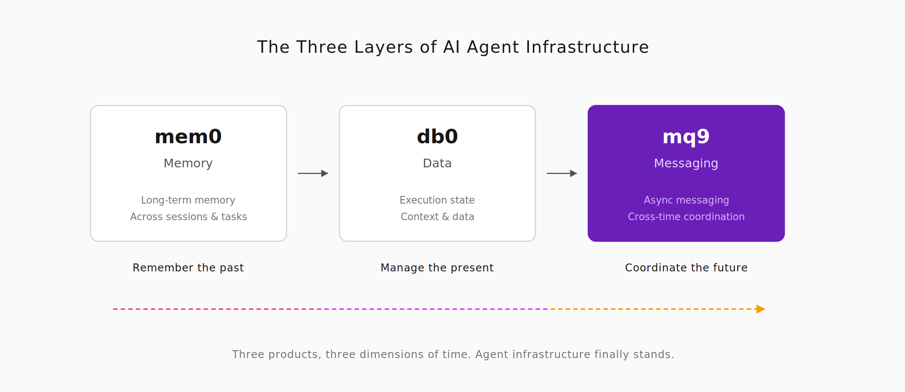
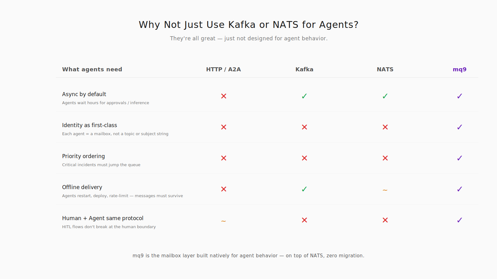
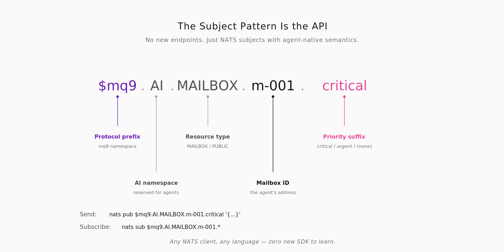
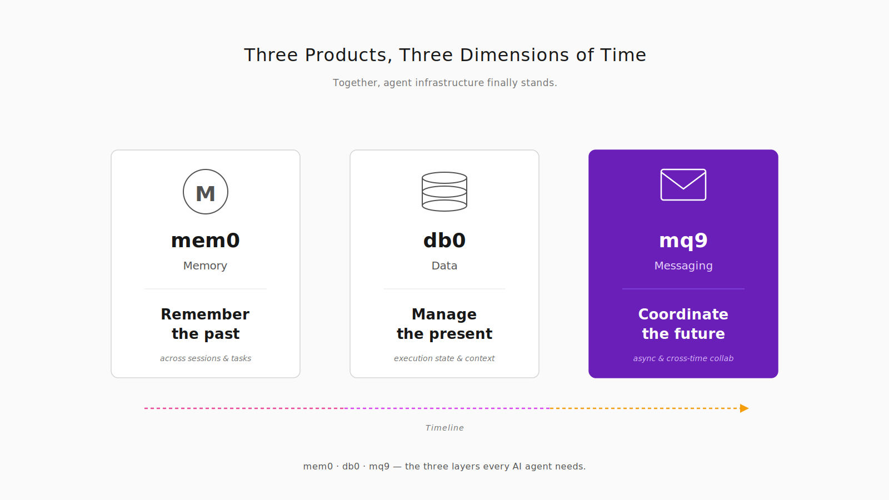

# mem0、db0、mq9：AI Agent 基础设施的三件套
一个研究 Agent 接到任务：调研 2026 年全球主要消息中间件的动态，整理成报告。它拆分了几个子任务，派出几个搜索 Agent 去不同信息源，中途根据新发现派生更多任务。期间有的 Agent 失败需要重试，有的拿到中间结果要回传给主 Agent。整个过程跨越 3 个小时，主 Agent 大部分时间在"等待"。

这不是虚构场景。这是 2026 年每个做 Agent 应用的团队都会碰到的日常。问题是，你用什么基础设施支撑它？


## Agent 基础设施的三层，前两层已经有了

Agent 不是一个更聪明的 chatbot。它是一种新的计算主体，有身份、有记忆、有判断、能跨时间协作。这样的主体需要为它量身设计的基础设施。

过去两年，硅谷逐渐形成了一个共识：**Agent 需要三层原生基础设施——记忆层、数据层、消息层**。这三层都不能简单用现有系统兜着，因为 Agent 的行为模式和传统应用根本不同。



第一层**记忆层**已经被 **mem0** 填上了。mem0 是 Agent 的长期记忆层，跨会话、跨任务，让 Agent 记得用户是谁、之前聊过什么、偏好是什么。它不是"加了 AI 包装的向量数据库"，而是原生为 Agent 设计：多维度的记忆 scope、事实自动提取、旧事实被新事实 supersede。这套机制如果用通用数据库自己拼，每个团队都要重造一次轮子。mem0 把这件事做成了开源基础设施。

第二层**数据层**被 **db0** 填上了。db0 是 Agent 的数据层，处理执行状态、上下文装配、token 预算、子 Agent 共享数据。它和 mem0 的分工清晰：mem0 管"长期的事"，db0 管"当下在做的事"。同样原生为 Agent 设计——scoped memory、state branching、context assembly with budgets。这些都是通用数据库不提供的能力。

这两层都有一个共同特征：**命名后缀用数字**。mem0、db0——"0"是这个命名范式的一部分，暗示"Agent 原生的 X 层"。

第三层**消息层**还缺。这一层的位置，是 **mq9**。

## 为什么消息层对 Agent 是特殊的

你可能会问：消息层不就是 Kafka、NATS、RabbitMQ 早就做完的事吗？Agent 为什么需要独立的消息层？

因为 Agent 之间的通信，有几个特征是传统消息系统不原生支持的：

**异步是刚需，不是选项**。Agent A 给 Agent B 发消息，B 可能需要几小时才能处理（等人审批、等模型推理、等外部系统回调）。A 不能在线等。用 HTTP 会超时，用 Kafka 需要自己拼 topic 和 consumer group。

**身份是一等公民**。Agent 之间通信是"A 发给 B"，不是"A 发到某个 topic、谁拿谁算"。每个 Agent 需要一个邮箱，邮箱有身份、有状态、有能力声明。Kafka 的核心抽象是 topic（消息路由键），NATS 的核心抽象是 subject（字符串），都不是"Agent 的身份"。

**优先级决定处理顺序**。Agent 处理能力有限，同时来了一个"critical 生产事故"和一个"default 日报汇总"，它必须先处理前者。传统消息系统按 FIFO 消费，优先级要应用层自己搞。

**离线投递是默认行为**。Agent 经常离线——重启、部署、限流、主动休眠。离线期间的消息不能丢，重连后要按优先级补发。

**人和 Agent 走同一个协议**。Human-in-the-loop 场景里，Agent 发审批请求给人、人回复给 Agent。两边用同一套消息协议，流程才能不中断。

把这五件事放在一起，就不是"消息队列的 Agent 版"了，而是一个**新的基础设施品类**。就像 mem0 不是"加了 AI 的数据库"、db0 不是"加了 AI 的 ORM"。



## mq9：建在 NATS 上的 mailbox 层

mq9 是 AI Agent 的 communication layer。核心抽象是 **mailbox**——每个 Agent 一个邮箱，消息投递到邮箱、Agent 按自己的节奏处理、优先级决定处理顺序、离线期间消息持久化。

重要的工程决策是：**mq9 建在 NATS 协议之上**，不重新造协议。任何 NATS 客户端都能直接连，零迁移成本。服务端由 RobustMQ 实现，识别 mq9 的 subject pattern 做 Agent 原生的处理。

subject pattern 本身就是 API：

```
$mq9.AI.MAILBOX.CREATE           # 创建 mailbox
$mq9.AI.MAILBOX.{id}             # 默认优先级
$mq9.AI.MAILBOX.{id}.urgent      # 高优先级
$mq9.AI.MAILBOX.{id}.critical    # 最高优先级
$mq9.AI.MAILBOX.{id}.*           # 订阅所有优先级
$mq9.AI.PUBLIC.LIST              # 发现公开 mailbox
```

结构图:



一个 Agent 给另一个 Agent 发消息只要三行：

```
# 创建邮箱
nats req '$mq9.AI.MAILBOX.CREATE' '{"ttl":3600}'
# → {"mail_id":"m-001"}

# 发送（离线安全、默认优先级）
nats pub '$mq9.AI.MAILBOX.m-001' \
  '{"msg_id":"msg-1","type":"task_result"}'

# 订阅所有优先级
nats sub '$mq9.AI.MAILBOX.m-001.*'
```

这种极简设计不是刻意"看起来简单"，而是因为**subject pattern 本身就承载了所有语义**。critical 消息走持久化优先派发、normal 消息走内存快通道、public mailbox 支持多订阅者 + queue group 竞争消费，这些全都通过 subject 的后缀和前缀约定完成。没有额外 API、没有新学习成本。

## 时间三轴：记住过去、管理当下、协调未来




Agent 的基础设施三件套，其实各自守一个时间维度：

**mem0 = 记住过去**。跨会话、跨任务的长期记忆。Agent 昨天知道的事情今天还能想起来。

**db0 = 管理当下**。当前执行状态、上下文、数据。Agent 此刻在做什么、需要哪些信息、子任务分给了谁。

**mq9 = 协调未来**。异步消息、任务调度、跨时间协作。Agent 现在发出的消息，可能几小时后才被另一个 Agent 处理。

三个产品各自守一个时间轴，加在一起，Agent 才真正站得起来。

## 今天就能跑起来

mq9 不是一个 concept，是可以今天就装上用的东西。

单节点部署只要一条命令：

```
curl -fsSL https://raw.githubusercontent.com/robustmq/robustmq/main/scripts/install.sh | bash
broker-server start
```

三种方式接入：

- **原生 NATS 客户端**：8 种语言的 NATS client 开箱直连，零依赖
- **RobustMQ SDK**：Python / Go / TypeScript / Rust 官方 SDK，type-safe、async-first
- **LangChain 集成**：`pip install langchain-mq9`，6 个 tool 直接插入 LangChain Agent 和 LangGraph workflow

官网有 8 个真实场景的示例：sub-agent 通知 orchestrator、通过 TTL 过期做 Agent 状态监控、任务队列竞争消费、异常事件广播、边缘 Agent 离线缓冲、human-in-the-loop 审批流、异步 request-reply、能力注册发现。这些都不是演示代码，是 Agent 应用里天天在用的模式。

Agent 基础设施正在成型。mem0 补上了记忆，db0 补上了数据，mq9 补上了消息。如果你在做 Agent 应用，消息和协作这一层正卡着你，来看看 mq9。GitHub 仓库开着，Discord 开着，issue 区开着。这一层值得做对。