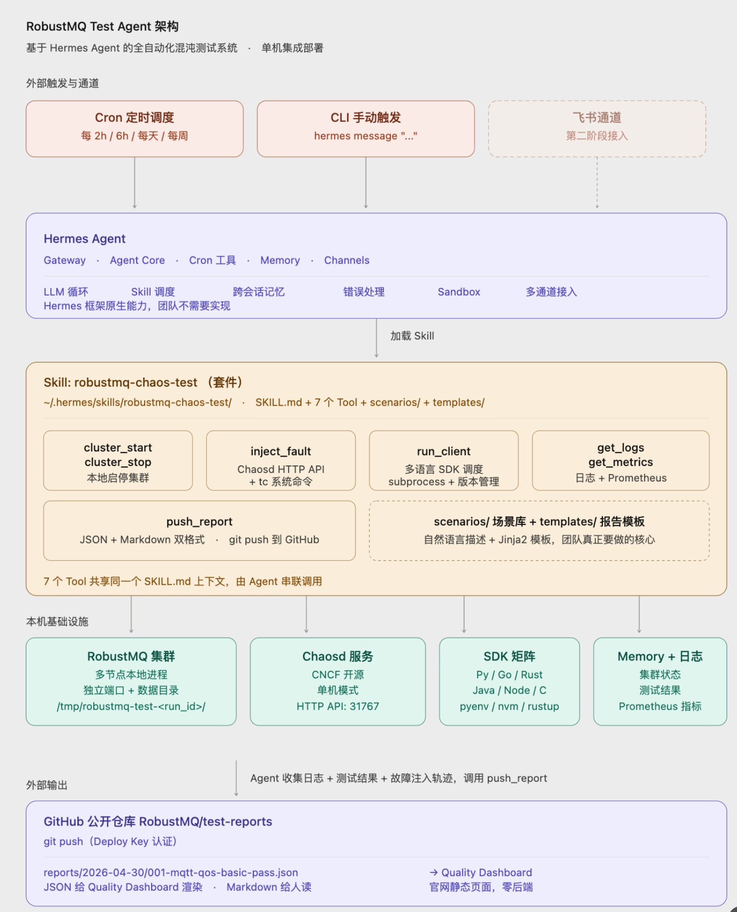

# 基于 Hermes Agent 实现 RobustMQ Test Agent 的技术方案

## 一句话概要

在[《# RobustMQ Test Agent 技术设计文档》](./84.md)把原本计划用 Claude API tool use + Python 工具函数自研的 RobustMQ Test Agent，改造成一组运行在 Hermes Agent 之上的 Skills。Hermes 提供 LLM 循环、Skill 调度、Cron 触发、跨会话记忆、多通道接入和安全沙箱，团队只需要专注于实现 RobustMQ 特定的工具函数和测试场景描述。

整套系统部署在一台云服务器上，Hermes、RobustMQ 集群、Chaos Mesh / Chaosd 故障注入、多语言 SDK 矩阵，全部在同机协同运行。

## 为什么用 Hermes 而不是自研

原设计文档讲清楚了系统的"What"和"Why"，但执行路径选了一条"自己撸"的路：用 Claude API tool use 实现 Agent 循环、用 Python 工具函数实现工具集、不引入 Agent 框架。

这条路看起来轻，实际不轻。一个生产可用的 AI Agent 系统需要的不只是工具函数，至少还包括：

- LLM 调用循环（多轮 tool use、token 管理、错误重试）
- 工具调度（参数校验、并发控制、超时处理）
- 上下文管理（场景状态、跨调用记忆、长任务持久化）
- 触发机制（Cron 定时、手动触发、外部事件）
- 通道接入（Slack / 飞书 / 邮件 / GitHub）
- 安全沙箱（Skill 级别隔离、命令白名单、敏感操作审计）
- 报告生成与持久化

工具函数是冰山一角。剩下的工程量加起来比工具函数本身大好几倍。**Hermes Agent 把这些全部解决了**。它的定位就是"自托管的 AI Agent 控制平面"，原生支持 Skills 扩展、Cron 触发、多通道、Sandbox、跨会话记忆。我们要做的事情和 Hermes 的能力几乎完全对齐。

| 自研 | 用 Hermes |
| --- | --- |
| 自己写 Claude API 调用循环 | 自带 |
| 自己实现 tool use 调度 | Skill 自动发现和调用 |
| 自己写场景描述加载 | SKILL.md 即场景描述 |
| 自己实现多轮上下文管理 | 跨会话记忆自带 |
| 自己处理工具异常和重试 | Skills 错误处理框架自带 |
| 自己做 Cron 触发 | Cron 工具自带 |
| 自己加多通道 | Channels 自带（飞书 / Slack 等） |
| 自己做权限和 Sandbox | 默认安全模型 + 6 种 backend |
| 自己写报告持久化 | Memory 系统自带 |

把核心系统建在 Hermes 之上还有一个隐性收益：**未来质量保障流程不只是"跑测试"**。例如团队成员可以通过飞书直接给 Hermes 发指令，类似"上次失败的网络抖动场景再跑一次"或"今天有什么新问题"，Hermes 把指令翻译成 Skill 调用，把结果通过原通道返回。**测试系统从"自动跑"演进成"AI 助理"，这是单纯的 Python 脚本系统做不到的**。

## 整体架构



整个系统部署在单台 Linux 云服务器（建议 8C16G 起，便于跑多节点 RobustMQ 集群和故障注入）。

Hermes 作为入口层，承载 Agent 循环、Skill 调度、Cron 触发。所有 RobustMQ 相关的能力被打包成一个 Skill 套件，Skill 内部各个 Tool 直接通过本地命令、HTTP 调用、文件读写操作 RobustMQ 集群、Chaosd 服务和报告系统。

## Skill 设计：robustmq-chaos-test 套件

原设计文档里的 7 个工具，全部映射成同一个 Skill 套件下的 Tools。这样设计的核心理由是：**它们共享同一个上下文（场景描述、集群状态、测试进度）**，由 Agent 串联调用最自然。如果拆成 7 个独立 Skill，跨 Skill 的上下文管理会成为新的负担。

Skill 目录结构：

```
~/.hermes/skills/robustmq-chaos-test/
├── SKILL.md                    # 给 Agent 的场景描述和工具说明
├── tools/
│   ├── cluster.py              # cluster_start / cluster_stop
│   ├── chaos.py                # inject_fault
│   ├── client.py               # run_client（多语言 SDK 调度）
│   ├── observability.py        # get_logs / get_metrics
│   └── report.py               # push_report
├── scenarios/                  # 场景库（自然语言描述）
│   ├── mqtt/
│   │   ├── qos_basic.md
│   │   ├── broker_kill.md
│   │   └── ...
│   └── mq9/
│       ├── mailbox_lifecycle.md
│       ├── priority_ordering.md
│       └── ...
├── templates/
│   ├── report.md.j2            # 报告 Markdown 模板
│   └── report.json.schema      # 报告 JSON 结构定义
└── config.yml                  # SDK 版本矩阵、Chaosd 端点、报告仓库地址
```

SKILL.md 是 Agent 真正读到的"场景描述"。它告诉 Agent 这个 Skill 是干什么的、有哪些 Tool 可用、什么时候该用哪个、报告应该长什么样。**它就是原设计文档里说的"自然语言场景描述"，只不过现在是 Hermes 标准格式**。

每个 Tool 是一个 Python 函数，遵循 Hermes Skill 的 Tool 定义规范：签名清晰、参数有类型、返回结构化数据。Agent 通过 LLM 调用 Tool，Hermes 负责调度和错误处理。

下面是几个关键 Tool 的简要设计。

### cluster_start / cluster_stop

```python
def cluster_start(nodes: int = 3, config: str = "default") -> ClusterInfo:
    """
    启动指定节点数的 RobustMQ 集群。

    使用本地预编译的 RobustMQ 二进制（路径在 config.yml 中配置）。
    每个节点用独立端口和数据目录，启动后等待健康检查通过。

    返回 ClusterInfo，包含每个节点的 PID、端口、数据目录、状态。
    """
```

实现要点：

- 不引入 Docker，直接 spawn 多个 RobustMQ 进程，各自独立端口
- 数据目录用临时目录（`/tmp/robustmq-test-<run_id>/`），cluster_stop 时清理
- 健康检查通过 RobustMQ 内置的 `/health` 端点轮询
- ClusterInfo 写入 Hermes Memory，后续 Tool 调用可以直接拿到集群引用

### inject_fault

故障注入选型：**Chaosd（Chaos Mesh 单机版）为主，tc / kill 等系统命令为补充**。

Chaosd 是 CNCF 项目 Chaos Mesh 的物理机模式，部署为后台服务，通过 HTTP API 注入故障。覆盖范围：

- 进程：kill -9、kill -SIGTERM、CPU 压力、内存压力
- 网络：延迟注入、丢包、带宽限制、网络分区
- 磁盘：I/O 延迟、磁盘填充
- 时钟：时间穿越（用于 TTL 和重传逻辑测试）

```python
def inject_fault(
    fault_type: Literal["kill", "network_delay", "network_loss",
                        "disk_pressure", "clock_skew"],
    target: str,                    # 节点 ID 或 PID
    params: dict,                   # 故障参数
    duration: str = "30s"
) -> FaultHandle:
    """
    注入指定类型的故障。返回 FaultHandle，可用于提前停止故障。
    """
```

实现要点：

- Chaosd 服务在云服务器上常驻，端口 31767（默认）
- 函数封装 Chaosd HTTP API 调用，参数对齐 Chaosd schema
- 极简场景（如纯 tc 网络抖动）可以直接 subprocess 跑系统命令，绕过 Chaosd
- FaultHandle 记录故障 ID、目标、注入时间，便于报告时回溯

### run_client

多语言 SDK 测试客户端调度。**关键设计**：服务器上预装多语言运行时和版本管理工具，Skill 里通过版本管理工具切换。

| 语言 | 版本管理 | 装的版本 |
| --- | --- | --- |
| Python | pyenv | 3.10 / 3.11 / 3.12 |
| Go | gvm 或 asdf | 1.21 / 1.22 / 1.23 |
| Rust | rustup | stable / nightly |
| Java | sdkman | 11 / 17 / 21 |
| Node.js | nvm | 18 / 20 / 22 |
| C | apt 系统包 | gcc 默认版本 |

每种语言的测试客户端代码放在 `clients/` 子目录，各自打包成可独立运行的 CLI 形态：

```
clients/
├── python-paho/
│   ├── pyproject.toml
│   └── client.py          # python client.py --scenario qos_basic --broker ...
├── go-paho/
│   ├── go.mod
│   └── main.go
├── rust-rumqttc/
│   ├── Cargo.toml
│   └── src/main.rs
└── ...
```

run_client Tool 接收 protocol / sdk_lang / sdk_version / scenario 四个参数，做如下事情：

1. 用版本管理工具切换到指定 SDK 版本
2. 进入对应 client 目录，确保依赖已装（首次会自动 install）
3. 启动 client 进程，传入场景参数（broker 地址、消息数、QoS 等）
4. Client 跑完返回结构化结果（消息发送数、接收数、丢失数、延迟分布、错误明细）
5. 结果写入 Hermes Memory，供 Agent 后续分析

### get_logs / get_metrics

```python
def get_logs(level: str = "WARN", time_range: str = "5m",
             node: Optional[str] = None) -> list[LogEntry]:
    """从 RobustMQ 节点日志中筛选指定级别和时间范围的条目。"""

def get_metrics(node: str) -> NodeMetrics:
    """获取指定节点的实时指标：连接数、消息速率、内存、CPU。"""
```

实现要点：

- 日志文件位置在 cluster_start 时记录到 ClusterInfo
- get_logs 直接读文件 + 简单过滤，不依赖 ELK
- get_metrics 调用 RobustMQ 内置 Prometheus endpoint，解析关键指标返回
- 返回结构化数据，Agent 直接基于这些数据做归因

### push_report

```python
def push_report(report: TestReport) -> str:
    """
    将测试报告推送到 GitHub 公开仓库。
    返回报告的公开访问 URL。
    """
```

实现要点：

- 报告仓库通过 GitHub Deploy Key 认证（仅限写入特定 reports 仓库）
- Skill 里直接执行 git clone / commit / push，不调 GitHub API
- 报告同时输出 JSON 和 Markdown 两种格式（用 Jinja2 模板渲染）
- JSON 用于 Quality Dashboard 数据源，Markdown 用于人读
- 提交信息格式固定：`test: <scenario_name> <pass|fail> <run_id>`

## 场景库设计

场景库是整个系统最核心的部分。工具函数是一次性工程，做完基本不用动；**场景库是持续输入的地方**，系统能不能发现问题、覆盖够不够深，完全取决于场景描述写得有多精准。

Agent 不读脚本、不读流程图，它读的是 `scenarios/` 下的自然语言描述文件。**场景描述写得越清晰，Agent 跑出来的结果越可靠、越可复现**。这件事比写代码难：它要求你把测试工程师的经验翻译成 AI 能理解和执行的语言。

### 场景描述的结构规范

每个场景描述文件必须包含四个部分，缺一不可：

```
## 场景目标
一句话说清楚这个场景要验证什么。

## 前置条件
- 集群节点数和配置（几个节点、用什么 config）
- 协议和 SDK（哪个语言、哪个版本）
- 其他依赖（如需要特定的 Chaosd 配置）

## 执行步骤
1. 步骤一（具体动作，不能含糊）
2. 步骤二
3. ...

## 验证标准
- PASS 条件：明确的数字或状态（如"消息丢失率 = 0"、"所有节点恢复健康"）
- FAIL 条件：什么情况下判定失败
- 允许的误差范围（如有）
```

**常见写法错误**：

- "测一下 QoS" → Agent 自由发挥，结果不可复现
- "看消息是否正常" → Agent 不知道什么叫"正常"，会自己猜
- 漏写前置条件 → Agent 在错误状态下开始测，结果无意义

### 完整示例：broker_kill 场景

```markdown
## 场景目标
验证 broker 节点被强杀后，QoS 1 消息在节点恢复后能够完整补发，
无消息丢失。

## 前置条件
- 3 节点集群，使用 default 配置
- 协议：MQTT，QoS 1
- SDK：Python paho-mqtt 2.x
- 消息数：1000 条，发送速率 100 条/秒

## 执行步骤
1. 启动 3 节点集群，等待健康检查通过
2. 启动 Python 测试客户端，开始以 100 条/秒持续发送 QoS 1 消息
3. 发送 300 条后，对节点 1（主节点）执行 kill -9
4. 等待 30 秒，让集群完成 leader 重新选举
5. 继续发送剩余消息直到总数达到 1000 条
6. 等待所有消息消费完毕（最多等待 60 秒）
7. 对账：发送总数 vs 接收总数

## 验证标准
- PASS：接收消息数 = 1000，无重复消息，顺序允许乱序
- FAIL：接收消息数 < 1000（消息丢失），或超时未全部消费
- 允许误差：QoS 1 允许重复，接收数 ≥ 1000 均可接受
```

这是 Agent 真正会读到的内容。步骤 3 里"节点 1（主节点）执行 kill -9"这种精确描述，Agent 才能正确选择调用 `inject_fault` 的参数。

### 场景分级

不是所有场景的优先级相同，按触发频率分三级：

**P0：每次触发必跑（2 小时一次）**

基础功能正确性验证，系统的最低健康保障线。任何一个 P0 失败，立即报警。

- QoS 0 / 1 / 2 正常收发
- 集群启停正常
- 单节点连接和消息收发

**P1：每天跑一次（凌晨）**

故障场景和多语言覆盖，发现稳定性和兼容性问题。

- broker kill -9 + 重启
- 网络延迟 / 丢包注入
- 持久会话重连
- Python / Go / Rust 各一个版本的基础场景

**P2：每周跑一次（周日）**

组合场景和完整 SDK 矩阵，发现深层次问题。

- 全语言全版本 SDK 兼容性矩阵
- 慢消费者 + broker 重启组合场景
- 大量连接同时断开
- 长时间运行（内存泄漏检测）

**场景库增长路径**：

第一期写好 P0 全部 + P1 核心几个，系统就能跑起来产出有价值的报告。P2 场景和更多 SDK 版本覆盖随后逐步补充，不需要一开始就全部到位。

## 触发机制

第一阶段三种触发并存：

**Cron 触发（主力）**

Hermes 自带 Cron 工具。配置示例：

```yaml
# ~/.hermes/cron.yml
- name: robustmq-mqtt-basic
  schedule: "0 */2 * * *"          # 每 2 小时
  prompt: "跑一遍 MQTT 基础场景库（QoS 0/1/2、大消息、高并发连接）"

- name: robustmq-mqtt-chaos
  schedule: "0 */6 * * *"          # 每 6 小时
  prompt: "跑 MQTT 故障场景库（broker kill、网络延迟、丢包）"

- name: robustmq-mq9-full
  schedule: "0 4 * * *"            # 每天凌晨 4 点
  prompt: "跑 mq9 全场景库"

- name: robustmq-compatibility-matrix
  schedule: "0 0 * * 0"            # 每周日
  prompt: "跑全语言全版本 SDK 兼容性矩阵"
```

每条 Cron 触发时，Hermes Agent 读取 prompt，加载 robustmq-chaos-test Skill，自主决定执行顺序（哪些场景先跑、哪些 SDK 组合覆盖、什么时候停）。Agent 跑完后调 push_report 提交报告。

**手动触发**

通过 Hermes CLI 直接发指令：

```
hermes message "跑 MQTT 的 broker kill 场景，用 Python 2.x SDK 验证"
```

适合开发期间针对性验证、修了 bug 后回归。

**事件触发（演进规划）**

第二阶段接入 GitHub webhook，每次 RobustMQ 主仓库 push 触发自动化回归测试。

## 多通道集成（演进）

第一期不接通道，所有交互通过 Hermes CLI 完成。

第二期接入飞书：

- 团队成员通过飞书私聊 Hermes Bot 发指令
- 关键事件主动推送到飞书群（测试失败、报告生成、长任务进展）
- 报告 URL 直接附在飞书消息里，点击跳到 Quality Dashboard

Hermes 的 Channels 系统天然支持这个能力，只需要配置飞书 App 凭据，无需改 Skill 代码。

## 报告系统

报告以 JSON + Markdown 双格式输出，提交到 GitHub 公开仓库（如 `RobustMQ/test-reports`）。

仓库结构：

```
test-reports/
├── reports/
│   ├── 2026-04-30/
│   │   ├── 001-mqtt-qos-basic-pass.json
│   │   ├── 001-mqtt-qos-basic-pass.md
│   │   ├── 002-mqtt-broker-kill-fail.json
│   │   ├── 002-mqtt-broker-kill-fail.md
│   │   └── ...
│   └── ...
└── index.json                     # 全量报告索引（Dashboard 用）
```

JSON 报告包含：

- 测试元数据（时间、场景、协议、SDK 语言版本、集群配置）
- Agent 执行轨迹（Tool 调用序列、每步参数和返回）
- 验证结果（消息发送 / 接收 / 丢失 / 重复数、延迟分布）
- 问题描述与初步归因
- 严重程度（P0 / P1 / P2）
- 原始日志片段（最多 1MB，超出截断并标记）

Markdown 报告是 JSON 的人读版本，加上 AI Agent 写的自然语言总结。

Quality Dashboard 是 RobustMQ 官网的静态页面，直接读 GitHub 仓库的 index.json 渲染列表和详情，零后端。

## 实施步骤

### 一、环境准备（1 天）

- 云服务器一台（Linux，8C16G 起）
- 安装 Hermes Agent（Python + uv 包管理）
- 安装 Chaosd（Chaos Mesh 单机版，常驻后台服务，端口 31767）
- 预装多语言运行时：Python（pyenv）/ Go（gvm 或 asdf）/ Rust（rustup）/ Java（sdkman）/ Node（nvm）

### 二、搭 Skill 骨架（1 天）

- 在 `~/.hermes/skills/` 下建 `chaos-test` 目录
- 写 `SKILL.md`：告诉 Hermes 这个 Skill 是干什么的、有哪些 Tool、什么时候调用哪个
- 定义 7 个 Tool 的函数签名（先签名，暂不实现）
- 写 `config.yml`：集群二进制路径、Chaosd 端点、GitHub 报告仓库地址

### 三、实现 7 个 Tool（5.5 天）

按依赖顺序实现，每个跑通后再进下一个：

| 顺序 | Tool | 工作量 |
| --- | --- | --- |
| 1 | `cluster_start / cluster_stop`：本地启停被测系统集群 | 1 天 |
| 2 | `get_logs / get_metrics`：读日志文件 + 拉 Prometheus 指标 | 0.5 天 |
| 3 | `run_client`：多语言 SDK 测试客户端调度（先跑通 Python 一种） | 1 天 |
| 4 | `inject_fault`：封装 Chaosd HTTP API（先接 kill 和 network_delay）| 1 天 |
| 5 | `push_report`：JSON + Markdown 双格式生成 + git push 到 GitHub | 1 天 |

### 四、写场景库（1 天）

- 在 `scenarios/` 下用自然语言写测试场景描述
- 第一批：基础场景 5 个 + 故障场景 3 个
- 后续扩展：补齐全部基础 / 故障 / 客户端异常 / 组合场景

### 五、配置触发机制 + 跑通完整闭环（1 天）

- 写 `~/.hermes/cron.yml`：配置定时触发（每 2h / 6h / 每天 / 每周）
- 验证手动触发：`hermes message "跑一遍基础场景"`
- 跑通完整闭环：Cron 触发 → Agent 读场景 → 串联调用 Tool → push_report → GitHub

### 六、报告系统（1 天）

- 建 GitHub 公开仓库（test-reports）
- 配置 Deploy Key（只写权限）
- 实现 `index.json` 自动更新（全量报告索引）
- Quality Dashboard：官网静态页面读 index.json 渲染，零后端

### 七、扩展（第二阶段，6-7 天）

- SDK 矩阵补全：Go / Rust / Java / Node 各加多版本
- 场景库补全：覆盖全部 MQTT 和 mq9 场景
- 飞书通道接入：只改 Hermes 配置，不改 Skill 代码

### 工作量汇总

| 阶段 | 内容 | 工作量 |
| --- | --- | --- |
| 第一阶段 | 环境 + Skill 骨架 + 7 个 Tool + 第一批场景 + Cron 跑通 + 报告系统 | 7-8 天 |
| 第二阶段 | SDK 矩阵补全 + 全部场景 + 飞书通道 | 6-7 天 |
| 第三阶段 | Claude Code 深度分析 Skill + 持续迭代 | 后续迭代 |

## 关键决策记录

| 决策 | 结论 | 理由 |
| --- | --- | --- |
| 单机 vs 分布式部署 | 单机 | 简化运维，混沌测试本身不需要分布式 |
| Skill 拆分粒度 | 1 个套件 + 多个 Tool | 共享上下文，Agent 调度更自然 |
| 故障注入 | Chaosd 主 + tc 补 | Chaosd 覆盖全、有 HTTP API；tc 用于极简场景 |
| 多语言 SDK 隔离 | 不用 Docker，本地版本管理 | 启动快、单机环境足够 |
| GitHub 提交方式 | git push（Deploy Key）| 比 API 调用更简单可控 |
| 第一期通道 | 仅 CLI | 先跑通核心闭环，飞书后续 |
| 报告格式 | JSON + Markdown 双格式 | JSON 给 Dashboard，Markdown 给人 |
| Dashboard 后端 | 静态页面 + GitHub 仓库 | 零后端、零维护成本 |

## 演进规划

**第一阶段（1-2 周）：跑通最小闭环**

云服务器搭建、Skill 骨架、MQTT 基础场景、Python SDK、Cron 触发、报告推送。目标：每天能自动跑出几份测试报告，公开发布到 Dashboard。

**第二阶段（3-4 周）：场景库与 SDK 矩阵补齐**

补齐 MQTT 和 mq9 全部场景，扩展 5 种语言的 SDK 多版本覆盖，引入兼容性自动归因。第二阶段产出可作为 RobustMQ 协议兼容性的对外质量声明。

**第三阶段（4-8 周）：飞书集成 + AI 深度分析**

接入飞书通道，团队成员通过自然语言查询测试结果、触发回归。引入 Claude Code 作为额外 Skill，对失败场景做源码级深度分析，直接给出修复建议。

**第四阶段（持续）：从测试系统演进为 RobustMQ 项目助理**

Hermes 不止跑混沌测试。可以扩展更多 Skill：版本发布检查、文档校对、Issue 标签自动化、用户问题答疑。**测试系统是切入点，最终形态是 RobustMQ 项目的全功能 AI 助理**。

## 总结

把 RobustMQ Test Agent 建在 Hermes Agent 之上，把 Agent 框架、Skill 调度、Cron、Sandbox、跨会话记忆、多通道接入这些通用工程问题外包给 Hermes，团队精力集中在 RobustMQ 特定的工具函数和场景库上。

工程量上，原计划自研路线需要把"工具函数 + 框架 + 通道 + 持久化"全部自己实现；用 Hermes 后，工作量收敛到工具函数和 Skill 配置，**首期工作量从估计 4-6 周压缩到 1-2 周**。

更重要的是，这套系统在 Hermes 之上有清晰的演进路径：从跑混沌测试开始，最终成为 RobustMQ 项目的全功能 AI 助理。这是单纯的 Python 脚本系统给不出的可能性。