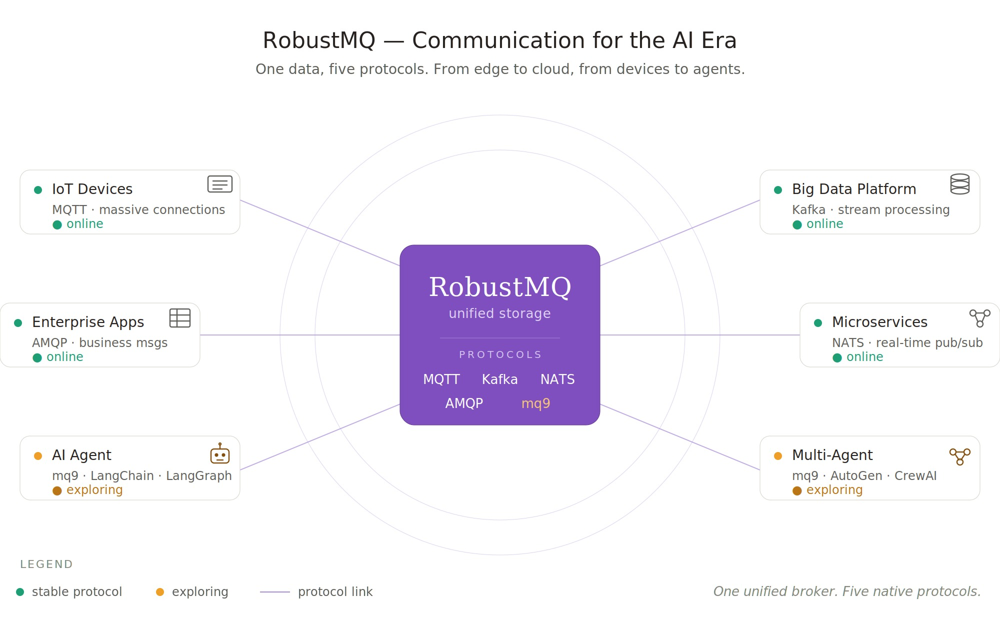

# RobustMQ 0.4.0 RELEASE 版本正式发布

RobustMQ 0.4.0 今天正式发布。

如果说 0.3.0 是"方向明确后的第一次起步"，那么 0.4.0 就是"方向明确后的第一次站稳"。这是一个里程碑版本——MQTT 进入试用阶段、多协议链路打通、mq9 第一版内核诞生、规则引擎完成。

> **注意**：0.4.0 仍处于早期阶段，MQTT 进入试用阶段，但 Kafka、AMQP、NATS、mq9 仍在快速迭代中。我们计划在 0.5.0 版本进一步成熟，预计 8 月到 9 月份发布。



## 0.4.0 这个版本做了什么

把 0.4.0 这一版的工作梳理一下，主要集中在六件事上。

**第一，RobustMQ MQTT 进入试用阶段。** 性能优化和死锁问题修复让发布、订阅、大量连接创建三个核心场景都能稳定跑起来。这是 MQTT 第一次走到"可以让真实用户上手试用"的状态。

**第二，多协议链路完整走通。** MQTT、Kafka、AMQP、NATS 四个协议在统一存储层之上的端到端链路全部打通。一份数据写入，多种协议消费，架构层面的可行性被运行时彻底验证。

**第三，重磅引入 mq9。** 完成了第一版协议设计和内核实现，专门为 AI Agent 异步通信而生。同步发布了多语言 SDK（Python、Go、JS、Java、C#）和 langchain-mq9 框架集成，开发者可以一行代码让 Agent 接入 mq9。

**第四，规则引擎完成。** RobustMQ 进入"数据集成"领域的第一步，让消息流转过程中能做过滤、转换、路由。配套增加了大量 Connector，让规则引擎的输出能直接打到下游系统。

**第五，延时任务的设计。** 完成了协议设计和核心实现，订单超时、定时通知、重试调度等基础场景有了支撑。

**第六，大量代码重构、bug 修复和模块完善。** HTTP 接口和 Admin 重构、存储层完善、多个性能瓶颈和死锁修复、模块边界精简内聚。这些工作不产生新功能，但决定了系统能不能在生产环境真正跑起来。

## 0.5.0 准备做什么

0.4.0 站稳了，0.5.0 要继续往前走。0.5.0 预计 8 月到 9 月份发布，期间会有大量 0.4.x 的小版本持续迭代。

**第一，继续完善 RobustMQ MQTT。** MQTT 进入试用阶段不是终点，目标是让它走到"生产就绪"。

**第二，继续完善 mq9。** 协议细节打磨、性能稳定性提升，基于真实场景持续探索 AI Agent 异步通信的最佳实践。

**第三，完成 Kafka 的 Producer/Consumer。** 把 Kafka 协议做完整，打通边缘到云端的核心链路。

**第四，边缘、云端、AI 一体化链路的探索。** MQTT 接入边缘设备数据，Kafka 协议对接云端大数据平台，mq9 承载 AI Agent 异步通信——一份数据，多种视角，覆盖从设备到 AI 的全链路。

预计 0.5.0 发布时，MQTT 会进一步成熟，边缘到云端、MQTT 到 Kafka 的一体化链路会初步打通，mq9 会完成初步探索。

下面展开说每一块的细节。

## RobustMQ MQTT

### 进入试用阶段

0.4.0 最重要的成果之一，是 MQTT 终于走到了"可以让真实用户开始试用"的阶段。

这一版的稳定性投入是过去几个版本里最大的。压测过程中我们持续修复了多个性能瓶颈和死锁问题：

**性能优化：** 发布消息耗时优化、订阅消息耗时优化、创建连接耗时优化。这些优化不是单点突破，而是从压测中持续暴露问题、定位、修复、再压测的循环。每一轮都让性能更接近可生产的水平。

**稳定性修复：** 压测过程中暴露了一个棘手的死锁问题——当大量连接同时创建时，连接管理的二级 DashMap 出现锁征用，导致系统卡死。理论上系统应该慢慢消化这些请求，而不是被锁死。我们重新设计了连接管理的数据结构，让大量连接的创建场景能够稳定运行。

**压测达标的三个核心场景：**
- 订阅消息稳定
- 发布消息稳定  
- 创建大量连接稳定

这三个场景都能稳定运行，意味着 RobustMQ MQTT 可以承接真实的 IoT 接入场景了。当然，还有很多边缘场景需要更多用户在生产环境帮我们发现和验证，所以我们还是把这一版称为"试用阶段"，而不是"生产就绪"。

### 规则引擎完成

0.4.0 完成了规则引擎的开发。这是 RobustMQ 进入"数据集成"领域的第一步。

规则引擎让 RobustMQ 不只是消息传递，还能在消息流转过程中做过滤、转换、路由。这些能力在 IoT 场景里特别关键——设备数据进来后，往往需要做轻量处理再转发到下游系统。

规则引擎完成后，下一步会自然延伸到大量 Connector 的开发。

### 大量 Connector

0.4.0 增加了大量 Connector 实现，让规则引擎的输出能直接打到各种下游系统。这是 RobustMQ 进入企业生产环境的关键拼图——只有协议层、存储层做得再好，没有 Connector 体系，用户还是没法真正用起来。

Connector 体系的设计沿用了 RobustMQ 一贯的插件化思路，加新的 Connector 不需要改核心代码，未来可以由社区持续扩展。

### 延时任务

0.4.0 完成了延时任务的设计。

延时任务是消息系统的一个基础能力——发送时指定延迟时间，到期才被消费。这个能力在订单超时、定时通知、重试调度等场景都是刚需。

0.4.0 完成了延时任务的协议设计和核心实现。后续版本会继续完善精度、规模、可观测性等细节。

## Agent 通信协议：mq9

### 重磅引入

0.4.0 引入了 mq9——RobustMQ 的第五个原生协议层，专为 AI Agent 异步通信设计。

**为什么做 mq9？**

Agent 不是服务。服务是长期在线的，Agent 是临时的，可能只活几秒。今天 Agent A 给 Agent B 发消息，B 不在线，消息直接丢了。每个构建多 Agent 系统的团队都在用临时方案绕这个问题——Redis pub/sub、轮询数据库、自研任务队列。能用，但都是绕路。

mq9 直接解决这个问题：以 mailbox 为核心抽象，每个 Agent 有自己的邮箱，发送方发完消息就走，接收方在准备好的时候来取。消息持久化存储，TTL 到期自动清理。发送方和接收方不需要同时在线。

**0.4.0 完成了什么？**

- mq9 第一版协议设计：mailbox 抽象、优先级、TTL、按 key 压缩等核心语义全部定义清楚
- mq9 第一版内核实现：基于 RobustMQ 统一存储层之上的协议解析和路由
- 兼容 NATS 协议：所有语言的 NATS 客户端零成本接入

mq9 的诞生不是临时起意，而是从 RobustMQ 三年架构积累自然长出来的。统一存储 + 协议视图层的设计，让我们可以在不动核心存储的前提下，为新场景增加新的协议。

### RobustMQ SDK + LangChain SDK

为了让 mq9 真正能进入 AI 开发者的工作流，0.4.0 同步发布了多语言 SDK：

- RobustMQ SDK：Python、Go、JS、Java、C# 五种语言
- langchain-mq9：LangChain 框架的原生集成

LangChain 是当前 Python AI 开发者最大的生态。`langchain-mq9` 把 mq9 的核心操作封装成 LangChain Tool，开发者一行代码就能让自己的 Agent 接入 mq9，不需要写任何适配代码。

mq9 协议有了，SDK 有了，框架集成有了——这条线在 0.4.0 算是初步完整。

## 多协议

### 四协议链路完整走通

0.4.0 完成了一个对 RobustMQ 整体定位至关重要的验证：**MQTT、Kafka、AMQP、NATS 四个协议的端到端链路全部走通**。

一条消息通过任意协议写入，可以通过其他协议消费。底层是统一的 Shard 存储层，没有数据复制，没有桥接转换。MQTT 的消息可以被 Kafka 消费，AMQP 的消息可以被 NATS 消费。

这个能力的工程意义远超 demo 演示。它意味着 RobustMQ 三年里坚持的"统一存储 + 多协议视图"架构是可行的。每种协议都有自己的语义——Kafka 有 offset 和 partition，MQTT 有 QoS 和 retain，NATS 有 subject 和 queue group，AMQP 有 exchange 和 binding。让这些协议在同一份存储上各自表现正确，需要在存储抽象层做大量工作。

0.4.0 的多协议链路只是基础订阅消费打通，每个协议的高级特性还在持续完善。但架构层面的可行性已经被运行时验证了——这是 0.4.0 最重要的工程成果之一。

## Bug 修复和重构

### HTTP 接口和 Admin 重构

0.4.0 对 HTTP 接口和 Admin 模块做了一次重构。

随着功能增加，原有的接口设计开始显得不够清晰。这次重构让接口分层更清楚、命名更一致、错误处理更统一。Admin 模块也做了相应的整理。

这种重构不产生新功能，但决定了系统的可维护性。RobustMQ 是个长期项目，每隔一段时间做一次必要的内部重构，是保持代码健康的常规动作。

### 存储层完善

0.4.0 对存储层做了进一步完善。三种存储引擎（Memory、RocksDB、File Segment）的功能在持续打磨，副本同步机制也在持续推进。

存储层是 RobustMQ 的核心。无论是多协议的统一视图，还是 mq9 的 mailbox 语义，最终都依赖存储层的稳定和性能。这一块的投入会一直持续。

### 代码精简、bug 修复、模块内聚

0.4.0 背后是大量不可见的工程投入。

每个版本之间，我们都会持续审视代码——哪里设计不够清晰、哪里存在隐患、哪里需要演进。0.4.0 也不例外。这些重构不产生新功能，但让架构更稳、代码更清晰、未来扩展更容易。

这一版我们也修复了大量 bug 和性能问题。有些是压测过程中暴露的，有些是社区用户反馈的，有些是日常 review 代码发现的。每一个修复都让系统在边缘场景下表现得更可预测。

代码本身也在持续精简和内聚。模块边界变得更清晰，重复逻辑被抽离，职责不清的类被拆分或合并。代码量没有快速增长，但每一行都比上一版更"该出现在那里"。

这是一种长期主义的工程文化：每一次重构都让架构更干净，每一次重构都让代码更扎实。

---

## 如何使用

RobustMQ 的设计目标之一是极简部署，无任何外部依赖。

```bash
curl -fsSL https://raw.githubusercontent.com/robustmq/robustmq/main/scripts/install.sh | bash
broker-server start
```

集群就绪后，用任意 MQTT 客户端连接验证：

```bash
mqttx pub -h localhost -p 1883 -t "test/topic" -m "Hello RobustMQ!"
mqttx sub -h localhost -p 1883 -t "test/topic"
```

也可以访问 `http://localhost:8080` 打开 Web 管理控制台，查看集群状态。

完整的快速上手文档：https://robustmq.com/QuickGuide/Overview.html

---

0.4.0 的发布，标志着 RobustMQ 从"方向明确后稳步推进"进入"核心能力开始站稳"的阶段。MQTT 进入试用、多协议链路打通、mq9 重磅引入、SDK 体系初步完整。这些都是过去几个月持续投入的成果。

但 0.4.0 依然只是早期阶段。基础软件没有捷径，每一步都要走实。我们会继续按照"慢就是快"的节奏推进——把每个方向做深、做稳，再走下一步。

项目地址：https://github.com/robustmq/robustmq

欢迎试用和反馈。