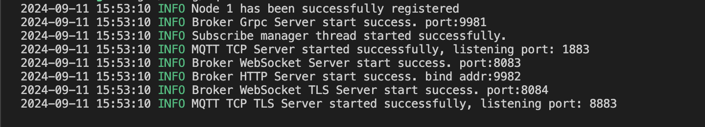
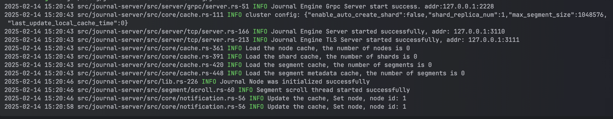

# Cargo运行
1. Run standalone by meta-service
```
cargo run --package cmd --bin meta-service -- --conf=config/meta-service.toml
```
输出如下信息，表示 meta-service 启动成功:


2. Run standalone by mqtt-server

```
cargo run --package cmd --bin mqtt-server -- --conf=config/mqtt-server.toml
```

输出如下信息，表示 mqtt-server 启动成功：


3. Run standalone by journal-server

```
cargo run --package cmd --bin journal-server -- --conf=config/journal-server.toml
```
输出如下信息，表示 journal-server 启动成功:

