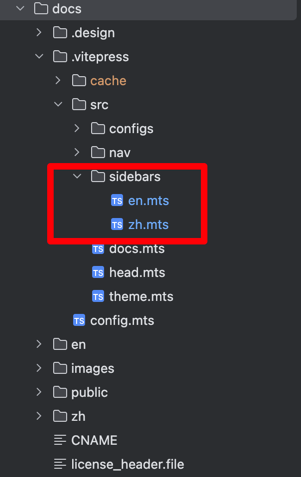

# 文档贡献指南
## 概述
目录`zh`和`en`分别代表着中文和英文的文档, 目录`images`中存放了对应的
图片内容

## MarkDown功能支持指南

MarkDown支持的内容可以参考[VitePress写作指南](https://vitepress.dev/guide/markdown)
关于MarkDown的功能支持以及写作指南


## 注意事项
1. 当你编写`zh`文档的同时你需要在`en`对应的目录复制一份，如果有时间，您
也可以通过大模型翻译成对应的语言，编写`en`文档也同理。
2. 对应文档的图片存放到`images`中，具体的命名格式为`文档名-编号`即可。
3. 如果要引用其他文档，可以参考[VitePress写作指南](https://vitepress.dev/guide/markdown)，
很多写作相关的扩展功能，你都可以通过它找到问题的答案
4. 在完成写作任务后，你需要添加到对应的目录当中，具体的步骤请参考下面的内容。

## 如何将文档添加到目录
1. 打开`doc/.vitepress/src/sidebars`目录，具体如下图所示


其中`en`代表的是英文目录，`zh`代表的是中文目录, 这里我们以`en`目录
为例子,
```ts
export const sidebar = [
    {
        text: "Architect",
        collapsed: true,
        items: [
            {text: "Overview", link: "/zh/Architect/Overview"},
            {text: "Meta Service", link: "/zh/Architect/Meta-Service"},
            {text: "Broker Server", link: "/zh/Architect/Broker-Server"},
            {text: "Storage Adapter", link: "/zh/Architect/Storage-Adapter"},
            {text: "Journal Server", link: "/zh/Architect/Journal-Server"},
            {text: "Ig Test", link: "/zh/Architect/Test-Case"},
            {
                text: "Configuration",
                collapsed: true,
                items: [
                    {text: "Meta Service", link: "/zh/Configuration/META"},
                    {text: "MQTT Broker", link: "/zh/Configuration/MQTT"},
                ],
            },
        ],
    },
]
```

该部分内容对应显示的目录结构如下图所示:


该部分在`en`目录中的结构如下图所示:


因此，如果要在对应目录下增加一个`Test.md`文档，我们只需要在`doc/.vitepress/src/sidebars`
的`en.mts`和`zh.mts`中添加如下的内容，即可将内容添加到目录当中

```ts
export const sidebar = [
    {
        text: "Architect",
        collapsed: true,
        items: [
            {text: "Overview", link: "/zh/Architect/Overview"},
            {text: "Meta Service", link: "/zh/Architect/Meta-Service"},
            {text: "Broker Server", link: "/zh/Architect/Broker-Server"},
            {text: "Storage Adapter", link: "/zh/Architect/Storage-Adapter"},
            {text: "Journal Server", link: "/zh/Architect/Journal-Server"},
            {text: "Ig Test", link: "/zh/Architect/Test-Case"},
            {text: "Test", link: "/zh/Architect/Test"}, // [!code highlight]
            {
                text: "Configuration",
                collapsed: true,
                items: [
                    {text: "Meta Service", link: "/zh/Configuration/META"},
                    {text: "MQTT Broker", link: "/zh/Configuration/MQTT"},
                ],
            },
        ],
    },
]
```

::: tip
如果你想要学习一下更多的使用可以参考
[VitePress侧边栏文档](https://vitepress.dev/zh/reference/default-theme-sidebar)
:::
