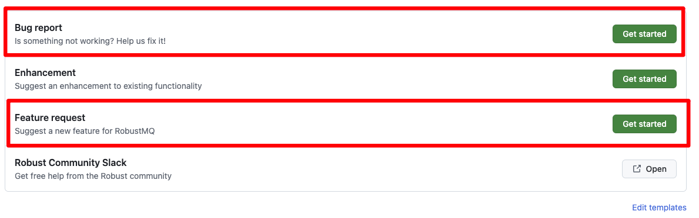
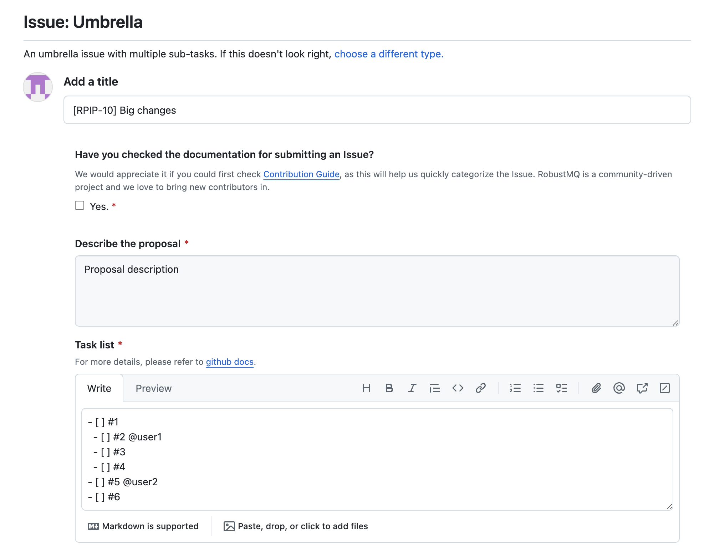
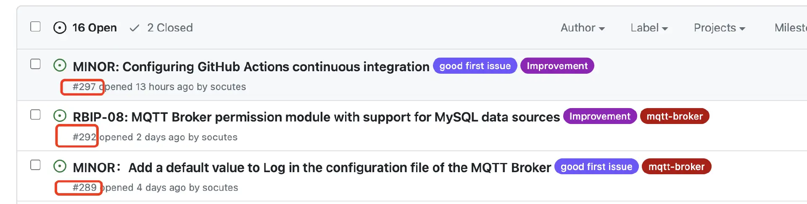
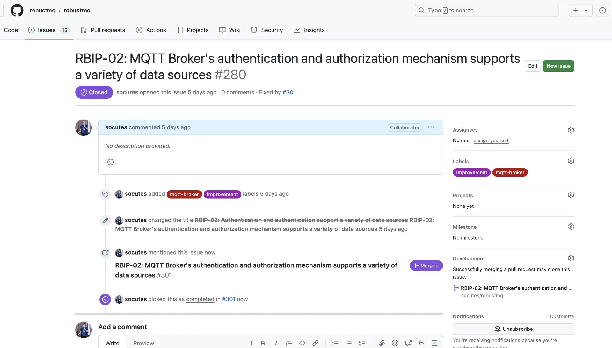

# Github贡献指南
## 1、创建 ISSUE

ISSUE 主要的范围类型有：feat, bug, test, refactor, chore, style, docs, perf, build, ci,
对应的解释内容如下：
- feat: 新功能特性
- bug: 发现的Bug问题
- test: 增加的测试用例
- refactor: 对代码的重构，既不是新功能特性也不是bug代码更改
- docs: 文档的变更与添加，对代码的注释也属于此内容
- perf: 设计到性能优化的代码，这部分需要有相关的优化证明
- build: 构建系统或外部依赖项的变更
- ci: 持续集成配置的变成，配置文件和脚本的修改等
- style: 代码风格变动，用于提交格式化，标点符号等不影响代码的变更
- chore: 混杂类型的工作，可能有多个其他类型的变更

### 用户与贡献者创建ISSUE

对于用户和贡献者而言，如果有新的feat需求和bug的修复的需求，
可以通过选择`BugReport`，`Enhancement`以及`FeatureRequest`来提交Issue。



### Committer创建ISSUE

如果是小任务项目, 那么同用户和贡献者类似，直接使用`BugReport`, `Enhancement`, `FeatureRequest`对`Pull
Request`进行关联，

如果是比较大的规划任务，需要进行拆分，此时使用`Umbrella`关联对应的Issue后，在其下方规划子任务，具体如下所示:



对于各项的子任务，则是通过`Subtask`来创建对应的子任务，在子任务中说明该部分子任务需要完成
的对应内容。

对于`Umbrella`的标题，暂时分为两类，RBIP-\* 和 MINOR 进行区分。

[RBIP-\*]： 是标识有特性和功能添加，比如 RBIP-09，RBIP-10，后面的序号是递增的。


[MINOR]：标识是修复或者增加一些小的功能。则可以 MINOR：开头，接标题。


对于`Subtask`标题，使用以下格式：
`[RBIP-*/MINOR][Style/Refactor/Performance/Docs/Test/Build/CI/Chore][Subtask] xxx`，例如：


## 2、创建 Pull Request

如果 PR 有关联的 ISSUE，必须在 PR 的内容中添加上：

close #issue_number
close 是固定的前缀， #也是固定的前缀，issue_number 表示这个 PR 关联的 ISSUE 编号。比如：


#297，#292 就是对应的 ISSUE 编号。

比如需要提交一个解决 ISSUE #297 的 PR，则 PR 内容需要包含

close #297
此时，当该 PR 被 MERGE 时，这个 ISSUE 会自动被关闭。PR 合并后，PR 和 ISSUE 效果如下：

PR：


ISSUE：



详细可以参考[提交PR的例子](./Pull-Request-Example.md)。

## 3、提交 PR 失败的原因

#### License 错误

License checker / license-header-check (pull_request) 失败。 有的文件没加 License, 需要加一下,最好每次提交前执行下检查命令.

```
cargo install hawkeye

# 当前项目下执行, 检测有哪些文件没有加 License
hawkeye check

# 自动没每个代码文件加上 License
hawkeye format
```

#### 标题格式错误

PR Title Checker / check (pull_request_target) 这个失败是 PR 的标题格式错误

```
前缀: 标题
前缀有这些选项：feat|fix|test|refactor|chore|style|docs|perf|build|ci|revert

feat: 新功能（feature）
例如：feat: Compatible with Rocksdb

fix: 修复 bug
docs: 文档变更
style: 代码风格变动（不影响代码逻辑）,用于提交仅格式化、标点符号、空白等不影响代码运行的变更。
refactor: 代码重构（既不是新增功能也不是修复bug的代码更改）
perf: 性能优化
test: 添加或修改测试
chore: 杂项（构建过程或辅助工具的变动）
build: 构建系统或外部依赖项的变更
ci: 持续集成配置的变更,配置文件和脚本的修改。
revert: 回滚
```
