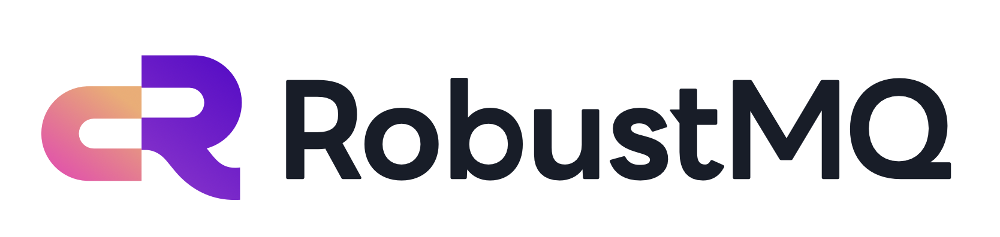

<div align="center">
  
</div>

## 什么是 RobustMQ

**定位：AI 时代的数据通信基础设施**

**愿景：成为 AI 时代数据流动的基石。让 AI Agent 协作、IoT 设备上报、边缘节点同步、传统消息分发、实时流数据管道，都运行在同一套通信基础设施之上。**

RobustMQ 是用 Rust 构建的统一消息引擎。一个二进制，一个 Broker，无外部依赖，从边缘到云端极简部署。原生支持 MQTT、Kafka、NATS、AMQP 多种协议，覆盖 IoT 设备接入、边缘到云端数据同步、传统消息分发、实时流数据管道、超低延迟实时分发、AI Agent 通信等六大场景。一条消息，一份数据，任意协议消费分发。

---

## 为什么需要 RobustMQ

传统消息基础设施是协议孤岛：IoT 设备用 MQTT Broker，数据管道用 Kafka，企业系统用 RabbitMQ，AI Agent 通信没有原生方案。多套系统意味着多份数据、多套运维、多种协议适配，复杂度随规模指数级增长。

RobustMQ 从架构底层解决这个问题：**统一存储层 + 多协议原生支持**。不是桥接，不是路由转发，而是一份数据只写一次，MQTT、Kafka、NATS、AMQP 各自按协议语义读取。一套系统替代多套 Broker，数据不复制，运维不重叠。

---

## 六大核心场景

### IoT 设备接入：MQTT in，Kafka out

IoT 设备通过 MQTT 接入，数据写入统一存储层。AI 系统、大数据平台直接用 Kafka 协议消费同一份数据，无需额外桥接或数据转发。一套系统替代 MQTT Broker + Kafka 双 Broker 架构。

```
IoT 设备（MQTT）→ RobustMQ 统一存储 → 大数据平台（Kafka）
                                      → AI 推理系统（Kafka）
                                      → 实时监控（NATS）
```

### 边缘到云端数据同步

边缘节点单机部署 RobustMQ，内存占用极低，支持断网本地缓存，网络恢复后自动同步云端。从工厂产线、零售门店到车载系统，统一的边缘到云端数据通路，无需额外的数据同步组件。

### 传统消息分发

完整的 AMQP 协议支持，Exchange、Queue、Binding、vhost 原生实现。现有 RabbitMQ 应用低成本迁移，同时获得统一存储层带来的多协议互通能力。

### 实时流数据管道

Kafka 协议完整兼容，现有 Kafka 应用使用标准 SDK 无缝接入，零迁移成本。多模式存储引擎支持热数据极速访问、冷数据自动分层到对象存储，百万级轻量 Topic 满足大规模数据分区需求。

### 超低延迟实时分发

基于 NATS 协议的纯内存消息分发，消息不落盘，直接在内存中路由推送。适用于对延迟极度敏感的场景：金融行情推送、游戏实时状态同步、工业控制指令下发、AI 推理结果实时分发。毫秒级到亚毫秒级延迟，吞吐随节点线性扩展。

```
发布者 → RobustMQ（内存路由）→ 订阅者（实时推送）
不落盘，不持久化，极致低延迟
需要持久化时，切换 JetStream 模式，统一存储层接管
```

### AI Agent 通信

基于 NATS 协议扩展的 `$AI.API.*` Subject 空间，提供 Agent 注册、发现、调用、负载均衡的原生通信能力。不依赖 LangChain 等外部框架，任何 NATS 客户端（Go/Rust/Python/Java）即可接入，零学习成本。

```
Agent 注册  → PUB $AI.API.AGENT.REGISTER
Agent 发现  → PUB $AI.API.AGENT.DISCOVER
Agent 调用  → PUB $AI.API.AGENT.INVOKE.{name}
负载均衡    → NATS Queue Group 原生支持
```

---

## 核心特性

- 🦀 **Rust 构建**：无 GC，内存稳定可预测，无周期性内存波动，极小内存占用，从边缘设备到云端集群统一部署
- 🗄️ **统一存储层**：所有协议共享同一存储引擎，数据只写一份，按协议语义消费，无数据复制
- 🔌 **多协议原生支持**：MQTT 3.1/3.1.1/5.0、Kafka、NATS、AMQP 原生实现，各自保持完整协议语义
- 🏢 **原生多租户**：所有协议统一的多租户支持，客户端无感知，租户间数据完全隔离，权限独立管理
- 🌐 **边缘到云端**：单二进制零依赖，断网缓冲自动同步，从边缘网关到云端集群极简部署
- 🤖 **AI Agent 通信**：基于 NATS 的 `$AI.API.*` 扩展，原生支持 Agent 注册、发现、调用和编排
- ⚡ **超低延迟分发**：NATS 纯内存路由，消息不落盘，毫秒级到亚毫秒级延迟
- 💾 **多模式存储引擎**：内存 / RocksDB / 文件三种形态，Topic 级独立配置，冷数据自动分层到 S3
- 🔄 **共享订阅**：突破"并发度 = Partition 数量"的限制，消费者随时弹性伸缩
- 🛠️ **极简运维**：单二进制，零外部依赖，内置 Raft 共识，开箱即用

---

## 协议路线图

我们的开发理念是：慢就是快，克制且聚焦。第一步，把 MQTT 做到极致，成为业界最好的 MQTT Broker，用这个过程打磨架构、代码和工程理念；第二步，探索 NATS 与 AI Agent 通信的结合，用 AI 场景定义未来的通信方式；第三步，同步推进 Kafka 兼容，打通从 IoT 设备到流数据管道的核心链路，让边缘到云端的数据流动成为现实；AMQP 的传统消息场景放在最后，有机会再说。不分散，不跟风，每一步都走扎实。

```
Phase 1（当前）
  MQTT 核心生产可用，持续打磨至成为 MQTT Broker 最优选
  同步完善核心架构与基础设施

Phase 2（探索中）
  NATS 协议兼容 + AI Agent 通信（$AI.API.* 扩展）
  探索 NATS 与 AI 结合的原生通信能力

Phase 3（同步推进）
  Kafka 协议完整兼容
  打通 IoT 到流数据的核心链路，稳步推进，不急于求成

Phase 4（规划）
  AMQP 协议完整兼容
  覆盖传统企业消息迁移场景，有机会再说
```

---

## 当前状态

| 功能 | 状态 |
|------|------|
| MQTT 3.x / 5.0 核心协议 | ✅ 可用 |
| Session 持久化与恢复 | ✅ 可用 |
| 共享订阅 | ✅ 可用 |
| 认证与 ACL | ✅ 可用 |
| Grafana + Prometheus 监控 | ✅ 可用 |
| Web 管理控制台 | ✅ 可用 |
| Kafka 协议 | 🚧 开发中 |
| NATS 协议 | 🔬 Demo 验证完成，开发中 |
| AMQP 协议 | 🔬 Demo 验证完成，开发中 |
| $AI.API.* Agent 通信 | 🔬 Demo 验证完成，开发中 |

> **注意**：当前版本仍处于早期阶段，暂不建议生产环境使用。预计 0.4.0 / 0.5.0 达到 MQTT 生产可用标准。

---

## 快速开始

```bash
# 一键安装
curl -fsSL https://raw.githubusercontent.com/robustmq/robustmq/main/scripts/install.sh | bash

# 启动服务
robust-server start

# MQTT 发布
mqttx pub -h localhost -p 1883 -t "robustmq.multi.protocol" -m "Hello RobustMQ!"

# Kafka 消费同一条消息
kafka-console-consumer.sh --bootstrap-server localhost:9092 \
  --topic robustmq.multi.protocol --from-beginning

# NATS 消费同一条消息
nats sub "robustmq.multi.protocol"
```

详细文档：[快速上手指南](../QuickGuide/Quick-Install.md)

---

## 项目信息

- **语言**：Rust
- **协议**：Apache 2.0
- **GitHub**：https://github.com/robustmq/robustmq
- **官网**：https://robustmq.com