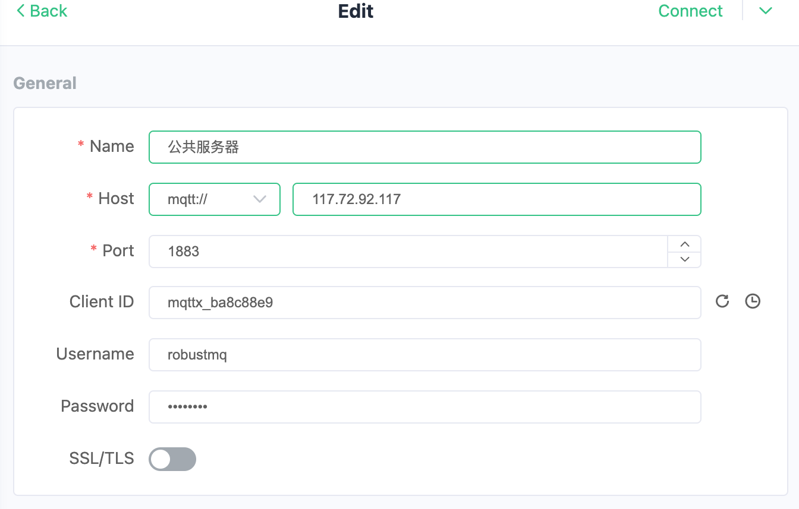
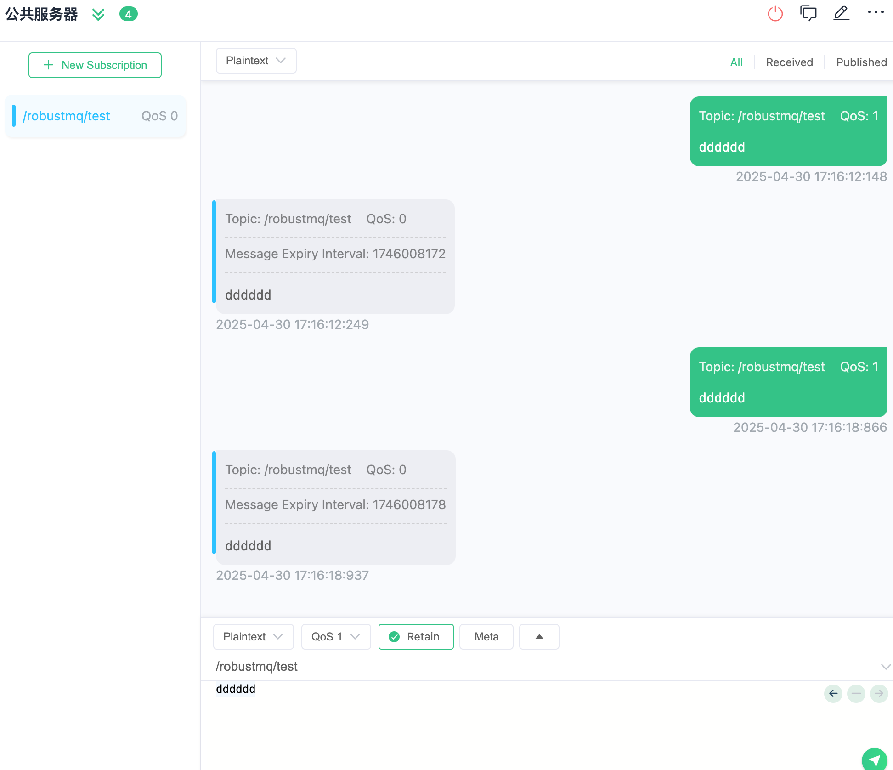

# 公共服务器

RobustMQ 提供公共测试服务器，覆盖 MQTT 和 mq9 两个协议，可直接用于测试和开发，无需本地部署。

## MQTT 公共服务器

### 服务器信息

### 接入点

| 协议 | 地址 | 端口 | 描述 |
|------|------|------|------|
| MQTT TCP | 117.72.92.117 | 1883 | 标准 MQTT 连接 |
| MQTT SSL/TLS | 117.72.92.117 | 1885 | 加密 MQTT 连接 |
| MQTT WebSocket | 117.72.92.117 | 8083 | WebSocket 连接 |
| MQTT WebSocket SSL | 117.72.92.117 | 8085 | 加密 WebSocket 连接 |
| MQTT QUIC | 117.72.92.117 | 9083 | QUIC 协议连接 |

### 认证信息

- **用户名**: `admin`
- **密码**: `robustmq`

### 管理界面

- **Dashboard**: <http://demo.robustmq.com/>

<div align="center">
  
</div>

### 快速体验

> MQTTX CLI 安装参考：[https://mqttx.app/zh/docs/cli](https://mqttx.app/zh/docs/cli)
>
> 也可直接使用 MQTTX Web 客户端：[https://mqttx.app/web-client](https://mqttx.app/web-client#/recent_connections)

#### 发布消息

```bash
# 发送消息
mqttx pub -h 117.72.92.117 -p 1883 -u admin -P robustmq -t "test/topic" -m "Hello RobustMQ!"

# 发送 QoS 1 消息
mqttx pub -h 117.72.92.117 -p 1883 -u admin -P robustmq -t "test/qos1" -m "msg" -q 1

# 发送保留消息
mqttx pub -h 117.72.92.117 -p 1883 -u admin -P robustmq -t "test/retained" -m "retained msg" -r
```

#### 订阅消息

```bash
# 订阅主题
mqttx sub -h 117.72.92.117 -p 1883 -u admin -P robustmq -t "test/topic"

# 通配符订阅
mqttx sub -h 117.72.92.117 -p 1883 -u admin -P robustmq -t "test/#"
```

#### 使用 MQTTX GUI 客户端

连接配置：**Host** `117.72.92.117` · **Port** `1883` · **Username** `admin` · **Password** `robustmq`

<div align="center">
  
</div>

<div align="center">
  
</div>

### 注意事项

1. 这是用于测试的公共服务器，请勿用于生产环境
2. 请勿在消息中传输敏感信息
3. 请合理使用，避免过度占用资源

---

## mq9 公共服务器

### mq9 接入点

| 参数 | 值 |
|------|----|
| NATS 地址 | `nats://117.72.92.117:4222` |
| 协议 | NATS（mq9 构建于 NATS 之上） |

这是共享环境，任何知道 subject 名称的人均可订阅，请勿发送敏感数据。

### mq9 快速体验

安装 NATS CLI：

```bash
# macOS
brew install nats-io/nats-tools/nats

# 其他平台参考：https://docs.nats.io/using-nats/nats-tools/nats_cli
```

设置连接地址：

```bash
export NATS_URL=nats://117.72.92.117:4222
```

### mq9 创建邮箱

```bash
nats req '$mq9.AI.MAILBOX.CREATE' '{"ttl":3600}'
# → {"mail_id":"m-xxxxxxxx"}
```

### mq9 发送消息

```bash
# 默认优先级（normal，无后缀）
nats pub '$mq9.AI.MAILBOX.MSG.{mail_id}' '{"type":"task","payload":"hello mq9"}'

# 紧急
nats pub '$mq9.AI.MAILBOX.MSG.{mail_id}.urgent' '{"type":"interrupt"}'

# 最高优先级
nats pub '$mq9.AI.MAILBOX.MSG.{mail_id}.critical' '{"type":"abort"}'
```

### mq9 订阅消息

```bash
# 订阅所有优先级
nats sub '$mq9.AI.MAILBOX.MSG.{mail_id}.*'

# 只订阅某一优先级
nats sub '$mq9.AI.MAILBOX.MSG.{mail_id}.critical'
```

### mq9 公开邮箱（任务队列）

```bash
# 创建公开邮箱
nats req '$mq9.AI.MAILBOX.CREATE' '{"ttl":3600,"public":true,"name":"demo.queue"}'

# 竞争消费
nats sub '$mq9.AI.MAILBOX.MSG.demo.queue.*' --queue workers

# 发送任务
nats pub '$mq9.AI.MAILBOX.MSG.demo.queue' '{"task":"job-1"}'
```

### mq9 注意事项

1. 公共服务器仅供测试，请勿用于生产环境
2. 请勿在消息中传输敏感信息
3. 公开邮箱名称对所有人可见，请使用随机或不敏感的名称
