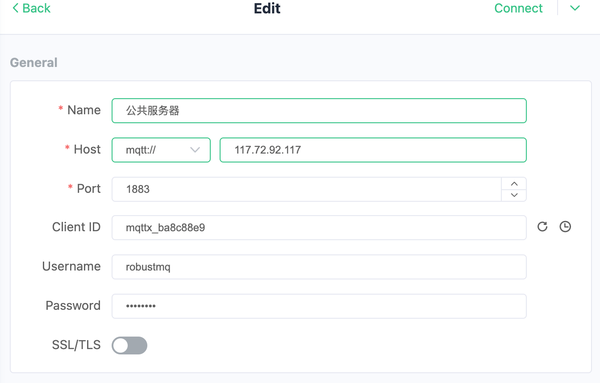

# RobustMQ 公共 MQTT 服务器

本指南介绍如何使用 RobustMQ 提供的公共 MQTT 服务器进行测试和开发。

## 服务器信息

### 接入点

| 协议 | 地址 | 端口 | 描述 |
|------|------|------|------|
| MQTT TCP | 117.72.92.117 | 1883 | 标准 MQTT 连接 |
| MQTT SSL/TLS | 117.72.92.117 | 1884 | 加密 MQTT 连接 |
| MQTT WebSocket | 117.72.92.117 | 8083 | WebSocket 连接 |
| MQTT WebSocket SSL | 117.72.92.117 | 8084 | 加密 WebSocket 连接 |
| MQTT QUIC | 117.72.92.117 | 9083 | QUIC 协议连接 |

### 认证信息

- **用户名**: `admin`
- **密码**: `robustmq`

### 管理界面

- **Dashboard**: <http://117.72.92.117:8080/>


## 快速体验

> **📦 MQTTX 安装**: 如果您还没有安装 MQTTX CLI，请参考我们的 [MQTTX 安装指南](../RobustMQ-MQTT/MQTTX-Guide.md#安装-mqttx-cli) 获取不同平台的详细安装说明。

> Web UI 地址：https://mqttx.app/web-client#/recent_connections

### 使用 MQTTX 命令行工具

#### 1. 发送消息

```bash
# 发送简单消息
mqttx pub -h 117.72.92.117 -p 1883 -u admin -P robustmq -t "test/topic" -m "Hello RobustMQ!"

# 发送 QoS 1 消息
mqttx pub -h 117.72.92.117 -p 1883 -u admin -P robustmq -t "test/qos1" -m "QoS 1 message" -q 1

# 发送保留消息
mqttx pub -h 117.72.92.117 -p 1883 -u admin -P robustmq -t "test/retained" -m "Retained message" -r

# 发送 JSON 格式消息
mqttx pub -h 117.72.92.117 -p 1883 -u admin -P robustmq -t "sensors/temperature" -m '{"value": 25.5, "unit": "celsius"}'
```

#### 2. 订阅消息

```bash
# 订阅单个主题
mqttx sub -h 117.72.92.117 -p 1883 -u admin -P robustmq -t "test/topic"

# 订阅通配符主题
mqttx sub -h 117.72.92.117 -p 1883 -u admin -P robustmq -t "test/+"  # 单级通配符
mqttx sub -h 117.72.92.117 -p 1883 -u admin -P robustmq -t "test/#"  # 多级通配符

# 订阅并显示详细信息
mqttx sub -h 117.72.92.117 -p 1883 -u admin -P robustmq -t "test/topic" --verbose
```

#### 3. 性能测试

```bash
# 发布性能测试
mqttx bench pub -h 117.72.92.117 -p 1883 -u admin -P robustmq -t "test/bench" -c 10 -C 100

# 订阅性能测试
mqttx bench sub -h 117.72.92.117 -p 1883 -u admin -P robustmq -t "test/bench" -c 50
```

### 使用 MQTTX GUI 客户端

#### 1. 连接配置

- **Host**: 117.72.92.117
- **Port**: 1883
- **Username**: admin
- **Password**: robustmq
- **Client ID**: 自定义



#### 2. 发布和订阅

连接成功后，您可以：

- 创建订阅来接收消息
- 发布消息到指定主题
- 查看实时消息流


## 完整示例

### 步骤 1: 订阅消息

```bash
# 终端 1: 订阅温度传感器数据
mqttx sub -h 117.72.92.117 -p 1883 -u admin -P robustmq -t "sensors/temperature" --verbose
```

### 步骤 2: 发送消息

```bash
# 终端 2: 发送温度数据
mqttx pub -h 117.72.92.117 -p 1883 -u admin -P robustmq -t "sensors/temperature" -m '{"sensor": "temp-001", "value": 23.5, "unit": "celsius", "timestamp": "2024-01-01T12:00:00Z"}'
```

### 步骤 3: 查看 Dashboard

访问 <http://117.72.92.117:3000/> 查看实时连接和消息统计。

## 注意事项

1. **公共服务器限制**: 这是用于测试的公共服务器，请勿用于生产环境
2. **消息保留**: 消息不会永久保留，请及时处理
3. **连接限制**: 请合理使用，避免过度占用资源
4. **安全提醒**: 请勿在消息中传输敏感信息

## 支持的协议特性

- ✅ MQTT 3.1.1
- ✅ MQTT 5.0
- ✅ QoS 0, 1, 2
- ✅ 保留消息
- ✅ 遗嘱消息
- ✅ 主题通配符
- ✅ SSL/TLS 加密
- ✅ WebSocket 支持
- ✅ QUIC 协议支持
