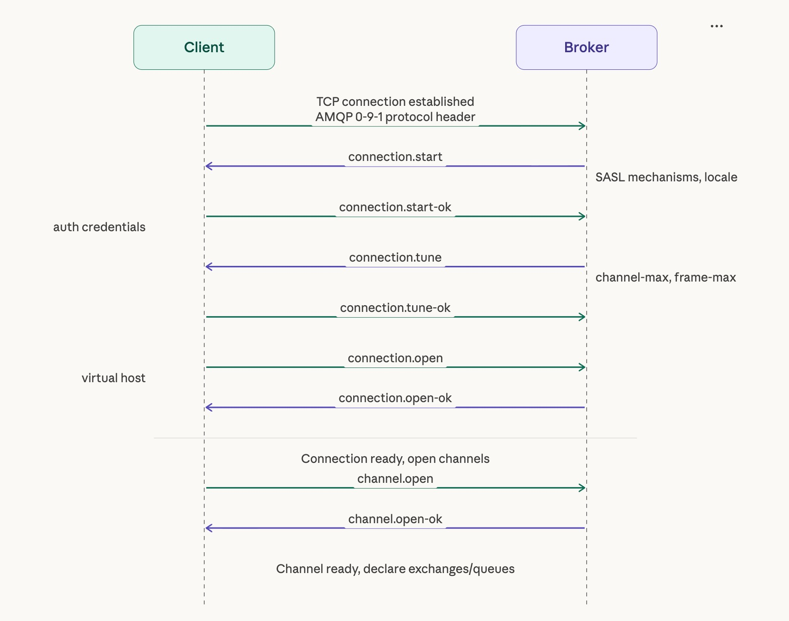
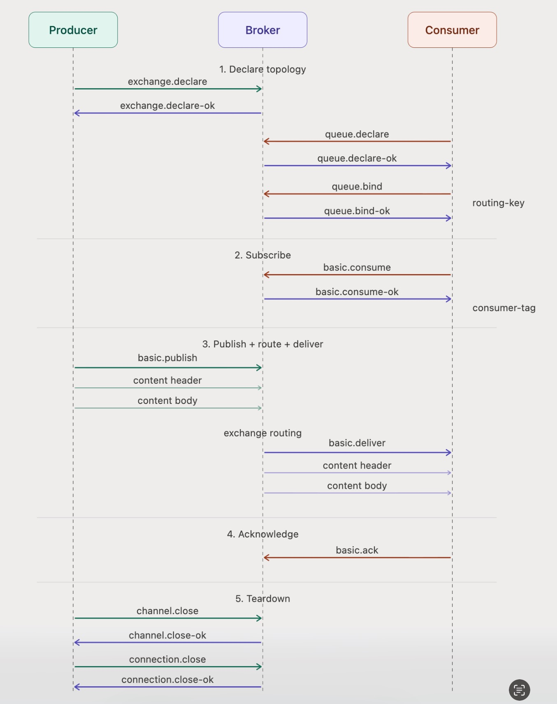
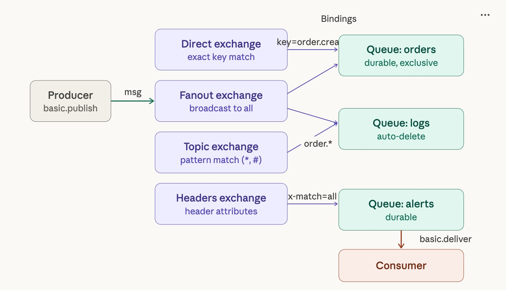

# RobustMQ AMQP 协议支持

本文档列出 RobustMQ 作为 AMQP Broker 需要支持的 AMQP 0.9.1 协议命令，以及各命令的优先级和说明。

参考文档：
- [AMQP 0.9.1 Protocol Specification](https://www.rabbitmq.com/resources/specs/amqp0-9-1.pdf)
- [AMQP 0.9.1 XML Definition](https://www.rabbitmq.com/resources/specs/amqp0-9-1.xml)

---

## 协议基础

AMQP 0.9.1 基于 TCP，采用帧（Frame）传输。每帧由类型、通道号、长度、payload 和帧结束符（0xCE）组成。

- 连接相关


- 生产消费相关
  


- broker 内部逻辑


### 帧类型

| 帧类型 | 编号 | 说明 |
|--------|------|------|
| Method Frame | 1 | 控制命令（所有 Class/Method） |
| Content Header Frame | 2 | 消息属性（content-type、delivery-mode、headers 等） |
| Content Body Frame | 3 | 消息体 payload（可分片） |
| Heartbeat Frame | 8 | 心跳保活 |

消息发布和投递均由 **Method + Content Header + Content Body** 三帧组合完成。

---

## 一、Connection 类（必须支持）

连接级握手，全部在 channel=0 上进行。Broker 需要主动发起 `start`、`secure`、`tune`、`close`，并处理客户端的响应。

| Class.Method | 编号 | 方向 | 说明 | 已支持 |
|--------------|------|------|------|--------|
| connection.start | 10.10 | S→C | Broker 发起握手，告知支持的 SASL 机制和 locale | ❌ |
| connection.start-ok | 10.11 | C→S | 客户端选择 SASL 机制并发送认证响应 | ❌ |
| connection.secure | 10.20 | S→C | Broker 发送 SASL challenge（多轮认证） | ❌ |
| connection.secure-ok | 10.21 | C→S | 客户端响应 SASL challenge | ❌ |
| connection.tune | 10.30 | S→C | Broker 提议 channel-max、frame-max、heartbeat 参数 | ❌ |
| connection.tune-ok | 10.31 | C→S | 客户端确认连接参数 | ❌ |
| connection.open | 10.40 | C→S | 客户端打开 virtual host | ❌ |
| connection.open-ok | 10.41 | S→C | Broker 确认 vhost 连接成功 | ❌ |
| connection.close | 10.50 | 双向 | 任一方发起关闭连接（携带错误码） | ❌ |
| connection.close-ok | 10.51 | 双向 | 确认关闭 | ❌ |

---

## 二、Channel 类（必须支持）

一条 TCP 连接上可以复用多个 channel，每个 channel 独立进行消息收发。

| Class.Method | 编号 | 方向 | 说明 | 已支持 |
|--------------|------|------|------|--------|
| channel.open | 20.10 | C→S | 客户端开启一个 channel | ❌ |
| channel.open-ok | 20.11 | S→C | Broker 确认 channel 开启 | ❌ |
| channel.flow | 20.20 | 双向 | 暂停或恢复消息流（背压控制） | ❌ |
| channel.flow-ok | 20.21 | 双向 | 确认 flow 命令 | ❌ |
| channel.close | 20.40 | 双向 | 关闭 channel（携带错误码） | ❌ |
| channel.close-ok | 20.41 | 双向 | 确认关闭 | ❌ |

---

## 三、Exchange 类（必须支持）

Exchange 是消息路由的核心，支持 direct、fanout、topic、headers 四种类型。

| Class.Method | 编号 | 方向 | 说明 | 已支持 |
|--------------|------|------|------|--------|
| exchange.declare | 40.10 | C→S | 创建或验证 exchange（type/passive/durable/no-wait） | ❌ |
| exchange.declare-ok | 40.11 | S→C | 确认创建 | ❌ |
| exchange.delete | 40.20 | C→S | 删除 exchange（if-unused 选项） | ❌ |
| exchange.delete-ok | 40.21 | S→C | 确认删除 | ❌ |

---

## 四、Queue 类（必须支持）

| Class.Method | 编号 | 方向 | 说明 | 已支持 |
|--------------|------|------|------|--------|
| queue.declare | 50.10 | C→S | 创建或验证队列（passive/durable/exclusive/auto-delete） | ❌ |
| queue.declare-ok | 50.11 | S→C | 确认创建，返回队列名、消息数、消费者数 | ❌ |
| queue.bind | 50.20 | C→S | 绑定队列到 exchange（指定 routing-key） | ❌ |
| queue.bind-ok | 50.21 | S→C | 确认绑定 | ❌ |
| queue.unbind | 50.50 | C→S | 解除队列与 exchange 的绑定 | ❌ |
| queue.unbind-ok | 50.51 | S→C | 确认解绑 | ❌ |
| queue.purge | 50.30 | C→S | 清空队列中所有未 ack 的消息 | ❌ |
| queue.purge-ok | 50.31 | S→C | 确认清空，返回清除消息数 | ❌ |
| queue.delete | 50.40 | C→S | 删除队列（if-unused / if-empty 选项） | ❌ |
| queue.delete-ok | 50.41 | S→C | 确认删除，返回删除消息数 | ❌ |

---

## 五、Basic 类（必须支持）

Basic 类是 AMQP 0.9.1 的核心，包含消息发布、投递、确认的全部逻辑。

### 5.1 消费者管理

| Class.Method | 编号 | 方向 | 说明 | 已支持 |
|--------------|------|------|------|--------|
| basic.qos | 60.10 | C→S | 设置预取（prefetch-size、prefetch-count、global） | ❌ |
| basic.qos-ok | 60.11 | S→C | 确认 QoS 设置 | ❌ |
| basic.consume | 60.20 | C→S | 注册消费者，开启 push 模式消费（no-local/no-ack/exclusive） | ❌ |
| basic.consume-ok | 60.21 | S→C | 返回 consumer-tag | ❌ |
| basic.cancel | 60.30 | C→S | 取消消费者 | ❌ |
| basic.cancel-ok | 60.31 | S→C | 确认取消 | ❌ |

### 5.2 消息发布

| Class.Method | 编号 | 方向 | 说明 | 已支持 |
|--------------|------|------|------|--------|
| basic.publish | 60.40 | C→S | 发布消息（指定 exchange、routing-key、mandatory、immediate），后跟 Content Header + Body 帧 | ❌ |
| basic.return | 60.50 | S→C | 退回无法路由的消息（mandatory/immediate 标志触发） | ❌ |

### 5.3 消息投递

| Class.Method | 编号 | 方向 | 说明 | 已支持 |
|--------------|------|------|------|--------|
| basic.deliver | 60.60 | S→C | Broker 推送消息给消费者（push 模式），后跟 Content Header + Body 帧 | ❌ |
| basic.get | 60.70 | C→S | 同步拉取一条消息（pull 模式） | ❌ |
| basic.get-ok | 60.71 | S→C | 返回消息，后跟 Content Header + Body 帧 | ❌ |
| basic.get-empty | 60.72 | S→C | 队列为空时的响应 | ❌ |

### 5.4 消息确认

| Class.Method | 编号 | 方向 | 说明 | 已支持 |
|--------------|------|------|------|--------|
| basic.ack | 60.80 | C→S | 确认消息已处理（支持 multiple 批量 ack） | ❌ |
| basic.reject | 60.90 | C→S | 拒绝消息（requeue=true 重新入队，false 丢弃） | ❌ |
| basic.recover | 60.110 | C→S | 要求 Broker 重新投递所有未 ack 的消息 | ❌ |
| basic.recover-ok | 60.111 | S→C | 确认 recover | ❌ |

---

## 六、Tx 类（可选，本地事务）

| Class.Method | 编号 | 方向 | 说明 | 已支持 |
|--------------|------|------|------|--------|
| tx.select | 90.10 | C→S | 开启事务模式 | ❌ |
| tx.select-ok | 90.11 | S→C | 确认事务模式开启 | ❌ |
| tx.commit | 90.20 | C→S | 提交事务（publish + ack 原子生效） | ❌ |
| tx.commit-ok | 90.21 | S→C | 确认提交 | ❌ |
| tx.rollback | 90.30 | C→S | 回滚事务 | ❌ |
| tx.rollback-ok | 90.31 | S→C | 确认回滚 | ❌ |

---

## 七、RabbitMQ 扩展（可选）

以下为 RabbitMQ 对 AMQP 0.9.1 的私有扩展，不在标准规范内，但主流客户端广泛使用：

| 扩展 | 说明 | 已支持 |
|------|------|--------|
| **basic.nack** | 批量拒绝消息（标准 reject 只能拒绝单条） | ❌ |
| **confirm.select / confirm.select-ok** | Publisher Confirm 模式，Broker 对每条 publish 回 ack/nack | ❌ |
| **exchange.bind / exchange.bind-ok** | Exchange-to-Exchange 绑定 | ❌ |
| **exchange.unbind / exchange.unbind-ok** | 解除 Exchange-to-Exchange 绑定 | ❌ |

> Publisher Confirm 是生产环境几乎必用的可靠性机制，建议与 basic.publish 一同实现。

---

## Broker 核心业务逻辑

AMQP 0.9.1 中约一半的 method 是 `*-ok` 的确认回包，Broker 直接构造返回即可。真正需要实现业务逻辑的是以下 5 个方面：

| 核心能力 | 涉及 Method | 说明 |
|----------|-------------|------|
| **认证** | connection.start / start-ok / secure / secure-ok | SASL 握手，支持 PLAIN、AMQPLAIN 机制 |
| **路由** | exchange.declare + queue.bind + basic.publish | publish → exchange → binding → queue 匹配，支持 direct/fanout/topic/headers |
| **Push 投递** | basic.consume + basic.deliver | 维护消费者注册表，遵守 prefetch 窗口，push 消息给消费者 |
| **消息确认** | basic.ack / reject / nack / recover | 驱动消息状态变更（unacked → acked / requeued / dead-lettered） |
| **事务** | tx.select / commit / rollback | publish 和 ack 的原子性保证（可选） |

---

## 实现路线图

### 第一阶段：标准客户端可用

实现以下 Method 后，标准 AMQP 客户端（pika、amqplib 等）可正常收发消息：

```text
connection: start → start-ok → tune → tune-ok → open → open-ok
channel: open → open-ok
exchange: declare → declare-ok
queue: declare → declare-ok → bind → bind-ok
basic: publish(+Header+Body) → deliver(+Header+Body)
basic: consume → consume-ok → ack
connection/channel: close → close-ok
```

### 第二阶段：完整消息语义

在第一阶段基础上，增加：

- basic.qos（prefetch 流控）
- basic.reject / basic.recover（消息重投）
- basic.get / get-ok / get-empty（pull 模式）
- basic.return（mandatory 消息退回）
- queue.purge / delete、exchange.delete

### 第三阶段：可靠性与事务

- Publisher Confirm（confirm.select + basic.ack/nack）
- Tx 事务（tx.select / commit / rollback）
- basic.nack（批量拒绝）
- Exchange-to-Exchange 绑定
