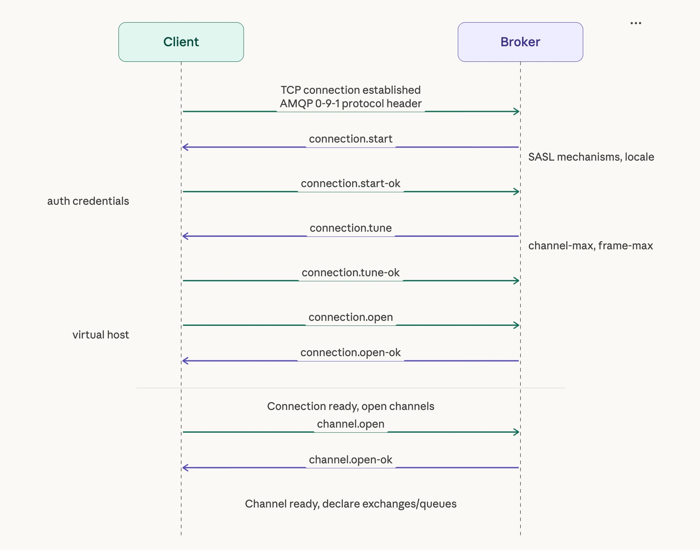
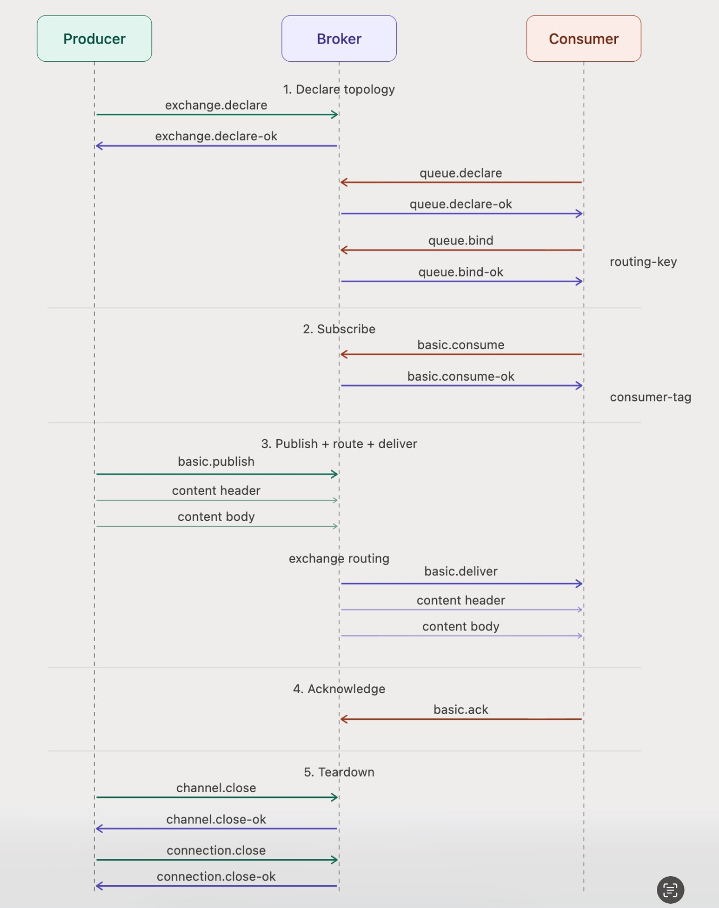
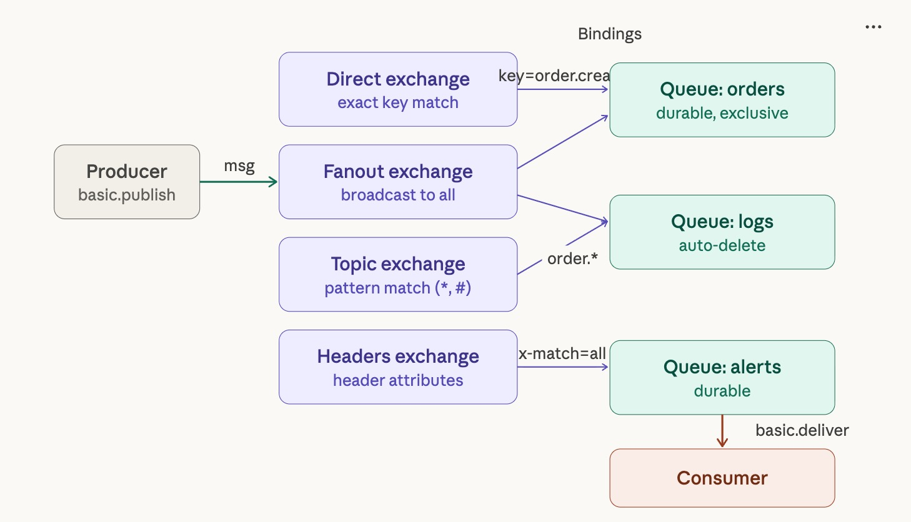

# RobustMQ AMQP 协议支持

本文列出 RobustMQ 作为 AMQP Broker 对 AMQP 0-9-1 协议各 Class/Method 的**实际支持状态**。状态分三档:

- ✅ **完整支持**:协议语义正确实现。
- 🟡 **部分支持**:协议握手/接口可用,但功能上是简化实现或存在已知限制,见备注。
- ❌ **不支持**:方法本身返回错误或不做真实语义。

参考文档:
- [AMQP 0-9-1 Protocol Specification](https://www.rabbitmq.com/resources/specs/amqp0-9-1.pdf)
- [AMQP 0-9-1 XML Definition](https://www.rabbitmq.com/resources/specs/amqp0-9-1.xml)

逐项的原因与影响见 [兼容性与限制](./Compatibility-and-Limitations.md)。

---

## 协议基础

AMQP 0-9-1 基于 TCP,采用帧(Frame)传输。每帧由类型、通道号、长度、payload 和帧结束符(0xCE)组成。

- 连接相关

- 生产消费相关

- broker 内部逻辑

### 帧类型

| 帧类型 | 编号 | 说明 |
|--------|------|------|
| Method Frame | 1 | 控制命令(所有 Class/Method) |
| Content Header Frame | 2 | 消息属性(content-type、delivery-mode、headers 等) |
| Content Body Frame | 3 | 消息体 payload(可分片) |
| Heartbeat Frame | 8 | 心跳保活 |

消息发布和投递均由 **Method + Content Header + Content Body** 三帧组合完成。

---

## 一、Connection 类

| Class.Method | 编号 | 方向 | 说明 | 状态 |
|--------------|------|------|------|------|
| connection.start | 10.10 | S→C | Broker 发起握手,告知支持的 SASL 机制和 locale | ✅ |
| connection.start-ok | 10.11 | C→S | 客户端选择 SASL 机制并发送认证响应 | ✅ 仅 PLAIN |
| connection.secure | 10.20 | S→C | Broker 发送 SASL challenge(多轮认证) | 🟡 未使用(PLAIN 不需要) |
| connection.secure-ok | 10.21 | C→S | 客户端响应 SASL challenge | 🟡 纯 ack 桩 |
| connection.tune | 10.30 | S→C | Broker 提议 channel-max、frame-max、heartbeat 参数 | ✅ |
| connection.tune-ok | 10.31 | C→S | 客户端确认连接参数 | ✅ 服务端会取客户端协商值与自身提议值的较小者 |
| connection.open | 10.40 | C→S | 客户端打开 virtual host(映射为租户) | ✅ |
| connection.open-ok | 10.41 | S→C | Broker 确认 vhost 连接成功 | ✅ |
| connection.close | 10.50 | 双向 | 任一方发起关闭连接(携带错误码) | ✅ |
| connection.close-ok | 10.51 | 双向 | 确认关闭 | ✅ |
| connection.blocked | 10.60 | S→C | 连接级流控告警 | 🟡 未使用(不做主动限流) |
| connection.unblocked | 10.61 | S→C | 解除流控告警 | 🟡 未使用 |
| connection.update-secret | 10.70 | C→S | 更新已建立连接的认证凭据 | 🟡 纯 ack 桩,不做真实凭据轮换 |
| connection.update-secret-ok | 10.71 | S→C | 确认更新 | 🟡 |

---

## 二、Channel 类

| Class.Method | 编号 | 方向 | 说明 | 状态 |
|--------------|------|------|------|------|
| channel.open | 20.10 | C→S | 客户端开启一个 channel | ✅ |
| channel.open-ok | 20.11 | S→C | Broker 确认 channel 开启 | ✅ |
| channel.flow | 20.20 | 双向 | 暂停或恢复消息流(背压控制) | 🟡 仅对本节点的推送生效,见 [兼容性与限制](./Compatibility-and-Limitations.md) |
| channel.flow-ok | 20.21 | 双向 | 确认 flow 命令 | ✅ |
| channel.close | 20.40 | 双向 | 关闭 channel(携带错误码) | ✅ |
| channel.close-ok | 20.41 | 双向 | 确认关闭 | ✅ |

---

## 三、Exchange 类

Exchange 是消息路由的核心,支持 `direct`、`fanout`、`topic`、`headers` 四种类型。

| Class.Method | 编号 | 方向 | 说明 | 状态 |
|--------------|------|------|------|------|
| exchange.declare | 40.10 | C→S | 创建或验证 exchange(type/passive/durable/no-wait) | ✅ 含 passive 语义(不存在返回 404) |
| exchange.declare-ok | 40.11 | S→C | 确认创建 | ✅ |
| exchange.delete | 40.20 | C→S | 删除 exchange(if-unused 选项) | ✅ |
| exchange.delete-ok | 40.21 | S→C | 确认删除 | ✅ |
| exchange.bind | 40.30 | C→S | Exchange-to-Exchange 绑定(RabbitMQ 扩展) | ✅ 支持链式路由,对循环绑定有保护 |
| exchange.bind-ok | 40.31 | S→C | 确认绑定 | ✅ |
| exchange.unbind | 40.40 | C→S | 解除 Exchange-to-Exchange 绑定 | ✅ |
| exchange.unbind-ok | 40.51 | S→C | 确认解绑 | ✅ |

---

## 四、Queue 类

| Class.Method | 编号 | 方向 | 说明 | 状态 |
|--------------|------|------|------|------|
| queue.declare | 50.10 | C→S | 创建或验证队列(passive/durable/exclusive/auto-delete) | ✅ 含 passive 语义 |
| queue.declare-ok | 50.11 | S→C | 确认创建,返回队列名、消息数、消费者数 | ✅ 真实统计值(基于当前存储位点与共享消费组成员数) |
| queue.bind | 50.20 | C→S | 绑定队列到 exchange(指定 routing-key) | ✅ |
| queue.bind-ok | 50.21 | S→C | 确认绑定 | ✅ |
| queue.unbind | 50.50 | C→S | 解除队列与 exchange 的绑定 | ✅ |
| queue.unbind-ok | 50.51 | S→C | 确认解绑 | ✅ |
| queue.purge | 50.30 | C→S | 清空队列中所有消息 | ✅ |
| queue.purge-ok | 50.31 | S→C | 确认清空,返回清除消息数 | ✅ |
| queue.delete | 50.40 | C→S | 删除队列(if-unused / if-empty 选项) | ✅ |
| queue.delete-ok | 50.41 | S→C | 确认删除,返回删除消息数 | ✅ |

---

## 五、Basic 类

Basic 类是 AMQP 0-9-1 的核心,包含消息发布、投递、确认的全部逻辑。

### 5.1 消费者管理

| Class.Method | 编号 | 方向 | 说明 | 状态 |
|--------------|------|------|------|------|
| basic.qos | 60.10 | C→S | 设置预取(prefetch-size、prefetch-count、global) | 🟡 消费者与队列 leader 同节点时强制生效,跨节点为尽力而为;`prefetch-size` 不生效 |
| basic.qos-ok | 60.11 | S→C | 确认 QoS 设置 | ✅ |
| basic.consume | 60.20 | C→S | 注册消费者,开启 push 模式消费(no-local/no-ack/exclusive) | ✅ `exclusive` 已强制;`no-local` 不生效(与 RabbitMQ 经典队列一致) |
| basic.consume-ok | 60.21 | S→C | 返回 consumer-tag | ✅ 客户端留空时由 Broker 生成 |
| basic.cancel | 60.30 | C→S | 取消消费者 | ✅ |
| basic.cancel-ok | 60.31 | S→C | 确认取消 | ✅ |

### 5.2 消息发布

| Class.Method | 编号 | 方向 | 说明 | 状态 |
|--------------|------|------|------|------|
| basic.publish | 60.40 | C→S | 发布消息(指定 exchange、routing-key、mandatory、immediate),后跟 Content Header + Body 帧 | ✅ `immediate` 已废弃标志,不做特殊处理(与现代 RabbitMQ 一致) |
| basic.return | 60.50 | S→C | 退回无法路由的消息(mandatory 标志触发) | ✅ |

### 5.3 消息投递

| Class.Method | 编号 | 方向 | 说明 | 状态 |
|--------------|------|------|------|------|
| basic.deliver | 60.60 | S→C | Broker 推送消息给消费者(push 模式),后跟 Content Header + Body 帧 | ✅ |
| basic.get | 60.70 | C→S | 同步拉取一条消息(pull 模式) | ✅ 跨节点自动转发到队列 leader |
| basic.get-ok | 60.71 | S→C | 返回消息,后跟 Content Header + Body 帧 | ✅ |
| basic.get-empty | 60.72 | S→C | 队列为空时的响应 | ✅ |

### 5.4 消息确认

| Class.Method | 编号 | 方向 | 说明 | 状态 |
|--------------|------|------|------|------|
| basic.ack | 60.80 | C→S | 确认消息已处理(支持 multiple 批量 ack) | ✅ |
| basic.reject | 60.90 | C→S | 拒绝消息(requeue=true 重新入队,false 丢弃) | ✅ |
| basic.recover-async | 60.100 | C→S | 要求 Broker 重新投递所有未 ack 的消息(不等待确认) | ✅ |
| basic.recover | 60.110 | C→S | 要求 Broker 重新投递所有未 ack 的消息 | ✅ |
| basic.recover-ok | 60.111 | S→C | 确认 recover | ✅ |
| basic.nack | 60.120 | C→S | 批量拒绝消息(RabbitMQ 扩展) | ✅ |

---

## 六、Tx 类(未实现真实语义)

| Class.Method | 编号 | 方向 | 说明 | 状态 |
|--------------|------|------|------|------|
| tx.select | 90.10 | C→S | 开启事务模式 | 🟡 仅握手,回复 select-ok |
| tx.select-ok | 90.11 | S→C | 确认事务模式开启 | 🟡 |
| tx.commit | 90.20 | C→S | 提交事务(publish + ack 原子生效) | 🟡 仅回复 commit-ok,不做真实原子提交 |
| tx.commit-ok | 90.21 | S→C | 确认提交 | 🟡 |
| tx.rollback | 90.30 | C→S | 回滚事务 | 🟡 仅回复 rollback-ok,不做真实回滚 |
| tx.rollback-ok | 90.31 | S→C | 确认回滚 | 🟡 |

> 使用 `Tx.Select` 之后,publish 和 ack 依然是**立即生效**的,不会被缓冲到 commit 才可见,也不支持 rollback 撤销。需要可靠发布语义的场景请使用 [Publisher Confirm](./PublisherConfirms.md)。

---

## 七、Confirm 类(Publisher Confirm,RabbitMQ 扩展)

| Class.Method | 编号 | 方向 | 说明 | 状态 |
|--------------|------|------|------|------|
| confirm.select | 85.10 | C→S | 开启 Publisher Confirm 模式 | ✅ |
| confirm.select-ok | 85.11 | S→C | 确认开启 | ✅ |

开启后,该 channel 上每条 `basic.publish` 都会在消息落盘后收到匹配的 `basic.ack`(成功)或 `basic.nack`(失败),详见 [Publisher Confirm](./PublisherConfirms.md)。

---

## Broker 核心业务逻辑

AMQP 0-9-1 中约一半的 method 是 `*-ok` 的确认回包,Broker 直接构造返回即可。真正承载业务逻辑的是以下方面:

| 核心能力 | 涉及 Method | 状态 |
|----------|-------------|------|
| **认证** | connection.start / start-ok | ✅ SASL PLAIN |
| **路由** | exchange.declare + queue.bind + basic.publish | ✅ direct/fanout/topic/headers + exchange 链式绑定 |
| **共享队列 / Push 投递** | basic.consume + basic.deliver | ✅ 基于共享消费组 leader 推送,见 [共享队列组](./SharedQueueGroup.md) |
| **消息确认** | basic.ack / reject / nack / recover | ✅ 驱动消息状态变更(unacked → acked / requeued) |
| **可靠发布** | confirm.select + basic.ack/nack | ✅ 见 [Publisher Confirm](./PublisherConfirms.md) |
| **预取流控** | basic.qos | 🟡 本节点强制,跨节点尽力而为 |
| **事务** | tx.select / commit / rollback | 🟡 仅握手,无真实语义 |

## 延伸阅读

- [核心概念](./AMQPCoreConcepts.md)
- [系统架构](./SystemArchitecture.md)
- [兼容性与限制](./Compatibility-and-Limitations.md)
- [路线图](./Roadmap.md)
