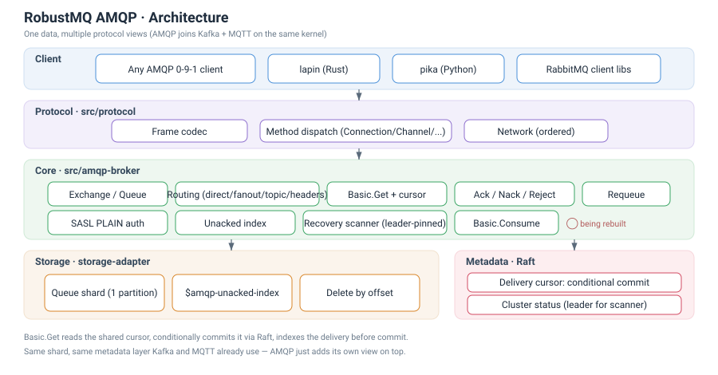

# 系统架构

RobustMQ 的 AMQP 能力并不是一个独立的消息队列服务,而是构建在 RobustMQ 统一内核之上的一层 **AMQP 0-9-1 协议兼容层**。它复用 RobustMQ 的网络框架、File Segment 存储引擎与基于 Raft 的元数据服务,对外呈现为一个标准的 AMQP 0-9-1 Broker——官方 RabbitMQ 客户端可以直接连接。

其最重要的设计取向是**复用共享消费组基础设施**:AMQP 队列的"竞争消费者"模型和 MQTT/NATS 的共享订阅是同一套机制,因此 AMQP 没有重新实现一套队列引擎,而是把每个队列映射为一个共享消费组,由集群选出的 leader 节点负责这个队列的消息拉取与投递。

## 分层架构

自上而下分为五层:

### 1. 客户端层

任何标准 AMQP 0-9-1 客户端都可接入:Java `com.rabbitmq:amqp-client`、Python `pika`、Node.js `amqplib` 等。客户端通过标准的 `Connection.Start`/`Tune`/`Open` 握手接入,无需任何 RobustMQ 专有扩展。

### 2. 协议层(`amq-protocol` + `src/amqp-broker/src/handler`)

基于 `amq-protocol` crate 完成 AMQP 0-9-1 线上协议的**编解码**(Method / Content Header / Content Body / Heartbeat 四种帧类型)。要点:

- **Handler 分发**(`handler/command.rs`):按 `AMQPClass`(Connection / Channel / Exchange / Queue / Basic / Tx / Confirm)把请求路由到对应处理模块。
- **多帧原子写**:一次 `Basic.Deliver`/`Basic.Get-Ok` 需要连续写出 Method + Header + Body 三帧;当同一条连接上有多个并发的队列推送任务时,写入必须持有同一把连接锁直到三帧全部发出,否则会在 TCP 流上交叉,导致客户端解析错乱。

### 3. 核心处理层(`src/amqp-broker/src/amqp`)

AMQP 语义的实现所在,按 AMQP 的 Class 划分模块:

- **connection / channel**:握手、SASL PLAIN 认证、vhost→租户映射、channel 生命周期。
- **exchange / queue**:声明(含 passive 语义)、删除(`if-unused`/`if-empty`)、绑定/解绑,元数据写入 Raft 并同步到本地缓存。
- **publish**:`Basic.Publish` 路由(默认 exchange 直连 + 四种 exchange 类型匹配)、`mandatory` 退回。
- **consume**:`Basic.Get`(拉取)与 `Basic.Consume`(注册共享消费组成员)。
- **basic**:`Ack`/`Nack`/`Reject`/`Recover`/`Qos`/`Confirm.Select` 等消息状态与可靠性语义。

### 4. 推送与协调层(`src/amqp-broker/src/push` + `src/amqp-broker/src/core`)

这是 AMQP 队列模型落地为共享消费组的关键一层:

- **`AmqpPushManager` / `AmqpQueuePush`**:每个队列的推送任务按 round-robin 把消息投给组内成员(消费者),遵守 `Basic.Qos` 设置的 prefetch 窗口。
- **Leader 选举与解析**(`resolve_queue_leader`):第一次访问某个队列时,通过 meta-service 创建/查询该队列的共享消费组并拿到 leader 节点;结果直接由创建/查询接口返回,不需要额外一次读回确认。
- **跨节点转发**:`Basic.Get` 落在非 leader 节点时,通过一次 gRPC(`FetchAmqpQueueMessage`)转发到 leader;`Basic.Consume` 的推送同理通过 `SendShareGroupMessage` 把消息投递到消费者所在的实际连接。

### 5. 存储层(File Segment 引擎)

通过 `StorageDriverManager` 访问与 Kafka、MQTT 共享的 File Segment 引擎:

- 每个 AMQP 队列对应一个内部 topic,承载消息的物理分片(shard)按段(segment)追加写入。
- 消费位点(已确认 / 未确认)通过独立的 offset 存储与未确认索引(unacked index)管理,支撑 `Basic.Ack`/`Nack`/`Recover` 的语义。

### 6. 元数据层(meta-service · Raft)

集群元数据由基于 Raft 的 meta-service 管理:

- **Exchange / Queue / Binding**:声明的元数据持久化在 Raft,复制到所有节点,重启不丢失。
- **共享消费组(ShareGroup / ShareGroupMember)**:AMQP 队列复用 MQTT/NATS 已有的共享消费组数据结构与选举逻辑,不单独维护一套队列表。
- **动态配置**:每次创建操作(如 `Queue.Declare` 首次创建共享组)由处理该请求的 leader 节点直接返回权威结果,避免"写完立刻读、读到还没应用的旧状态"这类竞态。

## 一次请求的走向

- **声明类操作(Exchange/Queue declare/delete/bind)**:协议层解码 → 核心层处理 → 写 Raft 元数据 → 更新本地缓存 → 返回确认帧。
- **发布(`Basic.Publish`)**:协议层解码 → 路由匹配(exchange 类型 + binding)→ 写入目标队列对应的存储分片。
- **拉取消费(`Basic.Get`)**:核心层解析队列 leader → 若为本节点,直接从存储读取下一条消息;若非本节点,gRPC 转发给 leader 处理。
- **推送消费(`Basic.Consume`)**:队列 leader 节点上的推送任务持续轮询存储,按 round-robin 挑选组内一个有空闲 prefetch 配额的消费者投递。

## 与原生 RabbitMQ 的关键差异

| 维度 | 原生 RabbitMQ | RobustMQ |
|---|---|---|
| 队列引擎 | Erlang 进程 + Mnesia | 共享消费组 + File Segment 存储引擎 |
| 队列协调者 | 队列所在节点(镜像/仲裁队列有独立选主) | meta-service 选举的共享消费组 leader |
| 多协议 | 仅 AMQP(需 Shovel/Federation 插件跨协议) | AMQP / Kafka / MQTT 共享同一份数据 |
| 管理 HTTP API | 内置 `rabbitmqadmin` / management 插件 | 暂无独立管理 API,通过 AMQP 协议本身管理 |
| 事务 / 死信队列 | 支持 | 暂不支持(见[兼容性与限制](./Compatibility-and-Limitations.md)) |

> 关于逐 method 的支持状态,见 [协议兼容矩阵](./Protocol.md)。
