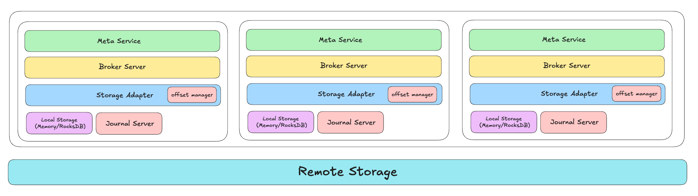
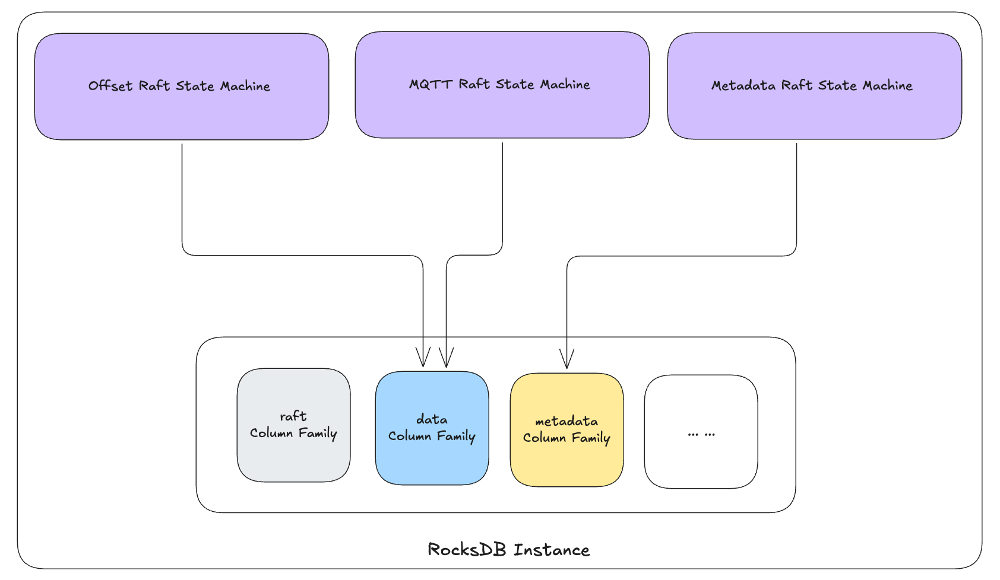

## RobustMQ 消费 Offset 存储实现

从设计角度来看，RobustMQ 的消息数据会存储在不同的存储介质中，在数据订阅和消费时会面临一个共性需求：Offset 应该如何存储。无论存储引擎是对象存储、HDFS 等文件型存储，还是未来可能引入的其他存储引擎，都需要解决 Offset 的存储问题。为此，我们必须设计一个通用的 Offset 存储方案，以简化插件化存储层的开发工作。

我们的实现思路如下图所示：



在 Storage Adapter 中实现一个 Offset Manager 模块。这样在适配新的存储引擎时，默认情况下不需要单独管理 offset，直接使用内置实现即可。

Offset Manager 会将 Offset 数据统一存储在 Meta Service 中。Meta Service 是一个基于 Raft 和 RocksDB 实现的分布式 KV 存储引擎，从一致性和功能性来看，用它来存储 Offset 数据是合适的选择。

然而，Offset 是极高频次读写的数据，而 Meta Service 又是 RobustMQ 集群的元数据存储引擎和控制中心。因此需要解决两个关键问题：
1. Offset 的高频读写不能影响元数据的读写和集群管控功能。
2. Meta Service 必须能够承受 Offset 的高频读写压力。

归根结底，核心在于如何做好隔离和提升读写性能。

## 隔离性

从实现层面来看，隔离性的核心在于 Multi Raft 架构。Offset 的读写由独立的 Raft 状态机负责，根据 Raft 协议，写入操作由 Leader 节点完成。我们会通过 Leader 分布策略，确保 Offset 状态机的 Leader 和其他状态机的 Leader 分布在不同的节点上。

独立 Raft 状态机的优势在于，raft log、快照以及节点间的一致性同步都是相互独立的。这意味着即使 offset 的请求量很大，也不会影响其他数据的一致性同步过程。如下图所示：



Offset 状态机的数据存储在 data column family 中，在存储层面也与 Meta 相关数据保持独立。

因此，我们在 Leader 分布、Raft 数据一致性以及数据存储三个层面都实现了与 Meta 数据的隔离。由于集群控制相关的 Controller 模块固定运行在 Metadata 状态机的 Leader 节点上，因此天然与 Offset 隔离。多状态机架构的另一个优势是可以充分利用多节点的性能，避免将所有写入集中在单个节点上。

总结来看，隔离的核心机制是 Multi Raft 架构和独立的 RocksDB Data Column Family。

虽然网络层共用 gRPC 协议，但如果这部分出现性能瓶颈，会作为通用优化项统一处理，不在本次讨论范围内。

## 读写性能提升

读写性能提升的核心除了独立的 Raft 状态机和存储之外，最重要的是 Batch 语义的支持。主要包括两个方面：
1. 在 Meta Service 中支持 Offset Batch Save 语义
2. Storage Adapter 支持 Cache + Batch Update 能力

### Batch Save

Meta Service 的 Batch Save 核心思路如下：

**1. 接口设计支持批量更新**

Meta Service 的 OffsetSave 接口允许同时更新多个 Group 的多个 Shard 的 Offset 信息：

```protobuf
message SaveOffsetDataRequest {
  string cluster_name = 1 [(validate.rules).string.min_len = 1];
  repeated SaveOffsetData offsets = 2;
}

message SaveOffsetData {
  string group = 1;
  repeated SaveOffsetDataRequestOffset offsets = 2;
}

message SaveOffsetDataRequestOffset {
  string namespace = 1;
  string shard_name = 2;
  uint64 offset = 3;
}
```

**2. 底层批量写入 RocksDB**

在 RocksDB 中更新 Offset 时，使用 RocksDB 的 WriteBatch 接口实现批量写入。目前暂未引入缓存层，考虑到 Batch 写入 RocksDB 的性能可以满足需求，同时也希望控制内存使用量。后续如有必要，会考虑增加缓存层优化。

### Storage Adapter Cache + Update

Offset 的更新频率可能极高，例如客户端可能处理每条消息都会提交一次 offset。如果每次 offset 更新都直接调用 Meta Service，会对 Meta Service 造成极大的压力。

因此我们采用以下设计策略：

1. **本地缓存写入**：Commit Offset 时不会直接调用 Meta Service，而是先将 Offset 更新到本地的 RocksDB 中。

2. **异步批量刷新**：通过一个异步线程每 100ms（可配置）将数据批量更新到 Meta Service，这样可以将 Offset Save 接口的调用频率控制在每台 Broker 每秒 10 次左右，显著降低 Meta Service 的压力。

3. **优雅关闭保证**：当 Broker 正常停止时，会先保存所有未持久化的 Offset，确保数据不会丢失。

4. **异常恢复补偿**：如果 Broker 异常停止，重启后会比对本地 Offset 和 Meta Service 中的 Offset。若本地 Offset 大于 Meta Service 中的值，会执行补偿措施，将最新的 Offset 更新到 Meta Service。

**配置灵活性**：系统支持通过配置关闭缓存策略，允许每次提交都直接更新 Meta Service。业务可以根据实际需求选择合适的更新方式。对于无法容忍重复消费的业务场景，可以配置为每次都直接更新 Meta Service。

**默认策略说明**：默认情况下启用缓存策略。从技术角度分析，缓存策略通过异步刷新和优雅关闭机制，能够有效保证 Offset 不丢失，同时性能更高，对系统压力更小。相比直接更新 Meta Service 的策略，缓存策略在极端情况下（如 Broker 异常崩溃且未刷新）存在丢失 Offset 的可能性，进而可能导致消息重复消费。但从技术实现和实际运行来看，这种情况发生的概率极低，因此默认启用缓存策略是合理的选择。

**关于缓存介质选择**：这里选择 RocksDB 而非内存作为本地缓存介质，主要基于异常恢复的考虑。如前所述，系统设计了异常补偿恢复机制，在 Broker 重启后可以比对本地和 Meta Service 的 Offset 数据，将更新的本地数据补偿到 Meta Service。如果使用内存缓存，一旦系统异常重启，本地 Offset 将全部丢失，无法进行补偿恢复，必然导致消息重复消费。而使用 RocksDB 持久化缓存，即使在异常场景下也能最大程度保证数据的完整性，配合补偿机制可以有效减少 Offset 丢失的概率。