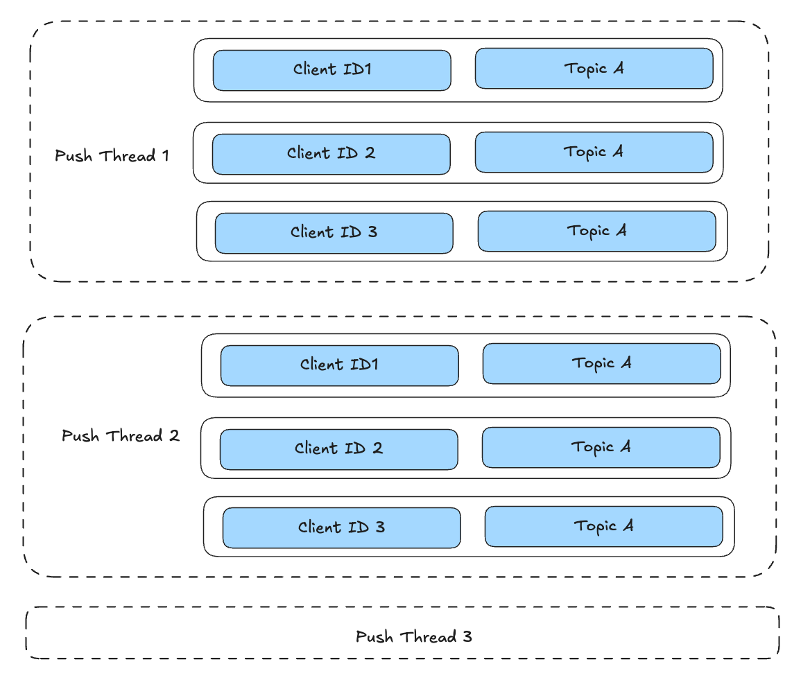
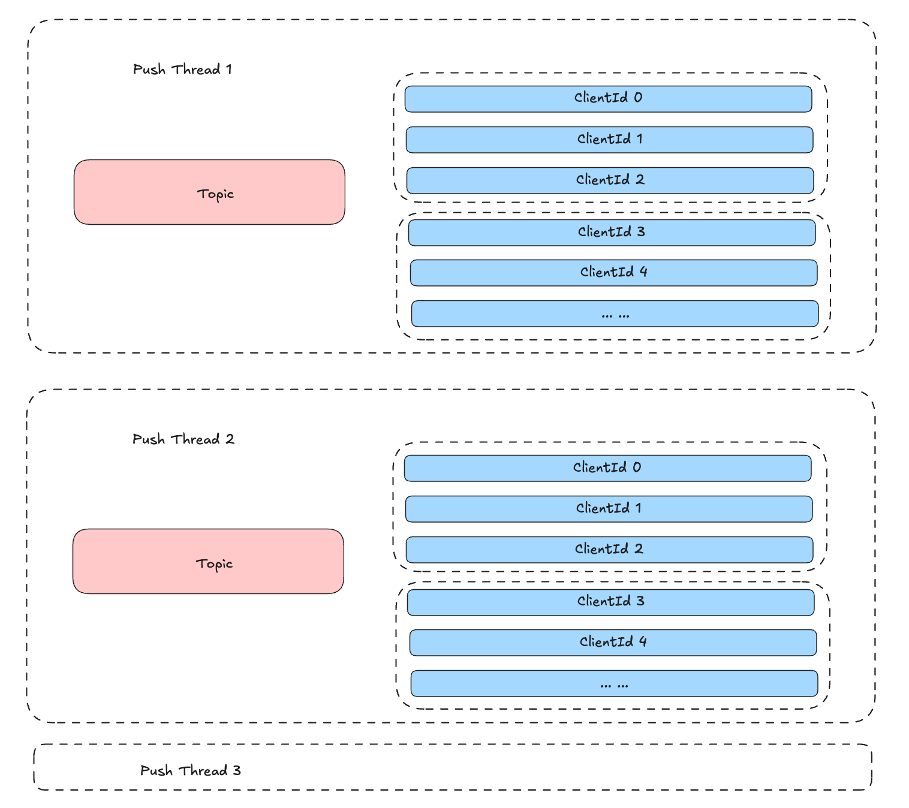
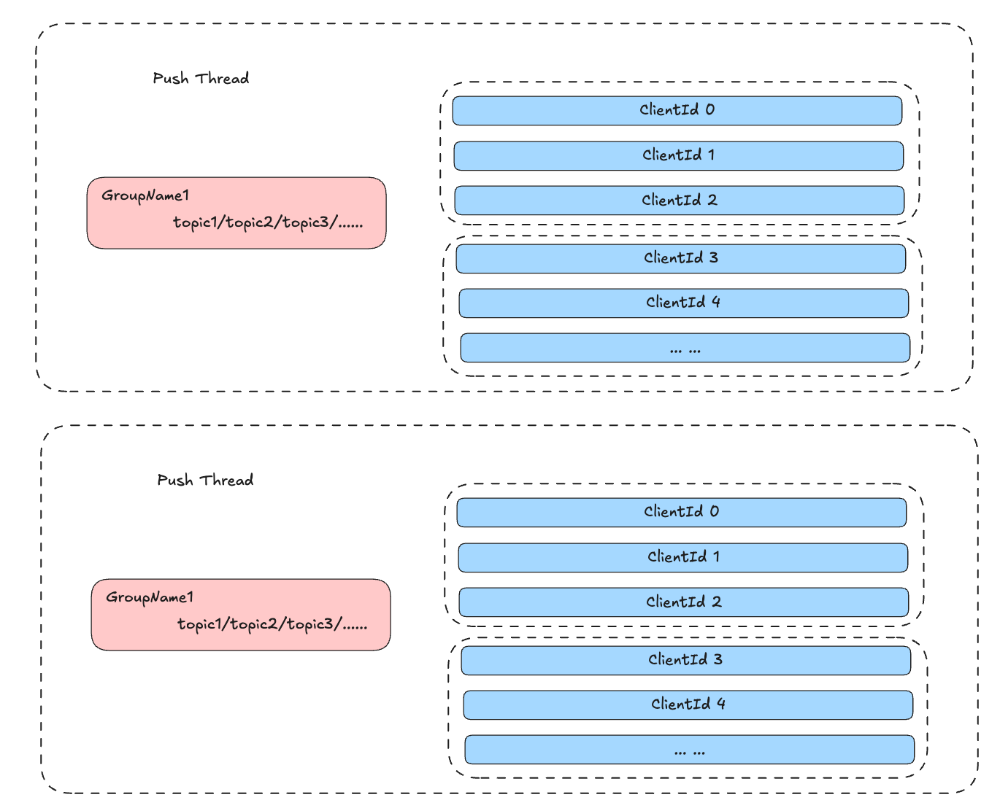

## MQTT 数据订阅

MQTT 客户端通过 Subscribe 命令订阅 Broker 中指定 Topic 的数据。订阅时可使用具体的 Topic 名称或通配符进行匹配。从功能上划分，MQTT 订阅分为直接订阅和共享订阅两种类型。

### 直接订阅与共享订阅

**直接订阅**指客户端通过指定 Topic 或通配符直接订阅数据，

**共享订阅**指客户端在订阅时额外指定一个 GroupName，所有使用相同 GroupName 的客户端会被组织成一个订阅组。共享订阅的格式如下：

```
$share/consumer1/sport/tennis/+
$share/consumer2/sport/tennis/+
$share/consumer1/sport/#
$share/consumer1/finance/#
```

需要注意的是，仅 Share Name 相同并不代表属于同一个共享订阅组。只有 `{Share Name}/{Topic Filter}` 组合才能唯一标识一个共享订阅组，上述示例中的订阅均属于不同的订阅组。

对于某个共享订阅组，所有匹配 `{Share Name}/{Topic Filter}` 的消息会被均匀分发给组内的多个客户端。

从实现角度看，直接订阅和共享订阅的推送机制存在本质差异。

### 技术挑战

MQTT 订阅场景具有以下四个显著特征：

1. **大规模订阅**：单个 Topic 可能被大量客户端订阅。例如在物联网数据采集场景中，每个传感器都需要上报数据并监听下发指令，单个 Topic 的订阅客户端数量可能达到数十万甚至上百万。

2. **多 Topic 订阅**：单个客户端可能订阅大量 Topic。由于 MQTT 支持通配符订阅，极端情况下一个客户端可能订阅集群内的所有 Topic，订阅数量可达数千甚至更多。

3. **弱网环境**：MQTT 客户端常处于弱网环境，连接不稳定，频繁上下线。这会导致消息推送耗时增加或推送失败。

4. **实时性要求**：订阅消息推送需要保证较高的实时性。

综合以上特征，订阅数据推送系统需要满足三个核心要求：

1. **系统负载平稳**：客户端数量或单客户端订阅的 Topic 数量的线性增长，不应导致系统负载线性增长
2. **消息推送及时**：保证消息的低延迟推送
3. **推送成功率高**：尽可能保证消息成功送达

### 推送模型设计

从流程上看，订阅推送就是从存储层读取消息数据，然后发送给对应的 MQTT 客户端。技术实现的核心在于线程模型的选择，即如何组织推送线程与客户端、Topic 之间的对应关系。可选的模型包括：
- 一个客户端一个推送线程
- 多个客户端共享一个推送线程
- 一个客户端多个推送线程
- 一个 Topic 一个推送线程

不同推送模型需要重点考虑以下三个问题：

1. **线程膨胀**：推送线程数量是否会无限膨胀，能否控制在合理范围内
2. **离线处理**：客户端频繁上下线时，如何处理未送达的消息
3. **慢客户端影响**：当某个客户端因网络原因接收消息缓慢时，是否会影响其他客户端的推送时效

早期版本中，直接订阅采用 client_id + topic 二元组为维度的推送模型，即一个 client_id + topic 对应一个 Tokio Task。这种方式的优点是每个订阅相互独立，隔离性强，可以很好地解决问题2和3。缺点是当订阅数量增长时，Tokio Task 数量会急剧膨胀，影响系统整体性能。

### 直接订阅推送

为了解决上述问题，当前实现的直接订阅模型提供了两种推送策略：按 Client + Topic 为粒度推送和按 Topic 为粒度推送。支持在集群级别配置默认推送策略，同时允许在 Topic 级别覆盖该策略。

两种策略的主要区别在于：策略一保证客户端即使频繁上下线也能接收到完整消息；策略二在客户端离线时直接跳过该客户端，保证消息推送的及时性，实现类似广播的效果。

#### 策略一：Client + Topic 粒度推送

该策略按照 ClientId + Topic 组织推送结构，一个 Tokio Task 中同时处理多个 ClientId + Topic 的数据推送。例如，单个 Task 可处理 10000 个 ClientId + Topic 组合，通过这种分组方式降低 Task 数量的增长速度。



实现思路：

1. 以 ClientId + Topic 为粒度组织推送数据，每个 Task 分配固定数量的 ClientId + Topic 组合
2. Task 循环读取 Topic 数据并推送给对应的 ClientId，只有推送成功才提交 offset，推送失败则下次继续推送同一条消息

该模式的特点是保证消息送达，推送失败会持续重试直到成功或客户端彻底离线。适用于强一致性场景，即必须保证客户端接收到每一条消息。缺点是某条消息推送失败会阻塞后续消息的推送。

#### 策略二：Topic 粒度推送（默认）

该策略以 Topic 为粒度推送消息，是系统的默认推送模式。核心思路是在有限的重试机制下，对推送失败的客户端快速失败并跳过，不阻塞其他客户端的消息推送。



实现思路：

1. 每个 Topic 对应一个推送线程。实际场景中，集群的 Topic 数量相对稳定，通常在百到万级别，不会出现严重膨胀
2. 为应对单个 Topic 可能存在的大量订阅（数万到数百万），在推送逻辑中进行线程拆分。从 Topic 读取消息后，按每 10000 个客户端（可配置）拆分成多个子 Task 并发推送。例如某 Topic 有 10 万订阅客户端，则拆分成 10 个子 Task 进行推送，所有子 Task 完成后再读取下一条消息

该模式的特点是每条消息对每个 ClientId 仅推送一次，推送时会进行有限次数的快速重试（可配置），重试仍失败则跳过该客户端，不再推送。客户端离线期间的消息不会被推送。重试机制会控制在短时间内完成（如 100ms），避免影响其他客户端的消息时效。该模型符合 MQTT 协议的特性设计。当Topic 特别多，比如几百万的时候，如果有人订阅，则会出现推送线程膨胀。

### 共享订阅推送

共享订阅的推送模型相对简单直接，如下图所示：



实现思路是以 `{Share Name}/{Topic Filter}` 为单位组织客户端，然后采用类似"策略二：Topic 粒度推送"的方式进行消息推送，此处不再赘述。